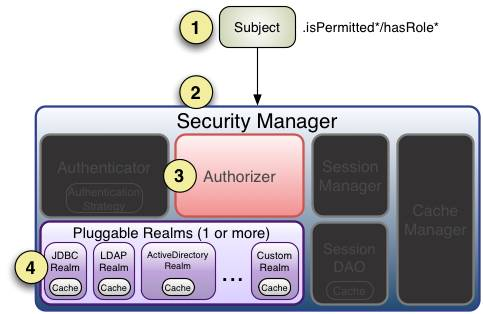

# 登录及权限组件概述 #


## 业务需求 ##

业务系统在使用时，一般会需要进行访问控制，需要以系统内的用户身份登录系统后，才能访问系统内的相关功能或资源，同时不同的用户能访问的功能一般也不一致，需要根据不同的用户进行控制，由此引入了登录认证和权限控制的要求。


## 解决方案 ##

本认证组件基于[Apache Shiro](http://shiro.apache.org/)。

本组件使用shiro安全框架管理登录及权限的信息，框架提供了用户、角色、功能、数据权限、用户角色关联，角色权限关联模型及维护Api。另外提供认证、授权、加密、会话管理、与Web集成、缓存等功能。  
权限结构基于RBAC模型，用户关联角色，角色关联功能。功能根据自定义策略可自行扩展。


## 功能说明 ##

**登录组件**

1.	提供统一的登录组件；
2.	身份、证明验证身份；
3.	支持多种身份标识，用户名、邮箱、手机号等；
4.	支持多个域，从域得到用户相应的角色/权限进行验证用户是否能进行操作（鉴权）；
5.	提供会话管理和安全管理；
6.	支持多种验证策略，并支持扩展

**权限框架**

1.	提供了用户、角色、功能、数据权限、用户角色关联，角色权限关联模型及维护Api。
2.	提供认证、授权、加密、会话管理、与Web集成、缓存等功能。
3.	权限结构基于RBAC模型，用户关联角色，角色关联功能。
4.	功能根据自定义策略可自行扩展；
5.	提供拦截器机制对权限进行控制；
6.	提供缓存机制，降低读消耗


# 整体设计 #

## 依赖环境 ##

组件采用Maven进行编译和打包发布，其对外提供的依赖方式如下：

	<dependency>
	  <groupId>com.yonyou.iuap</groupId>
	  <artifactId>iuap-authrbac-core</artifactId>
	  <version>${iuap.modules.version}</version>
	</dependency>

${iuap.modules.version} 为平台在maven私服上发布的组件的version。


## 工作流程 ##

### 几个概念 ###

**token：**令牌，代表执行某些操作的权利的对象，如最简单的用户名/密码即组成了一个token。  

**credentials：**证明/凭证，即只有主体知道的安全值，如密码/数字证书等。最常见的credentials就是密码了。  

**Subject：**主体，代表了当前“用户”，这个用户不一定是一个具体的人，与当前应用交互的任何东西都是Subject，如网络爬虫，机器人等；即一个抽象概念。  

**Realm：**域，Shiro从Realm获取安全数据（如用户、角色、权限），就是说SecurityManager要验证用户身份，那么它需要从Realm获取相应的用户进行比较以确定用户身份是否合法（登录）；也需要从Realm得到用户相应的角色/权限进行验证用户是否能进行操作（鉴权）；可以把Realm看成DataSource，即安全数据源。
实际上，是Realm与数据源做交流，然后告诉Shiro角色或权限是否存在。  

注意：Shiro不知道你的用户/权限存储在哪及以何种格式存储；所以我们一般在应用中都需要实现自己的Realm；  

**Session Manager：**会话管理，即用户登录后就是一次会话，在没有退出之前，它的所有信息都在会话中；会话可以是普通JavaSE环境的，也可以是如Web环境的。  

**SecurityManager：**安全管理器，即所有与安全有关的操作都会与SecurityManager交互。所有Subject都绑定到SecurityManager，所有交互都会委托给SecurityManager；可以把Subject认为是一个门面，SecurityManager才是实际的执行者。  

**Permissions：**权限，是Apache Shiro中安全策略最基本的元素，是一组关于行为的基本指令，以明确表示在一个程序中什么可以做。权限指令只描述行为（和资源相关的动作），并不关心“谁”有能力执行这个动作。  

**Roles：**角色，是一个实体名，代表一组行为或职责。角色通常赋给用户账户，关联之后，用户就可以做属于不用角色的事情。  
**Users：**用户，在Shiro中，Subject实际上就是“用户”，用户通过角色或者权限关联来确定是否被允许执行程序内特定的动作，程序数据模型确切定义了Subject是否允许做什么事情。  


### 具体流程 ###

**登录流程：**

  

1. 应用程序构建一个用户认证信息的`AuthenticationToken`实例之后，调用`Subject.login(token)`进行登录，其会自动委托给Security Manager。其中 ，`AuthenticationToken`中包含了终端用户的`Principals`和`Credentials`。  

2. `Subject`实例通常是`DelegatingSubject`类（或者子类）的实例对象，在认证时，会委托应用程序设置的`securityManager`实例调用`securityManager.login(token)`。
`SecurityManage`r负责真正的身份验证逻辑，它会委托给`Authenticator`进行身份验证。  

3. `SecurityManager`接收到`token`信息后委托给`Authenticator`的实例（通常是`ModularRealmAuthentication`类的实例，`Authenticator`才是真正的身份验证者，Shiro API中核心的身份认证入口点，此处可以自定义插入自己的实现），调用`authenticator. authenticate(token)`。`ModularRealmAuthentication`在认证中会对设置的一个或者多个`Realm`实例进行适配，实际上为Shiro提供了一个可插拔的认证机制。  

4. `Authenticator`可能会委托给相应的`Authentication Strategy`进行多`Realm`身份验证，默认`ModularRealmAuthenticator`会调用`AuthenticationStrategy`进行多`Realm`身份验证。在`Realm`被调用后，`Authentication`将对每一个`Realm`的结果作出相应。  

5. `Authenticator`会把相应的`token`传入`Realm`，`Realm`将调用`getAuthenticationInfo(token)`（此方法就是实际认证处理，我们需要覆盖`Realm`的`doGetAuthenticationInfo`方法来编写自己的认证处理），从`Realm`获取身份验证信息，如果返回`false`或者抛出异常，则表示身份验证失败了。


**权限控制流程**

  
1. 首先调用Subject.isPermitted\*/hasRole\*接口，其会委托给SecurityManager，而SecurityManager接着会委托给Authorizer；  
2. Authorizer是真正的授权者，如果我们调用如isPermitted("user:view")，其首先会通过PermissionResolver把字符串转换成相应的Permission实例；  
3. 在进行授权之前，其会调用相应的Realm获取Subject相应的角色/权限用于匹配传入的角色/权限；  
4. Authorizer会判断Realm的角色/权限是否和传入的匹配，如果有多个Realm，会委托给ModularRealmAuthorizer进行循环判断，如果匹配如isPermitted\*/hasRole\*会返回true，否则返回false表示授权失败。


## 关键功能 ##

### 授权 ###
根据用户、角色、权限模型，创建相应关联实体并进行持久化，组件将在用户登录过程中查询用户权限并分配给登录用户用于校验。同时，也会将用户的角色分配给当前登录用户，在权限校验过程中可根据角色，也可根据具体权限进行验证。  

### 授权认证 ###
基于角色的访问控制（隐式角色）  
通过Subject的hasRole/hasRole用于判断用户是否拥有某个角色/某些权限；但是没有提供如hashAnyRole用于判断是否有某些权限中的某一个。   
通过Subject的checkRole/checkRoles和hasRole/hasAllRoles不同的地方是它在判断为假的情况下会抛出UnauthorizedException异常。  

这种方式的缺点就是如果很多地方进行了角色判断，但是有一天不需要了那么就需要修改相应代码把所有相关的地方进行删除；这就是粗粒度造成的问题。  

**基于资源的访问控制（显示角色）**  
通过Subject的isPermitted/isPermittedAll用于判断用户是否拥有某个权限或所有权限。
但是失败的情况下会抛出UnauthorizedException异常。  
这种方式的一般规则是“资源标识符：操作”，即是资源级别的粒度；这种方式的好处就是如果要修改基本都是一个资源级别的修改，不会对其他模块代码产生影响，粒度小。但是实现起来可能稍微复杂点，需要维护“用户—角色，角色—权限（资源：操作）”之间的关系。   

字符串通配符权限  
规则：“资源标识符：操作：对象实例ID”  即对哪个资源的哪个实例可以进行什么操作。其默认支持通配符权限字符串，“:”表示资源/操作/实例的分割；“,”表示操作的分割；“*”表示任意资源/操作/实例。  

#### 1. 单个资源单个权限  

subject().checkPermissions("system:user:update");  
用户拥有资源“system:user”的“update”权限。

#### 2. 单个资源多个权限  

subject().checkPermissions("system:user:update", "system:user:delete");  
用户拥有资源“system:user”的“update”和“delete”权限。

#### 3. 单个资源全部权限  

subject().checkPermissions("system:user:create,delete,update:view");  
用户拥有资源“system:user”的“create”、“update”、“delete”和“view”所有权限。

#### 4. 所有资源全部权限  

subject().checkPermissions("user:view");  
用户拥有所有资源的“view”所有权限。

#### 5. 实例级别的权限


 - 单个实例单个权限  

通过如下代码判断  

		1.	subject().checkPermissions("user:view:1");  

 - 单个实例多个权限

通过如下代码判断  

		1.	subject().checkPermissions("user:delete,update:1");  
		2.	subject().checkPermissions("user:update:1", "user:delete:1");  

 - 单个实例所有权限  

通过如下代码判断   

		1.	subject().checkPermissions("user:update:1", "user:delete:1", "user:view:1");  

  - 所有实例单个权限  

通过如下代码判断   

		1.	subject().checkPermissions("user:auth:1", "user:auth:2");  

 - 所有实例所有权限  

通过如下代码判断  

		1.	subject().checkPermissions("user:view:1", "user:auth:2");  

#### 6. 对权限字符串缺失部分的处理  
如“user:view”等价于“user:view:\*”；而“organization”等价于“organization:*”或者“organization:\*:\*”。可以这么理解，这种方式实现了前缀匹配。  
另外如“user:\*”可以匹配如“user:delete”、“user:delete”可以匹配如“user:delete:1”、“user:\*:1”可以匹配如“user:view:1”、“user”可以匹配“user:view”或“user:view:1”等。即\*可以匹配所有，不加\*可以进行前缀匹配；但是如“\*:view”不能匹配“system:user:view”，需要使用“\*:\*:view”，即后缀匹配必须指定前缀（多个冒号就需要多个\*来匹配）。  
#### 7. WildcardPermission  
如下两种方式是等价的：   

	1.	subject().checkPermission("menu:view:1");  
	2.	subject().checkPermission(new WildcardPermission("menu:view:1"));   
因此没什么必要的话使用字符串更方便。  
#### 8. 性能问题  
通配符匹配方式比字符串相等匹配来说是更复杂的，因此需要花费更长时间，但是一般系统的权限不会太多，且可以配合缓存来提供其性能，如果这样性能还达不到要求我们可以实现位操作算法实现性能更好的权限匹配。  
另外实例级别的权限验证如果数据量太大也不建议使用，可能造成查询权限及匹配变慢。可以考虑比如在sql查询时加上权限字符串之类的方式在查询时就完成了权限匹配。   

### 拦截器 ###
1. 拦截器介绍  
使用了与Servlet一样的Filter接口进行扩展。  
对Servlet容器的FilterChain进行了代理，即ShiroFilter在Servlet容器的Filter链的执行之前，通过ProxiedFilterChain对Servlet容器的FilterChain进行了代理。即先走Shiro自己的Filter体系，然后才会委托给Servlet容器的FilterChain进行Servlet容器级别的Filter链执行。  
Shiro的ProxiedFilterChain执行流程：  
 1. 先执行Shiro自己的Filter链；  
 2. 再执行Servlet容器的Filter链（即原始的Filter）。  
而ProxiedFilterChain是通过FilterChainResolver根据配置文件中[urls]部分是否与请求的URL是否匹配解析得到的。

			1.	FilterChain getChain(ServletRequest request, ServletResponse response, FilterChain originalChain);    
即传入原始的chain得到一个代理的chain。  
2. 默认拦截器
默认提供了很多的拦截器，比如身份验证、授权等相关的。默认拦截器可以参考org.apache.shiro.web.filter.mgt.DefaultFilter中的枚举拦截器：  
<table>
  <tr>
    <th><br>  名称<br>  </th>
    <th><br>  拦截器类<br>  </th>
    <th><br>  说明（括号里的表示默认值）<br>  </th>
  </tr>
  <tr>
    <td><br>  身份验证相关的<br>  </td>
    <td><br>   <br>  </td>
    <td><br>   <br>  </td>
  </tr>
  <tr>
    <td><br>  authc<br>  </td>
    <td><br>  org.apache.shiro.web.filter.authc<br>  .FormAuthenticationFilter<br>  </td>
    <td><br>  基于表单的拦截器；如“/**=authc”，如果没有登录会跳到相应的登录页面登录；主要属性：usernameParam：表单提交的用户名参数名（ username）；<br>   passwordParam：表单提交的密码参数名（password）； rememberMeParam：表单提交的密码参数名（rememberMe）；  loginUrl：登录页面地址（/login.jsp）；successUrl：登录成功后的默认重定向地址；<br>  failureKeyAttribute：登录失败后错误信息存储key（shiroLoginFailure）；<br>  </td>
  </tr>
  <tr>
    <td><br>  authcBasic<br>  </td>
    <td><br>  org.apache.shiro.web.filter.authc<br>  .BasicHttpAuthenticationFilter<br>  </td>
    <td><br>  Basic HTTP身份验证拦截器，主要属性： applicationName：弹出登录框显示的信息（application）；<br>  </td>
  </tr>
  <tr>
    <td><br>  logout<br>  </td>
    <td><br>  org.apache.shiro.web.filter.authc<br>  .LogoutFilter<br>  </td>
    <td><br>  退出拦截器，主要属性：redirectUrl：退出成功后重定向的地址（/）;示例“/logout=logout”<br>  </td>
  </tr>
  <tr>
    <td><br>  user<br>  </td>
    <td><br>  org.apache.shiro.web.filter.authc<br>  .UserFilter<br>  </td>
    <td><br>  用户拦截器，用户已经身份验证/记住我登录的都可；示例“/**=user”<br>  </td>
  </tr>
  <tr>
    <td><br>  anon<br>  </td>
    <td><br>  org.apache.shiro.web.filter.authc<br>  .AnonymousFilter<br>  </td>
    <td><br>  匿名拦截器，即不需要登录即可访问；一般用于静态资源过滤；示例“/static/**=anon”<br>  </td>
  </tr>
  <tr>
    <td><br>  授权相关的<br>  </td>
    <td><br>   <br>  </td>
    <td><br>   <br>  </td>
  </tr>
  <tr>
    <td><br>  roles<br>  </td>
    <td><br>  org.apache.shiro.web.filter.authz<br>  .RolesAuthorizationFilter<br>  </td>
    <td><br>  角色授权拦截器，验证用户是否拥有所有角色；主要属性： loginUrl：登录页面地址（/login.jsp）；unauthorizedUrl：未授权后重定向的地址；示例“/admin/**=roles[admin]”<br>  </td>
  </tr>
  <tr>
    <td><br>  perms<br>  </td>
    <td><br>  org.apache.shiro.web.filter.authz<br>  .PermissionsAuthorizationFilter<br>  </td>
    <td><br>  权限授权拦截器，验证用户是否拥有所有权限；属性和roles一样；示例“/user/**=perms["user:create"]”<br>  </td>
  </tr>
  <tr>
    <td><br>  port<br>  </td>
    <td><br>  org.apache.shiro.web.filter.authz<br>  .PortFilter<br>  </td>
    <td><br>  端口拦截器，主要属性：port（80）：可以通过的端口；示例“/test= port[80]”，如果用户访问该页面是非80，将自动将请求端口改为80并重定向到该80端口，其他路径/参数等都一样<br>  </td>
  </tr>
  <tr>
    <td><br>  rest<br>  </td>
    <td><br>  org.apache.shiro.web.filter.authz<br>  .HttpMethodPermissionFilter<br>  </td>
    <td><br>  rest风格拦截器，自动根据请求方法构建权限字符串（GET=read, POST=create,PUT=update,DELETE=delete,HEAD=read,TRACE=read,OPTIONS=read,<br>  MKCOL=create）构建权限字符串；示例“/users=rest[user]”，会自动拼出“user:read,user:create,user:update,user:delete”权限字符串进行权限匹配（所有都得匹配，isPermittedAll）；<br>  </td>
  </tr>
  <tr>
    <td><br>  ssl<br>  </td>
    <td><br>  org.apache.shiro.web.filter.authz<br>  .SslFilter<br>  </td>
    <td><br>  SSL拦截器，只有请求协议是https才能通过；否则自动跳转会https端口（443）；其他和port拦截器一样；<br>  </td>
  </tr>
  <tr>
    <td><br>  其他<br>  </td>
    <td><br>   <br>  </td>
    <td><br>   <br>  </td>
  </tr>
  <tr>
    <td><br>  noSessionCreation<br>  </td>
    <td><br>  org.apache.shiro.web.filter.session<br>  .NoSessionCreationFilter<br>  </td>
    <td><br>  不创建会话拦截器，调用<br>  subject.getSession(false)不会有什么问题，但是如果<br>  subject.getSession(true)将抛出 DisabledSessionException异常；<br>  </td>
  </tr>
</table>

### 缓存机制 ###
框架提供了类似于Spring的Cache抽象，框架本身不实现Cache，但是对Cache进行了抽象，方便更换不同的底层Cache实现。  

框架提供的Cache接口：

	public interface Cache<K, V> {  
	    //根据Key获取缓存中的值  
	    public V get(K key) throws CacheException;  
	    //往缓存中放入key-value，返回缓存中之前的值  
	    public V put(K key, V value) throws CacheException;   
	    //移除缓存中key对应的值，返回该值  
	    public V remove(K key) throws CacheException;  
	    //清空整个缓存  
	    public void clear() throws CacheException;  
	    //返回缓存大小  
	    public int size();  
	    //获取缓存中所有的key  
	    public Set<K> keys();  
	    //获取缓存中所有的value  
	    public Collection<V> values();  
	}    
CacheManager接口：  

	public interface CacheManager {  
	    //根据缓存名字获取一个Cache  
	    public <K, V> Cache<K, V> getCache(String name) throws CacheException;  
	}   
CacheManagerAware用于注入CacheManager：  

	public interface CacheManagerAware {  
	    //注入CacheManager  
	    void setCacheManager(CacheManager cacheManager);  
	}  
框架的默认组件DefaultSecurityManager()会自动检测相应的对象（如Realm）是否实现了CacheManagerAware并自动注入相应的CacheManager。  

#### Realm缓存 ####
提供了CachingRealm，其实现了CacheManagerAware接口，提供了缓存的一些基础实现；另外AuthenticatingRealm及AuthorizingRealm分别提供了对AuthenticationInfo 和AuthorizationInfo信息的缓存。  

	<!-- 用户授权信息Cache, 采用EhCache -->
	<beanid="shiroEhcacheManager"class="org.apache.shiro.cache.ehcache.EhCacheManager">
	<propertyname="cacheManagerConfigFile"value="classpath:ehcache/ehcache-shiro.xml"/>
	</bean>
默认使用*EhCacheManager*  
首先登录成功（此时会缓存相应的AuthenticationInfo），然后修改密码,此时密码就变了。  
接着需要调用Realm的clearCachedAuthenticationInfo方法清空之前缓存的AuthenticationInfo，否则下次登录时还会获取到修改密码之前的那个AuthenticationInfo。


# 使用说明 #


## 认证开发说明 ##

本登录认证组件默认提供用户身份校验、session生命周期管理、登录登出操作，并提供登录校验扩展机制。  

组件未提供登录界面，需要开发者自行实现登录界面开发，并向后台提交登录所需身份/凭证信息。  

**注：如果使用认证组件(iuap-auth)，则不需要进行下面过程，请参考认证组件的开发说明，并在loginContraller中增加基于用户密码（或其他方式，例如图片验证码、手机、第三方登录等）的认证逻辑，具体可参考示例工程中的loginContraller的实现**

### 开发步骤 ###
#### 自定义Realm ####

**编写一个Realm**  

Realm：域，框架从Realm获取安全数据（如用户、角色、权限），就是说`SecurityManager`要验证用户身份，那么它需要从`Realm`获取相应的用户进行比较以确定用户身份是否合法；也需要从`Realm`得到用户相应的角色/权限进行验证用户是否能进行操作；可以把`Realm`看成`DataSource`，即安全数据源。  

一般情况下，我们只需要继承`org.apache.shiro.realm.AuthorizingRealm`重写`doGetAuthenticationInfo(AuthenticationToken authcToken)`方法和`doGetAuthorizationInfo(PrincipalCollection principals)`方法。
其中, `doGetAuthenticationInfo(AuthenticationToken authcToken)`：登录认证的时候会被调用，即用户自己编写的认证逻辑，可以根据自定义的密码加密算法来验证当前登录是否合法。  

`doGetAuthorizationInfo(PrincipalCollection principals)`：鉴权查询用户权限的时候会被调用，一般编写查询当前登录用户权限的逻辑。

下面是一个具体的例子：  

	/**
	 * 认证回调函数,登录时调用.
	 */
	@Override
	protected AuthenticationInfo doGetAuthenticationInfo(AuthenticationToken authcToken) throws AuthenticationException {
		CaptchaUsernamePasswordToken token = (CaptchaUsernamePasswordToken) authcToken;
		String encryptedPassWord = new String(token.getPassword());
        encryptedPassWord = encryptedPassWord.replace("_encrypted", "");
        String passWord = RSAUtils.decryptStringByJs(encryptedPassWord);

		User user = accountService.findUserByLoginName(token.getUsername());
		if (user != null) {
			byte[] hashPassword = Digests.sha1(passWord.getBytes(), Encodes.decodeHex(user.getSalt()), HASH_INTERATIONS);
            String checkPwd = Encodes.encodeHex(hashPassword);
            // 将密码按照加密算法进行加密之后，存储到token
            token.setPassword(checkPwd.toCharArray());

			byte[] salt = Encodes.decodeHex(user.getSalt());
			return new SimpleAuthenticationInfo(new ShiroUser(user.getId(), user.getLoginName(), user.getName()),
					user.getPassword(), ByteSource.Util.bytes(salt), getName());
		} else {
			return null;
		}
	}  

**将Realm配置到securityManager中**  

	<!-- 安全管理器 -->
		<bean id="securityManager" class="org.apache.shiro.web.mgt.DefaultWebSecurityManager">
			<!--可配制多个认证授权Realm，此处只配置了一个自定义的shiroDbRealm -->
			<property name="realm" ref="myShiroDbRealm" />
	</bean>

此处的*myShiroDbRealm*已经通过by-name注解的方式注解到Spring中。我们当然可以使用配置的方式来注入此realm：  

	<!-- 安全管理器 -->
		<bean id="securityManager" class="org.apache.shiro.web.mgt.DefaultWebSecurityManager">
			<!--可配制多个认证授权Realm，此处只配置了一个自定义的shiroDbRealm -->
			<property name="realm" ref="com.yonyou.login.realm.MyShiroDbRealm" />
	</bean>  

如果配置了多个Realm，可以按照此方式来配置：  

  

此时，securityManager会按照Realms指定的顺序来进行身份认证。  


#### 验证策略AuthenticationStrategy ####

当一个程序配置了两个或者两个以上的`Realm`时,`ModularRealmAuthenticator`依靠内部的`AuthenticationStrategy`组件来判定认证的成功和失败。  ####
`AuthenticationStrategy`是一个无状态的组件，它在身份验证中被询问4次：    
1. 在任何`Realm`被调用之前被询问；  
2. 在一个单独的`Realm`的`getAuthenticationInfo`方法被调用之前立即被询问;  
3. 在一个单独的`Realm`的`getAuthenticationInfo`方法被调用之后理解被询问;  
4. 在所用的`Realm`被调用之后被询问。  


认证策略的另外一项工作就是聚合所有的`Realm`的结果信息封装至一个`AuthenticationInfo`实例中，并将此信息返回，以此作为`Subject`的身份信息。
框架定义了3中认证策略的实现：
**FirstSuccessfulStrategy：**只要有一个`Realm`验证成功即可，只返回第一个`Realm`身份验证成功的认证信息，其他的忽略；
**AtLeastOneSuccessfulStrategy：**只要有一个`Realm`验证成功即可，和`FirstSuccessfulStrategy`不同，返回所有`Realm`身份验证成功的认证信息；
**AllSuccessfulStrategy：**所有`Realm`验证成功才算成功，且返回所有`Realm`身份验证成功的认证信息，如果有一个失败就失败了。  

**ModularRealmAuthenticator**内置的认证策略默认实现是`AtLeastOneSuccessfulStrategy`，因为这种方式也是被广泛使用的一种认证策略。

**改认证策略：**  

一般情况下，我们不需要更改配置文件中的认证策略，甚至不需要配置（此时框架会执行默认的**AtLeastOneSuccessfulStrategy**策略），如果需要修改的话，可以按照如下方式来配置：  

	<bean id="securityManager" class="org.apache.shiro.web.mgt.DefaultWebSecurityManager">
		<!-- 配置认证策略 -->
		   <property name="authenticator" ref="authenticator" />  
	</bean>
	<bean id="authenticator" class="org.apache.shiro.authc.pam.ModularRealmAuthenticator">  
		<property name="authenticationStrategy">  
			<bean class="org.apache.shiro.authc.pam.AtLeastOneSuccessfulStrategy" />  
		</property>  
	</bean>  


#### 与Spring整合 ####


**web.xml配置**  

在web.xml中配置shiro的过滤器，将对所有的访问进行拦截：  

	<filter>
		<filter-name>shiroFilter</filter-name>
	<filter-class>org.springframework.web.filter.DelegatingFilterProxy</filter-class>
		<init-param>
			<param-name>targetFilterLifecycle</param-name>
			<param-value>true</param-value>
		</init-param>
	</filter>
	<filter-mapping>
		<filter-name>shiroFilter</filter-name>
		<url-pattern>/*</url-pattern>
	</filter-mapping>  

并添加对配置文件的读取（*applicationContext-shiro.xml*需要放在系统的classpath下）：  

	<context-param>
		<param-name>contextConfigLocation</param-name>
		<param-value>
			classpath*:/applicationContext-shiro.xml
		</param-value>
	</context-param>


**spring-mvc.xml配置**  

spring-mvc.xml中添加对组件的扫描  


	<!-- 自动扫描且只扫描@Controller -->
	<context:component-scan base-package=" com.yonyou.uap.ieop.security" use-default-filters="false">
		<context:include-filter type="annotation" expression="org.springframework.stereotype.Controller"/>
		<context:include-filter type="annotation" expression="org.springframework.web.bind.annotation.ControllerAdvice"/>
	</context:component-scan>  


**applicationContext-shiro.xml配置**  

applicationContext-shiro.xml中添加shiro配置   

	<!-- Shiro的Web过滤器 -->
	<!-- 此处的bean id需要和web.xml定义的shiro组件过滤器filter-name保持一致 -->
	<bean id="shiroFilter" class="org.apache.shiro.spring.web.ShiroFilterFactoryBean">
		<!-- Shiro的核心安全接口，必须属性 -->
		<property name="securityManager" ref="securityManager" />
		<!-- 非必须属性，登录页面地址，如果不写，会寻找工程根目录下的"/login.jsp"页面 -->
		<property name="loginUrl" value="/login/jump" />
		<!-- 非必须属性，如果登录成功后的跳转页面在处理逻辑LoginController中有指定，可以不写 -->
		<!-- <property name="successUrl" value="loginSuccess.jsp"/> -->
		<!-- 用户访问未对其授权的链接时，所显示的连接 -->
		<property name="unauthorizedUrl" value="/login/fail" />
		<property name="filters">
			<util:map>
				<!--  登录验证Filter -->
				<entry key="authc" value-ref="authcationFilter" />
			</util:map>
		</property>
		<property name="filterChainDefinitions">
			<value>
				/logout = logout
				/static/** = anon
				/images/** = anon
				/css/** = anon
				/js/** = anon
			</value>
		</property>
	</bean>

	<!-- 安全管理器 -->
	<bean id="securityManager" class="org.apache.shiro.web.mgt.DefaultWebSecurityManager">
		<!--可配制多个认证授权Realm，此处只配置了一个自定义的shiroDbRealm -->
		<property name="realm" ref="myShiroDbRealm" />
	</bean>

	<!-- Shiro生命周期处理器 -->
	<bean id="lifecycleBeanPostProcessor" class="org.apache.shiro.spring.LifecycleBeanPostProcessor" />

	<!-- 启用验证码检验 -->
	<bean id="authcationFilter" class="com.yonyou.login.filter.CaptchaFormAuthenticationFilter" />  


配置文件说明：  

1. 配置shiroFilter，此处id需要与2.4.3.2中web.xml的filter-name一致。
	<bean id="shiroFilter" class="org.apache.shiro.spring.web.ShiroFilterFactoryBean">  

2. shiro的必须属性，可以配置多个Realm，也可以配置认证策略。具体见2.4.1和2.4.2。

	<property name="securityManager" ref="securityManager" />
	<!-- 安全管理器 -->
	<bean id="securityManager" class="org.apache.shiro.web.mgt.DefaultWebSecurityManager">
		<!--可配制多个认证授权Realm，此处只配置了一个自定义的shiroDbRealm -->
		<property name="realm" ref="myShiroDbRealm" />
	</bean>  

3. 非必须属性，配置登录页面、登录成功页面以及未授权页面。  

	<!-- 非必须属性，登录页面地址，如果不写，会寻找工程根目录下的"/login.jsp"页面 -->		
		<property name="loginUrl" value="/login/jump" />
		<!-- 非必须属性，如果登录成功后的跳转页面在处理逻辑LoginController中有指定，可以不写 -->
		<!-- <property name="successUrl" value="loginSuccess.jsp"/> -->
		<!-- 用户访问未对其授权的链接时，所显示的连接 -->
		<property name="unauthorizedUrl" value="/login/fail" />


4. 非必须属性，定义的是一个关于验证码的过滤器，会验证前台输入的验证码是否正确  

		<property name="filters">
				<util:map>
					<!--  登录验证Filter -->
					<entry key="authc" value-ref="authcationFilter" />
				</util:map>
			</property>
			<!-- 启用验证码检验 -->
			<bean id="authcationFilter" class="com.yonyou.login.filter.CaptchaFormAuthenticationFilter" />  

5. 过滤链定义,非必须属性,   

	/logout = logout：系统登出的URL  
	/** = authc：系统内需要授权才可以访问的URL  
	/api/** = anon：系统内匿名用户也可访问的URL   

		<property name="filterChainDefinitions">
				<value>
					/logout = logout
					/static/** = anon
					/images/** = anon
					/css/** = anon
					/js/** = anon
				</value>
			</property>


其他的过滤链定义：  

<table>
  <tr>
    <th><br>  anon<br>  </th>
    <th><br>  org.apache.shiro.web.filter.authc.AnonymousFilter<br>  anon:例子/admins/**=anon 没有参数，表示可以匿名使用。<br>  </th>
    <th></th>
  </tr>
  <tr>
    <td><br>  authc<br>  </td>
    <td><br>  org.apache.shiro.web.filter.authc.FormAuthenticationFilter<br>  authc:例如/admins/user/**=authc表示需要认证(登录)才能使用，没有参数<br>  </td>
    <td></td>
  </tr>
  <tr>
    <td><br>  authcBasic<br>  </td>
    <td><br>  org.apache.shiro.web.filter.authc.BasicHttpAuthenticationFilter<br>  authcBasic：例如/admins/user/**=authcBasic没有参数表示httpBasic认证<br>  </td>
    <td></td>
  </tr>
  <tr>
    <td><br>  perms<br>  </td>
    <td><br>  org.apache.shiro.web.filter.authz.PermissionsAuthorizationFilter<br>  perms：例子/admins/user/**=perms[user:add:*],参数可以写多个，多个时必须加上引号，并且参数之间用逗号分割，例如/admins/user/**=perms["user:add:*,user:modify:*"]，当有多个参数时必须每个参数都通过才通过，想当于isPermitedAll()方法。<br>  </td>
    <td></td>
  </tr>
  <tr>
    <td><br>  port<br>  </td>
    <td><br>  org.apache.shiro.web.filter.authz.PortFilter<br>  port：例子/admins/user/**=port[8081],当请求的url的端口不是8081是跳转到schemal://serverName:8081?queryString,其中schmal是协议http或https等，serverName是你访问的host,8081是url配置里port的端口，queryString是你访问的url里的？后面的参数。<br>  </td>
    <td></td>
  </tr>
  <tr>
    <td><br>  rest<br>  </td>
    <td><br>  org.apache.shiro.web.filter.authz.HttpMethodPermissionFilter<br>  rest：例子/admins/user/**=rest[user],根据请求的方法，相当于/admins/user/**=perms[user:method]<br>  ,其中method为post，get，delete等。<br>  </td>
    <td></td>
  </tr>
  <tr>
    <td><br>  roles<br>  </td>
    <td><br>  org.apache.shiro.web.filter.authz.RolesAuthorizationFilter<br>  roles：例子/admins/user/**=roles[admin],参数可以写多个，多个时必须加上引号，并且参数之间用逗号分割，当有多个参数时，例如admins/user/**=roles["admin,guest"],每个参数通过才算通过，相当于hasAllRoles()方法。<br>  </td>
    <td></td>
  </tr>
  <tr>
    <td><br>  ssl<br>  </td>
    <td><br>  org.apache.shiro.web.filter.authz.SslFilter<br>  ssl:例子/admins/user/**=ssl没有参数，表示安全的url请求，协议为https<br>  </td>
    <td></td>
  </tr>
  <tr>
    <td><br>  user<br>  </td>
    <td><br>  org.apache.shiro.web.filter.authc.UserFilter<br>  user:例如/admins/user/**=user没有参数表示必须存在用户，当登入操作时不做检查<br>  </td>
    <td></td>
  </tr>
</table>  


注：anon，authcBasic，auchc，user是认证过滤器；perms，roles，ssl，rest，port是授权过滤器。  


#### 代码调用 ####

**登入**  

以下文例子来讲解登入操作：  

		@RequestMapping(method = RequestMethod.POST, value = "formLogin")
		public String formlogin(HttpServletRequest request, HttpServletResponse response, Model model) throws IOException {

			String userName = request.getParameter("username");
			String encryptedPassWord = request.getParameter("password");
			String captcha = request.getParameter("captcha");
			String rememberMe = request.getParameter("rememberMe");
			// 构造登录token
			CaptchaUsernamePasswordToken token = new CaptchaUsernamePasswordToken(userName, encryptedPassWord.toCharArray(),
					new Boolean(rememberMe), "", captcha);

			// 获取当前登录主体Subject
			Subject subject = SecurityUtils.getSubject();

			try {
				// 验证码校验
				captchaFilter.doCaptchaValidate(request, token);

			} catch (IncorrectCaptchaException e) {//当验证码不正确的时候会出现此异常
				initPubKeyParams(model);
				model.addAttribute(FormAuthenticationFilter.DEFAULT_ERROR_KEY_ATTRIBUTE_NAME , e);
				return "login";
			}

			try {
				// 登录
				subject.login(token);

			} catch (UnknownAccountException uae) {//username不存在
				model.addAttribute(FormAuthenticationFilter.DEFAULT_ERROR_KEY_ATTRIBUTE_NAME,uae);
				return reLogin(model);
			}catch (IncorrectCredentialsException ice) {//password错误
				model.addAttribute(FormAuthenticationFilter.DEFAULT_ERROR_KEY_ATTRIBUTE_NAME,ice);
				return reLogin(model);
			}catch (LockedAccountException lae) {//账户被锁住
				model.addAttribute(FormAuthenticationFilter.DEFAULT_ERROR_KEY_ATTRIBUTE_NAME,lae);
				return reLogin(model);
			}catch (AuthenticationException ae) {//其他异常
				model.addAttribute(FormAuthenticationFilter.DEFAULT_ERROR_KEY_ATTRIBUTE_NAME,ae);
				return reLogin(model);
			}

			if(subject.isAuthenticated()){//登录成功

				// TODO 添加其他的业务逻辑，例如将用户信息存入session...
				model.addAttribute(accountService.findUserByLoginName(userName));
				return "loginSuccess";

			}else{//登录失败

				model.addAttribute(FormAuthenticationFilter.DEFAULT_ERROR_KEY_ATTRIBUTE_NAME,"未通过验证");
				return reLogin(model);
			}
		}  


主要的步骤是三步：  

1. 将前端发送到Server到信息（包括用户名、密码、验证码等）包装成一个登录token;  
2. 执行登录操作`subject.login(token)`;具体的登录验证操作，是在2.4.1自定义`Realm`中的`doGetAuthenticationInfo(AuthenticationToken authcToken)`方法来实现的;
3. 验证是否登录成功（即调用`subject.isAuthenticated()`），来执行后续操作。  

**登出**  
登出操作比较简单，核心代码就是一行：  

	SecurityUtils.getSubject().logout();  

当调用此行代码时，任何现有的Session都会失效，而且任何身份都将会失去关联。  


### API接口 ###

#### 登录相关

**描述**  
用于实现用户登录。  
**请求方法**  
`/login`  
**请求方式**  
`URL POST`  
**请求参数说明**  

<table>
  <tr>
    <th><br>  参数字段<br>  </th>
    <th><br>  必选<br>  </th>
    <th><br>  类型<br>  </th>
    <th><br>  长度限制<br>  </th>
    <th><br>  说明<br>  </th>
  </tr>
  <tr>
    <td><br>  username<br>  </td>
    <td><br>  True<br>  </td>
    <td><br>  String<br>  </td>
    <td><br>  20<br>  </td>
    <td><br>  用户名<br>  </td>
  </tr>
  <tr>
    <td><br>  password<br>  </td>
    <td><br>  True<br>  </td>
    <td><br>  String<br>  </td>
    <td><br>  20<br>  </td>
    <td><br>  用户密码<br>  </td>
  </tr>
</table>  

**返回参数说明**  
无  


#### 登出相关

**描述**  
用于实现用户登出。  
**请求方法**  
`/logout`  
**请求方式**  
`URL POST`  
**请求参数说明**  

<table>
  <tr>
    <th><br>  参数字段<br>  </th>
    <th><br>  必选<br>  </th>
    <th><br>  类型<br>  </th>
    <th><br>  长度限制<br>  </th>
    <th><br>  说明<br>  </th>
  </tr>
  <tr>
    <td><br>  username<br>  </td>
    <td><br>  True<br>  </td>
    <td><br>  String<br>  </td>
    <td><br>  20<br>  </td>
    <td><br>  用户名<br>  </td>
  </tr>
</table>  

**返回参数说明**  
无

### 扩展机制 ###

#### 添加验证码 ####

验证码可以有效地防止机器登录、恶意破解密码等破坏网站安全性的行为，如果用户需要在网站中添加验证码机制，可以按照以下步骤来进行：  
以google开源的Captcha组件为例  
1. 前端页面添加显示验证码的img区域，和输入验证码的输入框

		<div class="form-group">
		<label  class="col-sm-4 control-label">验证码</label>
		<div class="col-sm-8">
			<input type="text" class="form-control"  id="captcha" name="captcha" placeholder="请输入下图中的验证码">
			/images/kaptcha.jpg" title="点击更换" id="img_captcha" onclick="javascript:refreshCaptcha('<%=path%>')"> (看不清? &nbsp; <a href="javascript:void(0)" onclick="javascript:refreshCaptcha('<%=path%>')">换一张</a>)
		</div>
		</div>  
显示效果如图：  
  
2. 扩展实体`bean org.apache.shiro.authc.UsernamePasswordToken`为`CaptchaUsernamePasswordToken`，增加一个`private String captcha`字段;  
3. 扩展异常类`AuthenticationException`为`IncorrectCaptchaException`，增加当验证码输入不正确时的异常信息;  
4. 扩展过滤`org.apache.shiro.web.filter.authc.FormAuthenticationFilter`,增加验证码校验的功能`CaptchaFormAuthenticationFilter`;  
  核心方法：

		// 从request中取得Captcha
		protected String getCaptcha(ServletRequest request){
			return WebUtils.getCleanParam(request, getCaptchaParam());
		}

		//创建Token
		protected CaptchaUsernamePasswordToken createToken(ServletRequest request , ServletResponse response) {

			String userName = getUsername(request);
			String password = getPassword(request);
			String captcha = getCaptcha(request);
			boolean rememberMe = isRememberMe(request);
			String host = getHost(request);
			return new CaptchaUsernamePasswordToken(userName, password.toCharArray(), rememberMe, host, captcha);
		}

		//验证码校验
		public void doCaptchaValidate(HttpServletRequest request , CaptchaUsernamePasswordToken token) {

			// 获取session中的图形码字符串
			String captcha = (String) request.getSession().getAttribute(Constants.KAPTCHA_SESSION_KEY);

			if (captcha != null && !captcha.equalsIgnoreCase(token.getCaptcha())) {
				throw new IncorrectCaptchaException("验证码错误！");
			}
		}   
5.注册步骤4中的`CaptchaFormAuthenticationFilter`;  

		<property name="filters">
				<util:map>
					<!--  登录验证Filter -->
					<entry key="authc" value-ref="authcationFilter" />
				</util:map>
			</property>
			<!-- 启用验证码检验 -->
			<bean id="authcationFilter" class="com.yonyou.login.filter.CaptchaFormAuthenticationFilter" />
6.调用此filter;  

		String userName = request.getParameter("username");
			String encryptedPassWord = request.getParameter("password");
			String captcha = request.getParameter("captcha");
			String rememberMe = request.getParameter("rememberMe");
			// 构造登录token
			CaptchaUsernamePasswordToken token = new CaptchaUsernamePasswordToken(userName, encryptedPassWord.toCharArray(),
					new Boolean(rememberMe), "", captcha);

			// 获取当前登录主体Subject
			Subject subject = SecurityUtils.getSubject();

			try {
				// 验证码校验
				captchaFilter.doCaptchaValidate(request, token);

			} catch (IncorrectCaptchaException e) {//当验证码不正确的时候会出现此异常
				initPubKeyParams(model);
				model.addAttribute(FormAuthenticationFilter.DEFAULT_ERROR_KEY_ATTRIBUTE_NAME , e);
				return "login";
			}    

7.当验证输入不正确的时候，前台需要给出提示。  

		<%
			Object obj = request.getAttribute(FormAuthenticationFilter.DEFAULT_ERROR_KEY_ATTRIBUTE_NAME);
			String msg = "";
			if(obj != null){
				if(obj instanceof IncorrectCaptchaException){
					msg = "验证码错误！";
				}else{
					msg = "帐号或者密码错误！";
				}
			}
			out.println("<label><div class='error'>" + msg + "</div></label>");
		%>  


## 权限开发说明 ##
### 开发步骤 ###
#### 与Spring集成 ####

${iuap.modules.version} 为平台在maven私服上发布的组件的version。

1. 配置扫描路径  
扫描路径加入com.yonyou.uap.ieop.security包括bean路径和Jpa扫描路径  

		<context:component-scan base-package=" com.yonyou.uap.ieop.security.web.controller">
				<context:exclude-filter type="annotation" expression="org.springframework.stereotype.Controller"/>
				<context:exclude-filter type="annotation" expression="org.springframework.web.bind.annotation.ControllerAdvice"/></context:component-scan>
2. web.xml中添加shiro filter  

		<filter>
			<filter-name>shiroFilter</filter-name>
		<filter-class>org.springframework.web.filter.DelegatingFilterProxy</filter-class>
			<init-param>
				<param-name>targetFilterLifecycle</param-name>
				<param-value>true</param-value>
			</init-param>
		</filter>
		<filter-mapping>
			<filter-name>shiroFilter</filter-name>
			<url-pattern>/*</url-pattern>
		</filter-mapping>  
DelegatingFilterProxy作用是：自动到Spring容器查找名字为shiroFilter（filter-name）的bean并把所有Filter的操作委托给它。然后将ShiroFilter配置到spring容器即可：  

		<!-- Shiro Filter -->
		<beanid="shiroFilter"class="org.apache.shiro.spring.web.ShiroFilterFactoryBean">
			<propertyname="securityManager"ref="securityManager"/>
			<propertyname="loginUrl"value="/login"/>
			<propertyname="successUrl"value="/"/>
			<propertyname="filterChainDefinitions">
				<value>
					/logout = logout
					/static/** = anon
					/extlogin/**=anon
					/api/** = anon
					/cxf/** = anon
					/** = authc
				</value>
			</property>
		</bean>
最后不要忘了使用  org.springframework.web.context.ContextLoaderListener加载这个spring配置文件即可。  
其中：   
loginUrl即为登录地址，  
successUrl为登录成功跳转地址。  
3. 配置applicationContext-shiro.xml权限相关属性  
securityManager中的realm，可以配置为多个，此处为单个组件预置realm  

		<beanid="securityManager"class="org.apache.shiro.web.mgt.DefaultWebSecurityManager">
		<!--配置Realm-->
			<property name="realms">
				<list>		   						<beanid="ExtShiroDbRealm"class="com.yonyou.uap.ieop.security.realm.ExtShiroDbRealm"></bean>
				</list>
			</property>
		<!--配置相关认证策略-->
			<property name="authenticator"ref="authenticator"/>
			<beanid="authenticator"class="org.apache.shiro.authc.pam.ModularRealmAuthenticator">
		<propertyname="authenticationStrategy">
			<beanclass="org.apache.shiro.authc.pam.AtLeastOneSuccessfulStrategy"/>
			</property>
		</bean>

4. 依次执行examples项目下sql目录中的dll.sql、index.sql、dml.sql建立数据库并初始化数据。

#### 配置用户对应服务 ####
继承com.yonyou.uap.ieop.security.service.ISecurityUserService接口。  

	public interface ISecurityUserService  {
		/**
		 * 根据登陆名查询用户，并返回ID、name、code
		 *
		 * @param loginName
		 * @return
		 */
		public abstract SecurityUser findUserByLoginName(String loginName) throws Exception;
	}
一个具体的例子：  

	@Service
	public class SecurityUserServiceImpl implements ISecurityUserService{

		@Autowired
		AccountService userService;

		public SecurityUser findUserByLoginName(String loginName) throws Exception {

			User user = userService.findUserByLoginName(loginName);

			SecurityUser shiroUser=new SecurityUser(user.getId().toString(), user.getLoginName(), user.getName());

			return shiroUser;
		}
	}

#### 读取权限 ####
发送HTTP GET请求到/security/function/rootmenu 此rest服务可以查询用户所有菜单权限。不需要传入参数，组件会自动记录当前登录用户的信息，根据用户ID查询数据库中存储的用户  

#### 权限控制 ####
权限控制可通过加入filter控制url访问  
Controller层加入@RequiresPermissions("User:save")控制整个controller或具体方法，前台可调用auth.js中btnAuth将按钮传入返回有权限按钮  

#### 权限配置 ####
可自行创建脚本插入数据库或通过自行开发界面调用组件提供的API接口完成数据插入  
顺序为：创建用户（系统自有） ---> 创建角色 ---> 创建功能（function或按钮） --->
为用户分配角色 ---> 为角色分配功能。  
注：默认认为注入功能菜单的url及按钮都为权限控制  


### API接口 ###
#### 基础服务接口 ####
**服务接口**  
com.yonyou.uap.ieop.security.service.IBaseService<T, ID>  
**默认实现类**  
com.yonyou.uap.ieop.security.service.impl.BaseServiceImpl<T, ID>  
**描述**  
服务类公共接口及默认实现  
#####保存

**描述**  
用户保存接口  
**方法**  
	T save(T entity) throws Exception;  
**请求参数说明**  
<table>
  <tr>
    <th><br>  参数字段<br>  </th>
    <th><br>  必选<br>  </th>
    <th><br>  类型<br>  </th>
    <th><br>  长度限制<br>  </th>
    <th><br>  说明<br>  </th>
  </tr>
  <tr>
    <td><br>  entity<br>  </td>
    <td><br>  True<br>  </td>
    <td><br>  T<br>  </td>
    <td></td>
    <td><br>  实体对象<br>  </td>
  </tr>
</table>
**返回参数说明**  
<table>
  <tr>
    <th><br>  参数字段<br>  </th>
    <th><br>  必选<br>  </th>
    <th><br>  类型<br>  </th>
    <th><br>  长度限制<br>  </th>
    <th><br>  说明<br>  </th>
  </tr>
  <tr>
    <td><br>   <br>  </td>
    <td><br>   <br>  </td>
    <td><br>  Iterable&lt;T &gt;<br>  </td>
    <td><br>   <br>  </td>
    <td><br>  保存成功的实体集合<br>  </td>
  </tr>
</table>  

##### 批量保存

**描述**  
批量保存用户接口  
**方法**

```
public <S extends T> Iterable<> save(Iterable<T >paramIterable)
```

**请求参数说明**  
<table>
<tr>
 <th><br>  参数字段<br>  </th>
 <th><br>  必选<br>  </th>
 <th><br>  类型<br>  </th>
 <th><br>  长度限制<br>  </th>
 <th><br>  说明<br>  </th>
</tr>
<tr>
 <td><br>  paramIterable<br>  </td>
 <td><br>  True<br>  </td>
 <td><br>  Iterable&lt;T &gt;<br>  </td>
 <td></td>
 <td><br>  实体集合<br>  </td>
</tr>
</table>  
**返回参数说明**  
<table>
<tr>
 <th><br>  参数字段<br>  </th>
 <th><br>  必选<br>  </th>
 <th><br>  类型<br>  </th>
 <th><br>  长度限制<br>  </th>
 <th><br>  说明<br>  </th>
</tr>
<tr>
 <td><br>   <br>  </td>
 <td><br>   <br>  </td>
 <td><br>  Iterable&lt;T &gt;<br>  </td>
 <td><br>   <br>  </td>
 <td><br>  保存成功的实体集合<br>  </td>
</tr>
</table>  

##### 删除  

**描述**  
用户删除接口  
**方法**  
	public void delete(ID id) ;  
**请求参数说明**  
<table>
  <tr>
    <th><br>  参数字段<br>  </th>
    <th><br>  必选<br>  </th>
    <th><br>  类型<br>  </th>
    <th><br>  长度限制<br>  </th>
    <th><br>  说明<br>  </th>
  </tr>
  <tr>
    <td><br>  id<br>  </td>
    <td><br>  True<br>  </td>
    <td><br>  ID<br>  </td>
    <td></td>
    <td><br>  实体ID<br>  </td>
  </tr>
</table>  	
**返回参数说明**  
无  

##### 更新

**描述**  
用户保存接口  
**方法**  
	T update (T entity) throws Exception;  
**请求参数说明**  
<table>
  <tr>
    <th><br>  参数字段<br>  </th>
    <th><br>  必选<br>  </th>
    <th><br>  类型<br>  </th>
    <th><br>  长度限制<br>  </th>
    <th><br>  说明<br>  </th>
  </tr>
  <tr>
    <td><br>  entity<br>  </td>
    <td><br>  True<br>  </td>
    <td><br>  T<br>  </td>
    <td></td>
    <td><br>  实体对象<br>  </td>
  </tr>
</table>  
**返回参数说明**  
无  

#### 用户服务接口 ####
**服务接口**  
com.yonyou.uap.ieop.security.service.IAccountService  
**默认实现类**  
com.yonyou.uap.ieop.security.service.account.AccountService  
**从类继承的方法**  
com.yonyou.uap.ieop.security.service.impl.BaseServiceImpl  
delete, deleteByEntity, findAll, findAll, get, save, save, update  
**描述**  
提供用户服务相关接口，包括增删改查，分页查询，动态条件查询，锁定/解锁用户  

##### 根据登录名查询用户

**描述**  
根据用户登录名查询用户实体信息  
**方法**  
	public abstract User findUserByLoginName(String loginName) throws Exception;  
**请求参数说明**  
<table>
  <tr>
    <th><br>  参数字段<br>  </th>
    <th><br>  必选<br>  </th>
    <th><br>  类型<br>  </th>
    <th><br>  长度限制<br>  </th>
    <th><br>  说明<br>  </th>
  </tr>
  <tr>
    <td><br>  loginName<br>  </td>
    <td><br>  True<br>  </td>
    <td><br>  String<br>  </td>
    <td></td>
    <td><br>  用户登录名<br>  </td>
  </tr>
</table>  
**返回参数说明**  
<table>
  <tr>
    <th><br>  参数字段<br>  </th>
    <th><br>  必选<br>  </th>
    <th><br>  类型<br>  </th>
    <th><br>  长度限制<br>  </th>
    <th><br>  说明<br>  </th>
  </tr>
  <tr>
    <td><br>  User<br>  </td>
    <td><br>   <br>  </td>
    <td><br>  User<br>  </td>
    <td><br>   <br>  </td>
    <td><br>  该登录名对应用户<br>  </td>
  </tr>
</table>  

##### 根据ID查询用户

**描述**  
根据用户登录名查询用户实体信息  
**方法**  
	public abstract User getUser(Long id) throws Exception;  
**请求参数说明**  
<table>
  <tr>
    <th><br>  参数字段<br>  </th>
    <th><br>  必选<br>  </th>
    <th><br>  类型<br>  </th>
    <th><br>  长度限制<br>  </th>
    <th><br>  说明<br>  </th>
  </tr>
  <tr>
    <td><br>  id<br>  </td>
    <td><br>  True<br>  </td>
    <td><br>  Long<br>  </td>
    <td></td>
    <td><br>  用户ID<br>  </td>
  </tr>
</table>  
**返回参数说明**  
<table>
  <tr>
    <th><br>  参数字段<br>  </th>
    <th><br>  必选<br>  </th>
    <th><br>  类型<br>  </th>
    <th><br>  长度限制<br>  </th>
    <th><br>  说明<br>  </th>
  </tr>
  <tr>
    <td><br>  User<br>  </td>
    <td><br>   <br>  </td>
    <td><br>  User<br>  </td>
    <td><br>   <br>  </td>
    <td><br>  根据用户ID查询的用户实体<br>  </td>
  </tr>
</table>  

##### 动态分页查询

**描述**  
根据查询条件分页查询用户  
**方法**  
	public abstract Page<User> getAccountPage(Map<String, Object>searchParams, PageRequest pageRequest) throws Exception;  
**请求参数说明**  
<table>
  <tr>
    <th><br>  参数字段<br>  </th>
    <th><br>  必选<br>  </th>
    <th><br>  类型<br>  </th>
    <th><br>  长度限制<br>  </th>
    <th><br>  说明<br>  </th>
  </tr>
  <tr>
    <td><br>  searchParams<br>  </td>
    <td><br>  True<br>  </td>
    <td><br>  Map<br>  </td>
    <td></td>
    <td><br>  查询条件<br>  </td>
  </tr>
  <tr>
    <td><br>  pageRequest<br>  </td>
    <td><br>  True<br>  </td>
    <td><br>  PageRequest<br>  </td>
    <td><br>   <br>  </td>
    <td><br>  分页查询请求<br>  </td>
  </tr>
</table>  
**返回参数说明**  
<table>
  <tr>
    <th><br>  参数字段<br>  </th>
    <th><br>  必选<br>  </th>
    <th><br>  类型<br>  </th>
    <th><br>  长度限制<br>  </th>
    <th><br>  说明<br>  </th>
  </tr>
  <tr>
    <td><br>   <br>  </td>
    <td><br>   <br>  </td>
    <td><br>  Page&lt;User&gt;<br>  </td>
    <td><br>   <br>  </td>
    <td><br>  查询返回的用户分页<br>  </td>
  </tr>
</table>  

##### 锁定用户

**描述**  
锁定用户  
**方法**  
	public User lockUser(User entity)   
**请求参数说明**
<table>
  <tr>
    <th><br>  参数字段<br>  </th>
    <th><br>  必选<br>  </th>
    <th><br>  类型<br>  </th>
    <th><br>  长度限制<br>  </th>
    <th><br>  说明<br>  </th>
  </tr>
  <tr>
    <td><br>  entity<br>  </td>
    <td><br>  True<br>  </td>
    <td><br>  User<br>  </td>
    <td></td>
    <td><br>  用户<br>  </td>
  </tr>
</table>  
**返回参数说明**  
无  

##### 解锁用户

**描述**  
锁定用户  
**方法**  
	public User unlockUser (User entity)   
**请求参数说明**  
<table>
  <tr>
    <th><br>  参数字段<br>  </th>
    <th><br>  必选<br>  </th>
    <th><br>  类型<br>  </th>
    <th><br>  长度限制<br>  </th>
    <th><br>  说明<br>  </th>
  </tr>
  <tr>
    <td><br>  entity<br>  </td>
    <td><br>  True<br>  </td>
    <td><br>  User<br>  </td>
    <td></td>
    <td><br>  用户<br>  </td>
  </tr>
</table>  
**返回参数说明**  
无  

#### 角色服务接口 ####
**服务接口**  
com.yonyou.uap.ieop.security.service.IroleService  
**默认实现类**  
com.yonyou.uap.ieop.security.service.impl.RoleService  
**从类继承的方法**  
com.yonyou.uap.ieop.security.service.impl.BaseServiceImpl  
delete, deleteByEntity, findAll, findAll, get, save, save, update  
**描述**  
提供角色服务相关接口，包括增删改查（继承自IBaseService），分页查询，动态条件查询，查询有效角色。  

##### 根据ID查询角色

**描述**  
根据角色ID查询角色  
**方法**  
	public abstract Role findById(longid) throws Exception;  
**请求参数说明**  
<table>
  <tr>
    <th><br>  参数字段<br>  </th>
    <th><br>  必选<br>  </th>
    <th><br>  类型<br>  </th>
    <th><br>  长度限制<br>  </th>
    <th><br>  说明<br>  </th>
  </tr>
  <tr>
    <td><br>  id<br>  </td>
    <td><br>  True<br>  </td>
    <td><br>  Long<br>  </td>
    <td></td>
    <td><br>  角色ID<br>  </td>
  </tr>
</table>  
**返回参数说明**  
<table>
  <tr>
    <th><br>  参数字段<br>  </th>
    <th><br>  必选<br>  </th>
    <th><br>  类型<br>  </th>
    <th><br>  长度限制<br>  </th>
    <th><br>  说明<br>  </th>
  </tr>
  <tr>
    <td><br>  Role<br>  </td>
    <td><br>   <br>  </td>
    <td><br>  Role<br>  </td>
    <td><br>   <br>  </td>
    <td><br>  根据角色ID查询的角色<br>  </td>
  </tr>
</table>  

##### 根据角色名称查询角色  

**描述**  
根据角色名称查询角色  
**方法**  
	public abstract List<Role> findByName(String roleName) throws Exception;  
**请求参数说明**  
<table>
  <tr>
    <th><br>  参数字段<br>  </th>
    <th><br>  必选<br>  </th>
    <th><br>  类型<br>  </th>
    <th><br>  长度限制<br>  </th>
    <th><br>  说明<br>  </th>
  </tr>
  <tr>
    <td><br>  roleName<br>  </td>
    <td><br>  True<br>  </td>
    <td><br>  String<br>  </td>
    <td></td>
    <td><br>  角色名称<br>  </td>
  </tr>
</table>  
**返回参数说明**  
<table>
  <tr>
    <th><br>  参数字段<br>  </th>
    <th><br>  必选<br>  </th>
    <th><br>  类型<br>  </th>
    <th><br>  长度限制<br>  </th>
    <th><br>  说明<br>  </th>
  </tr>
  <tr>
    <td><br>   <br>  </td>
    <td><br>   <br>  </td>
    <td><br>  List&lt;Role&gt;<br>  </td>
    <td><br>   <br>  </td>
    <td><br>  根据角色名称查询返回的角色集合<br>  </td>
  </tr>
</table>  

##### 根据角色编码查询角色

**描述**  
根据角色编码查询角色  
**方法**  
	public abstract List<Role> findByCode(String roleCode) throws Exception;
**请求参数说明**  
<table>
  <tr>
    <th><br>  参数字段<br>  </th>
    <th><br>  必选<br>  </th>
    <th><br>  类型<br>  </th>
    <th><br>  长度限制<br>  </th>
    <th><br>  说明<br>  </th>
  </tr>
  <tr>
    <td><br>  roleCode<br>  </td>
    <td><br>  True<br>  </td>
    <td><br>  String<br>  </td>
    <td></td>
    <td><br>  角色编码<br>  </td>
  </tr>
</table>  
**返回参数说明**  
<table>
  <tr>
    <th><br>  参数字段<br>  </th>
    <th><br>  必选<br>  </th>
    <th><br>  类型<br>  </th>
    <th><br>  长度限制<br>  </th>
    <th><br>  说明<br>  </th>
  </tr>
  <tr>
    <td><br>   <br>  </td>
    <td><br>   <br>  </td>
    <td><br>  List&lt;Role&gt;<br>  </td>
    <td><br>   <br>  </td>
    <td><br>  根据角色编码查询返回的角色集合<br>  </td>
  </tr>
</table>  

##### 动态分页查询

**描述**  
根据查询条件分页查询角色  
**方法**  
	public abstract Page<Role> getAccountPage(Map<String, Object>searchParams, PageRequest pageRequest) throws Exception;  
**请求参数说明**  
<table>
  <tr>
    <th><br>  参数字段<br>  </th>
    <th><br>  必选<br>  </th>
    <th><br>  类型<br>  </th>
    <th><br>  长度限制<br>  </th>
    <th><br>  说明<br>  </th>
  </tr>
  <tr>
    <td><br>  searchParams<br>  </td>
    <td><br>  True<br>  </td>
    <td><br>  Map<br>  </td>
    <td></td>
    <td><br>  查询条件<br>  </td>
  </tr>
  <tr>
    <td><br>  pageRequest<br>  </td>
    <td><br>  True<br>  </td>
    <td><br>  PageRequest<br>  </td>
    <td><br>   <br>  </td>
    <td><br>  分页查询请求<br>  </td>
  </tr>
</table>  
**返回参数说明**  
<table>
  <tr>
    <th><br>  参数字段<br>  </th>
    <th><br>  必选<br>  </th>
    <th><br>  类型<br>  </th>
    <th><br>  长度限制<br>  </th>
    <th><br>  说明<br>  </th>
  </tr>
  <tr>
    <td><br>   <br>  </td>
    <td><br>   <br>  </td>
    <td><br>  Page&lt;Role&gt;<br>  </td>
    <td><br>   <br>  </td>
    <td><br>  查询返回的角色分页<br>  </td>
  </tr>
</table>  

#### 角色分配接口 ####
**服务接口**  
com.yonyou.uap.ieop.security.service.IUserRoleService  
**默认实现类**  
com.yonyou.uap.ieop.security.service.impl.UserRoleService  
**从类继承的方法**  
com.yonyou.uap.ieop.security.service.impl.BaseServiceImpl  
.delete, deleteByEntity, findAll,findAll,get,save,save,update  
**描述**  
提供角色服务相关接口的实现，包括增删改查（继承自IBaseService），分页查询，动态条件查询，查询有效角色。  

#### 功能服务接口 ####
**服务接口**  
com.yonyou.uap.ieop.security.service.IFunctionService  
**默认实现类**  
com.yonyou.uap.ieop.security.service.impl.FunctionService  
**从类继承的方法**  
com.yonyou.uap.ieop.security.service.impl.BaseServiceImpl  
delete, deleteByEntity, findAll, findAll, get, save, save, update  
**描述**  
提供功能服务相关接口的实现，包括增删改查（继承自IBaseService），分页查询，动态条件查询，查询有效角色。

##### 根据ID查询功能

**描述**  
根据功能ID查询功能  
**方法**  
	public abstract Function getFuncById(String id) throws Exception;   
**请求参数说明**  
<table>
  <tr>
    <th><br>  参数字段<br>  </th>
    <th><br>  必选<br>  </th>
    <th><br>  类型<br>  </th>
    <th><br>  长度限制<br>  </th>
    <th><br>  说明<br>  </th>
  </tr>
  <tr>
    <td><br>  id<br>  </td>
    <td><br>  True<br>  </td>
    <td><br>  String<br>  </td>
    <td></td>
    <td><br>  功能ID<br>  </td>
  </tr>
</table>  
**返回参数说明**  
<table>
  <tr>
    <th><br>  参数字段<br>  </th>
    <th><br>  必选<br>  </th>
    <th><br>  类型<br>  </th>
    <th><br>  长度限制<br>  </th>
    <th><br>  说明<br>  </th>
  </tr>
  <tr>
    <td><br>  Function<br>  </td>
    <td></td>
    <td><br>  Function<br>  </td>
    <td></td>
    <td><br>  根据功能ID查询的功能<br>  </td>
  </tr>
</table>  

##### 根据ID删除功能

**描述**  
根据功能ID删除功能  
**方法**  
	public abstract void deleteById(String id) throws Exception;  
**请求参数说明**  
<table>
  <tr>
    <th><br>  参数字段<br>  </th>
    <th><br>  必选<br>  </th>
    <th><br>  类型<br>  </th>
    <th><br>  长度限制<br>  </th>
    <th><br>  说明<br>  </th>
  </tr>
  <tr>
    <td><br>  id<br>  </td>
    <td><br>  True<br>  </td>
    <td><br>  String<br>  </td>
    <td></td>
    <td><br>  功能ID<br>  </td>
  </tr>
</table>  
**返回参数说明**  
无  

##### 保存功能

**描述**  
保存功能  
**方法**  
	public abstract Function saveEntity(Function entity) throws Exception;  
**请求参数说明**  
<table>
  <tr>
    <th><br>  参数字段<br>  </th>
    <th><br>  必选<br>  </th>
    <th><br>  类型<br>  </th>
    <th><br>  长度限制<br>  </th>
    <th><br>  说明<br>  </th>
  </tr>
  <tr>
    <td><br>  entity<br>  </td>
    <td><br>  True<br>  </td>
    <td><br>  Function<br>  </td>
    <td></td>
    <td><br>  待保存的功能<br>  </td>
  </tr>
</table>  
**返回参数说明**  
<table>
  <tr>
    <th><br>  参数字段<br>  </th>
    <th><br>  必选<br>  </th>
    <th><br>  类型<br>  </th>
    <th><br>  长度限制<br>  </th>
    <th><br>  说明<br>  </th>
  </tr>
  <tr>
    <td><br>  Function<br>  </td>
    <td><br>  True<br>  </td>
    <td><br>  Function<br>  </td>
    <td></td>
    <td><br>  保存后的功能<br>  </td>
  </tr>
</table>

##### 查询根功能

**描述**  
保存功能  
**方法**  
	public abstract Function getFuncRoot() throws Exception;  
**请求参数说明**  
无  
**返回参数说明**  
<table>
  <tr>
    <th><br>  参数字段<br>  </th>
    <th><br>  必选<br>  </th>
    <th><br>  类型<br>  </th>
    <th><br>  长度限制<br>  </th>
    <th><br>  说明<br>  </th>
  </tr>
  <tr>
    <td><br>  Function<br>  </td>
    <td><br>  True<br>  </td>
    <td><br>  Function<br>  </td>
    <td></td>
    <td><br>  根节点功能<br>  </td>
  </tr>
</table>  

##### 根据用户查询功能

**描述**  
根据用户查询功能  
**方法**  
	public abstract List<Function> getFuncByUser(String userId) throws Exception;
**请求参数说明**  
<table>
  <tr>
    <th><br>  参数字段<br>  </th>
    <th><br>  必选<br>  </th>
    <th><br>  类型<br>  </th>
    <th><br>  长度限制<br>  </th>
    <th><br>  说明<br>  </th>
  </tr>
  <tr>
    <td><br>  userId<br>  </td>
    <td><br>  True<br>  </td>
    <td><br>  String<br>  </td>
    <td></td>
    <td><br>  用户ID<br>  </td>
  </tr>
</table>  
**返回参数说明**  
<table>
  <tr>
    <th><br>  参数字段<br>  </th>
    <th><br>  必选<br>  </th>
    <th><br>  类型<br>  </th>
    <th><br>  长度限制<br>  </th>
    <th><br>  说明<br>  </th>
  </tr>
  <tr>
    <td></td>
    <td><br>  True<br>  </td>
    <td><br>  List< Function ><br>  </td>
    <td></td>
    <td><br>  功能List<br>  </td>
  </tr>
</table>  

##### 动态查询功能

**描述**  
创建动态查询条件组合  
**方法**  
	public abstract Specification<Function> buildSpecification(
			Map<String, Object> searchParams) throws Exception;  
**请求参数说明**  
<table>
  <tr>
    <th><br>  参数字段<br>  </th>
    <th><br>  必选<br>  </th>
    <th><br>  类型<br>  </th>
    <th><br>  长度限制<br>  </th>
    <th><br>  说明<br>  </th>
  </tr>
  <tr>
    <td><br>  searchParams<br>  </td>
    <td><br>  True<br>  </td>
    <td><br>  Map< String, Object ><br>  </td>
    <td></td>
    <td><br>  查询条件Map<br>  </td>
  </tr>
</table>  
**返回参数说明**  
<table>
  <tr>
    <th><br>  参数字段<br>  </th>
    <th><br>  必选<br>  </th>
    <th><br>  类型<br>  </th>
    <th><br>  长度限制<br>  </th>
    <th><br>  说明<br>  </th>
  </tr>
  <tr>
    <td></td>
    <td><br>  True<br>  </td>
    <td><br>  Specification< Function > <br>  </td>
    <td></td>
    <td></td>
  </tr>
</table>  


### 扩展机制 ###
权限模型接口可通过集成模型实体及默认实现扩展；  
权限扩展可通过继承permission，定义权限策略并注册，权限认证时会根据定义自己的权限策略进行权限解析。  
