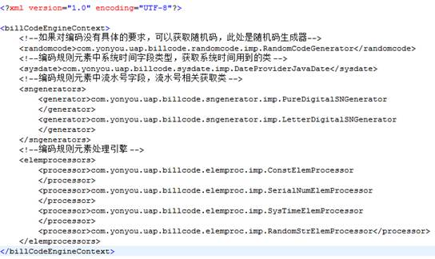

# 编码规则 #

## 功能简介 ##

在业务系统中，业务对象通常会有一个**业务对象编号**，业务对象编号作为业务对象具有业务意义的标识，一般由时间，序列号，常量等子段按照一定的规则拼接而成，这个规则我们称为'**编码规则**'，各个子段我们称之为'编码元素'。考虑如下的业务对象编号：'TT-20150615-0001',编码规则为:（常量'TT-'+yyyyMMdd类型的时间'20150615'+常量'-'+序列号'0001'),如果时间变为'20150616',序列号重新从'0001'开始流水，那么我们称此时间编码元素是'流水依据元素',所有的流水依据元素合起来叫做本编码规则的'流水依据'，同一个编码规则，可以有很多个流水依据！  

目前比较少编码规则的开源组件，网上能找到的也只是一些简单的实现类或者设计思路，要么将规则写死在代码中，缺乏通用性和灵活性，要么缺少全面的考虑，本组件提供了一种通用的编码规则解决方案。
本组件的核心是根据编码规则和一些必要信息，生成业务对象编码。组件需要的编码规则可以存储在文件中，甚至是手工构造，或者存储在数据库中。本组件提供了存储在数据库中一种实现，提供了基本的增加，删除，修改编码规则的服务方法，用户可以在此调用此服务，开发出自己的编码规则设计工具，也可以直接设计符合自己要求的编码规则数据库结构和服务，编码规则VO符合组件的模型即可（实现组件的规则接口）。  

另外，组件提供了数据库行锁和zookeeper分布式锁的支持，以应对大并发的情况下可能出现的编码重复问题。

## 工作流程 ##

1.	获取编码规则：从自己的编码规则存储位置获取编码规则。
2.	调用编码规则的服务：根据需要调用相关接口（用户在使用的过程中，可以进行再封装，将获取编码的服务和编码规则接口调用服务封装在一起，方便使用）。  

## API接口 ##

### 获取编码规则API ###

**描述**  
根据编码规则编码查询编码规则  
**请求方法**  

	com.yonyou.uap.billcode.service.BillCodeRuleMgrService.getBillCodeRuleByRuleCode(String)  

**请求方式**  
服务调用  
**请求参数说明**

<table>
  <tr>
    <th>参数字段</th>
    <th>必选</th>
	<th>类型</th>
    <th>长度限制</th>
    <th>说明</th>
  </tr>
  <tr>
    <td>rulecode</td>
    <td>True</td>
	<td>String</td>
    <td>  </td>
    <td>编码规则编号</td>
  </tr>
</table>  

**返回参数说明**  
`编码规则`  

### 删除编码规则的API ###

**描述**  
删除编码规则  
**请求方法**  

	com.yonyou.uap.billcode.service.BillCodeRuleMgrService.delBillCodeRule(String)  

**请求方式**  
服务调用  
**请求参数说明**  

<table>
  <tr>
    <th>参数字段</th>
    <th>必选</th>
	<th>类型</th>
    <th>长度限制</th>
    <th>说明</th>
  </tr>
  <tr>
    <td>rulecode</td>
    <td>True</td>
	<td>String</td>
    <td>  </td>
    <td>编码规则编号</td>
  </tr>
</table>

**返回参数说明**  
无  

### 更新和保存编码规则的API ###

**描述**  
更新或保存编码规则  
**请求方法**  

	com.yonyou.uap.billcode.service.BillCodeRuleMgrService.saveBillCodeRule(BillCodeRuleVO)  

**请求方式**  
服务调用  
**请求参数说明**  

<table>
  <tr>
    <th>参数字段</th>
    <th>必选</th>
	<th>类型</th>
    <th>长度限制</th>
    <th>说明</th>
  </tr>
  <tr>
    <td>rulevo</td>
    <td>True</td>
	<td>BillCodeRuleVO</td>
    <td>无 </td>
    <td>要保存的编码规则</td>
  </tr>
</table>

**返回参数说明**  
无

### 获取本规则所有流水依据的最大流水号的API ###

**描述**  
获取本规则所有流水依据的最大流水号，以管理最大流水号  
**请求方法**  

	com.yonyou.uap.billcode.service.BillCodeSNmgrService.getMaxSNsByRulePk(String)  

**请求方式**  
服务调用  
**请求参数说明**  

<table>
  <tr>
    <th>参数字段</th>
    <th>必选</th>
	<th>类型</th>
    <th>长度限制</th>
    <th>说明</th>
  </tr>
  <tr>
    <td>pk_billcodebase</td>
    <td>True</td>
	<td>String</td>
    <td>  </td>
    <td>编码规则主键</td>
  </tr>
</table>

**返回参数说明**  
`List<PubBcrSn>`

### 获取本规则所有返还流水号的API ###

**描述**  
实现业务日志的删除
**请求方法**  

	com.yonyou.uap.billcode.service.BillCodeSNmgrService.getRtnCodesByRulePk(String)  
**请求方式**  
服务调用  
**请求参数说明**  

<table>
  <tr>
    <th>参数字段</th>
    <th>必选</th>
	<th>类型</th>
    <th>长度限制</th>
    <th>说明</th>
  </tr>
  <tr>
    <td>pk_billcodebase</td>
    <td>True</td>
	<td>String</td>
    <td>  </td>
    <td>编码规则主键</td>
  </tr>
</table>

**返回参数说明**  
`List<PubBcrReturn>`  

### 删除返还号API ###

**描述**  
根据返还号ID删除返还号  
**请求方法**  

	com.yonyou.uap.billcode.service.BillCodeSNmgrService.delRtnCodeByID(String)  
**请求方式**  
服务调用  
**请求参数说明**  

<table>
  <tr>
    <th>参数字段</th>
    <th>必选</th>
	<th>类型</th>
    <th>长度限制</th>
    <th>说明</th>
  </tr>
  <tr>
    <td>id</td>
    <td>True</td>
	<td>long</td>
    <td>20 </td>
    <td>返还号ID</td>
  </tr>
</table>  
**返回参数说明**  
无  

### 删除最大流水号API ###

**描述**  
根据最大流水号id删除最大流水号  
**请求方法**  

	com.yonyou.uap.billcode.service.BillCodeSNmgrService.delMaxSNByID(String)  
**请求方式**  
服务调用  
**请求参数说明**  

<table>
  <tr>
    <th>参数字段</th>
    <th>必选</th>
	<th>类型</th>
    <th>长度限制</th>
    <th>说明</th>
  </tr>
  <tr>
    <td>id</td>
    <td>True</td>
	<td>long</td>
    <td>20 </td>
    <td>最大流水号ID</td>
  </tr>
</table>  
**返回参数说明**  
无 

### 更新最大流水号API ###

**描述**  
更新最大流水号  
**请求方法**  

	com.yonyou.uap.billcode.service.BillCodeSNmgrService.updateMaxSNByID(String, String)  
**请求方式**  
服务调用  
**请求参数说明**  

<table>
  <tr>
    <th>参数字段</th>
    <th>必选</th>
	<th>类型</th>
    <th>长度限制</th>
    <th>说明</th>
  </tr>
  <tr>
    <td>id</td>
    <td>True</td>
	<td>long</td>
    <td>20 </td>
    <td>最大流水号ID</td>
  </tr>
  <tr>
    <td>sn</td>
    <td>True</td>
	<td>String</td>
    <td>  </td>
    <td>最大流水号</td>
  </tr>
</table>  
**返回参数说明**  
无   

### 获取编码规则上下文API ###

**描述**  
获取编码规则上下文，业务单据号相应字段是否允许修改等信息  
**请求方法**  

	com.yonyou.uap.billcode.service.IBillCodeProvider.getBillCodeContext(BillCodeRuleVO)  
**请求方式**  
服务调用  
**请求参数说明**  

<table>
  <tr>
    <th>参数字段</th>
    <th>必选</th>
	<th>类型</th>
    <th>长度限制</th>
    <th>说明</th>
  </tr>
  <tr>
    <td>rulevo</td>
    <td>True</td>
	<td>BillCodeRuleVO</td>
    <td>  </td>
    <td>编码规则</td>
  </tr>
</table>  
**返回参数说明**  
`BillCodeContext：上下文信息`  

### 前编码预取单据号API ###

**描述**  
获取前编码  
**请求方法**  

	com.yonyou.uap.billcode.service.IBillCodeProvider.getPreBillCode(BillCodeRuleVO, BillCodeElemInfo, Object)  
**请求方式**  
服务调用   
**请求参数说明**  

<table>
  <tr>
    <th>参数字段</th>
    <th>必选</th>
	<th>类型</th>
    <th>长度限制</th>
    <th>说明</th>
  </tr>
  <tr>
    <td>rulevo</td>
    <td>True</td>
	<td>BillCodeRuleVO</td>
    <td>  </td>
    <td>编码规则</td>
  </tr>
  <tr>
    <td>externalElemInfo</td>
    <td>False</td>
	<td>BillCodeElemInfo</td>
    <td>  </td>
    <td>未体现在编码规则中的其他编码元素</td>
  </tr>
  <tr>
    <td>randomCodePara</td>
    <td>False</td>
	<td>Object</td>
    <td>  </td>
    <td>自定义对象，不走编码规则，生成随机码时使用</td>
  </tr>
</table>  
**返回参数说明**  
`单据号`  

### 提交预取的前编码单据编码API ###

**描述**  
提交前编码  
**请求方法**  

	com.yonyou.uap.billcode.service.IBillCodeProvider.commitPreBillCode(BillCodeRuleVO, BillCodeElemInfo, String)  
**请求方式**  
服务调用   
**请求参数说明**  

<table>
  <tr>
    <th>参数字段</th>
    <th>必选</th>
	<th>类型</th>
    <th>长度限制</th>
    <th>说明</th>
  </tr>
  <tr>
    <td>rulevo</td>
    <td>True</td>
	<td>BillCodeRuleVO</td>
    <td>20 </td>
    <td>编码规则</td>
  </tr>
  <tr>
    <td>billvo</td>
    <td>False</td>
	<td>BillCodeElemInfo</td>
    <td>  </td>
    <td>未体现在编码规则中的其他编码元素</td>
  </tr>
  <tr>
    <td>billCode</td>
    <td>True</td>
	<td>String</td>
    <td>  </td>
    <td>要提交的编码</td>
  </tr>
</table>  
**返回参数说明**  
无  

### 回滚预取单据号API ###

**描述**  
回滚前编码  
**请求方法**  

	com.yonyou.uap.billcode.service.IBillCodeProvider.rollbackPreBillCode(BillCodeRuleVO, BillCodeElemInfo, String)  
**请求方式**  
服务调用  
**请求参数说明**  

<table>
  <tr>
    <th>参数字段</th>
    <th>必选</th>
	<th>类型</th>
    <th>长度限制</th>
    <th>说明</th>
  </tr>
  <tr>
    <td>rulevo</td>
    <td>True</td>
	<td>BillCodeRuleVO</td>
    <td>  </td>
    <td>编码规则</td>
  </tr>
  <tr>
    <td>billvo</td>
    <td>False</td>
	<td>BillCodeElemInfo</td>
    <td>  </td>
    <td>未体现在编码规则中的其他编码元素</td>
  </tr>
  <tr>
    <td>billCode</td>
    <td>True</td>
	<td>String</td>
    <td>  </td>
    <td>要提交的编码</td>
  </tr>
</table>  

**返回参数说明**  
无	

### 批量返回num个单据号API ###

**描述**  
获取num个后编码  
**请求方法**  
	com.yonyou.uap.billcode.service.IBillCodeProvider.getBatchBillCodes(BillCodeRuleVO, BillCodeBillVO, BillCodeElemInfo, Object, int)
**请求方式**  
服务调用  
**请求参数说明**  

<table>
  <tr>
    <th>参数字段</th>
    <th>必选</th>
	<th>类型</th>
    <th>长度限制</th>
    <th>说明</th>
  </tr>
  <tr>
    <td>rulevo</td>
    <td>True</td>
	<td>BillCodeRuleVO</td>
    <td>  </td>
    <td>编码规则</td>
  </tr>
  <tr>
    <td>rulevo</td>
    <td>False</td>
	<td>BillCodeBillVO</td>
    <td>  </td>
    <td>业务对象VO</td>
  </tr>
  <tr>
    <td>billvo</td>
    <td>False</td>
	<td>BillCodeElemInfo</td>
    <td>  </td>
    <td>未体现在编码规则中的其他编码元素</td>
  </tr>
  <tr>
    <td>randomCodePara</td>
    <td>False</td>
	<td>Object</td>
    <td>  </td>
    <td>自定义对象，不走编码规则，生成随机码时使用</td>
  </tr>
  <tr>
    <td>num</td>
    <td>True</td>
	<td>int</td>
    <td>  </td>
    <td>要取的编号数量</td>
  </tr>
</table>  

**返回参数说明**   
`List<String>,一批单据号`  

### 获取一个生成的单据号API ###

**描述**  
获取一个后编码  
**请求方法**  
	com.yonyou.uap.billcode.service.IBillCodeProvider.getBillCode(BillCodeRuleVO, BillCodeBillVO, BillCodeElemInfo, Object)  
**请求方式**  
服务调用  
**请求参数说明**  

<table>
  <tr>
    <th>参数字段</th>
    <th>必选</th>
	<th>类型</th>
    <th>长度限制</th>
    <th>说明</th>
  </tr>
  <tr>
    <td>rulevo</td>
    <td>True</td>
	<td>BillCodeRuleVO</td>
    <td>  </td>
    <td>编码规则</td>
  </tr>
  <tr>
    <td>rulevo</td>
    <td>False</td>
	<td>BillCodeBillVO</td>
    <td>  </td>
    <td>业务对象VO</td>
  </tr>
  <tr>
    <td>billvo</td>
    <td>False</td>
	<td>BillCodeElemInfo</td>
    <td>  </td>
    <td>未体现在编码规则中的其他编码元素</td>
  </tr>
  <tr>
    <td>randomCodePara</td>
    <td>False</td>
	<td>Object</td>
    <td>  </td>
    <td>自定义对象，不走编码规则，生成随机码时使用</td>
  </tr>
</table>  

**返回参数说明**  
`单据号`  

### 删除单据时回退单据号API ###

**描述**  
回退单据号  
**请求方法**  

	com.yonyou.uap.billcode.service.IBillCodeProvider.returnBillCode(BillCodeRuleVO, BillCodeBillVO, BillCodeElemInfo, String)  
**请求方式**  
服务调用  
**请求参数说明**  

<table>
  <tr>
    <th>参数字段</th>
    <th>必选</th>
	<th>类型</th>
    <th>长度限制</th>
    <th>说明</th>
  </tr>
  <tr>
    <td>rulevo</td>
    <td>True</td>
	<td>BillCodeRuleVO</td>
    <td>  </td>
    <td>编码规则</td>
  </tr>
  <tr>
    <td>rulevo</td>
    <td>False</td>
	<td>BillCodeBillVO</td>
    <td>  </td>
    <td>业务对象VO</td>
  </tr>
  <tr>
    <td>billvo</td>
    <td>False</td>
	<td>BillCodeElemInfo</td>
    <td>  </td>
    <td>未体现在编码规则中的其他编码元素</td>
  </tr>
  <tr>
    <td>billCode</td>
    <td>True</td>
	<td>String</td>
    <td>  </td>
    <td>要回退的单据号</td>
  </tr>
</table>  

**返回参数说明**  
无  

### 删除回退的单据号API ###

**描述**  
将已经回退的单据号丢弃  
**请求方法**  

	com.yonyou.uap.billcode.service.IBillCodeProvider.DeleteRetrunedBillCode(BillCodeRuleVO, BillCodeElemInfo, String)  
**请求方式**  
服务调用  
**请求参数说明**  

<table>
  <tr>
    <th>   参数字段   </th>
    <th>   必选   </th>
    <th>   类型   </th>
    <th>   长度限制   </th>
    <th>   说明   </th>
  </tr>
  <tr>
    <td>   rulevo   </td>
    <td>   True   </td>
    <td>   BillCodeRuleVO   </td>
    <td></td>
    <td>   编码规则   </td>
  </tr>
  <tr>
    <td>   billvo   </td>
    <td>   False   </td>
    <td>   BillCodeElemInfo   </td>
    <td></td>
    <td>   未体现在编码规则中的其他编码元素   </td>
  </tr>
  <tr>
    <td>   billCode   </td>
    <td>   True   </td>
    <td>   String   </td>
    <td></td>
    <td>   已回退的单据号   </td>
  </tr>
</table>  

**返回参数说明**  
无  

### 删除已经使用的单据号API ###

**描述**  
单据号已经使用，但是在编码规则还提供，这种情况下删除它  
**请求方法**  

	com.yonyou.uap.billcode.service.IBillCodeProvider.AbandenBillCode(BillCodeRuleVO, BillCodeBillVO, BillCodeElemInfo, String)  
**请求方式**  
服务调用  
**请求参数说明**  

<table>
  <tr>
    <th>   参数字段   </th>
    <th>   必选   </th>
    <th>   类型   </th>
    <th>   长度限制   </th>
    <th>   说明   </th>
  </tr>
  <tr>
    <td>   rulevo   </td>
    <td>   True   </td>
    <td>   BillCodeRuleVO   </td>
    <td></td>
    <td>   编码规则   </td>
  </tr>
  <tr>
    <td>   rulevo   </td>
    <td>   False   </td>
    <td>   BillCodeBillVO   </td>
    <td></td>
    <td>   业务对象VO   </td>
  </tr>
  <tr>
    <td>   billvo   </td>
    <td>   False   </td>
    <td>   BillCodeElemInfo   </td>
    <td></td>
    <td>   未体现在编码规则中的其他编码元素   </td>
  </tr>
  <tr>
    <td>   billCode   </td>
    <td>   True   </td>
    <td>   String   </td>
    <td></td>
    <td>   要丢弃的单据号   </td>
  </tr>
</table>  

**返回参数说明**  
无   

## 开发步骤 ##

可参见一个具体的示例工程：

    <!-- 编码规则组件 -->
    <dependency>
      <groupId>com.yonyou.iuap.example</groupId>
      <artifactId>example-iuap-billcode</artifactId>
      <version>1.0.1-SNAPSHOT</version>
      <type>war</type>
    </dependency>

### 引入组件jar包 ###

如果项目是maven工程，可以直接使用如下依赖：

		<!-- 编码规则组件 -->
		<dependency>
			<groupId>com.yonyou.iuap</groupId>
			<artifactId>iuap-billcode</artifactId>
			<version>1.0.1-SNAPSHOT</version>
		</dependency>  

### 执行数据库脚本 ###

（for mysql）

	SET FOREIGN_KEY_CHECKS=0;
	
	-- ----------------------------
	-- Table structure for pub_bcr_elem
	-- ----------------------------
	DROP TABLE IF EXISTS `pub_bcr_elem`;
	CREATE TABLE `pub_bcr_elem` (
	  `pk_billcodeelem` decimal(10,0) NOT NULL,
	  `pk_billcodebase` varchar(40) NOT NULL,
	  `elemtype` smallint(6) DEFAULT NULL,
	  `elemvalue` varchar(100) DEFAULT NULL,
	  `elemlenth` smallint(6) DEFAULT NULL,
	  `isrefer` smallint(6) DEFAULT NULL,
	  `eorder` smallint(6) DEFAULT NULL,
	  `pk_billcodeentity` varchar(20) DEFAULT NULL,
	  `fillstyle` smallint(6) DEFAULT NULL,
	  `fillsign` varchar(4) DEFAULT NULL,
	  `createdate` timestamp NOT NULL DEFAULT '0000-00-00 00:00:00',
	  `datedisplayformat` varchar(16) DEFAULT NULL,
	  PRIMARY KEY (`pk_billcodeelem`)
	) ENGINE=InnoDB DEFAULT CHARSET=utf8;
	
	-- ----------------------------
	-- Table structure for pub_bcr_precode
	-- ----------------------------
	DROP TABLE IF EXISTS `pub_bcr_precode`;

	CREATE TABLE `pub_bcr_precode` (
	  `pk_precode` decimal(10,0) NOT NULL,
	  `pk_rulebase` varchar(40) NOT NULL,
	  `markstr` varchar(100) DEFAULT NULL,
	  `billcode` varchar(100) DEFAULT NULL,
	  `lastsn` varchar(10) DEFAULT NULL,
	  `markstrdesc` varchar(100) DEFAULT NULL,
	  PRIMARY KEY (`pk_precode`)
	) ENGINE=InnoDB DEFAULT CHARSET=utf8;
	
	-- ----------------------------
	-- Table structure for pub_bcr_return
	-- ----------------------------
	DROP TABLE IF EXISTS `pub_bcr_return`;
	CREATE TABLE `pub_bcr_return` (
	  `pk_billcodertn` decimal(10,0) NOT NULL,
	  `pk_billcodebase` varchar(40) NOT NULL,
	  `markstr` varchar(100) DEFAULT NULL,
	  `rtnsn` varchar(10) DEFAULT NULL,
	  `markstrdesc` varchar(100) DEFAULT NULL,
	  PRIMARY KEY (`pk_billcodertn`)
	) ENGINE=InnoDB DEFAULT CHARSET=utf8;
	
	-- ----------------------------
	-- Records of pub_bcr_return
	-- ----------------------------
	
	-- ----------------------------
	-- Table structure for pub_bcr_rulebase
	-- ----------------------------
	DROP TABLE IF EXISTS `pub_bcr_rulebase`;
	CREATE TABLE `pub_bcr_rulebase` (
	  `pk_billcodebase` varchar(40) NOT NULL,
	  `rulecode` varchar(40) DEFAULT NULL,
	  `rulename` varchar(300) DEFAULT NULL,
	  `codemode` varchar(10) DEFAULT NULL,
	  `iseditable` char(1) DEFAULT NULL,
	  `isautofill` char(1) DEFAULT NULL,
	  `format` varchar(20) DEFAULT NULL,
	  `isdefault` char(1) DEFAULT NULL,
	  `isused` char(1) DEFAULT NULL,
	  `islenvar` char(1) DEFAULT NULL,
	  `isgetpk` char(1) DEFAULT NULL,
	  `createdate` timestamp NOT NULL DEFAULT '0000-00-00 00:00:00',
	`renterid` varchar(40) DEFAULT NULL,
	  `productid` varchar(40) DEFAULT NULL,
	  PRIMARY KEY (`pk_billcodebase`)
	) ENGINE=InnoDB DEFAULT CHARSET=utf8;
	
	-- ----------------------------
	-- Table structure for pub_bcr_sn
	-- ----------------------------
	DROP TABLE IF EXISTS `pub_bcr_sn`;
	CREATE TABLE `pub_bcr_sn` (
	  `pk_billcodesn` varchar(40) NOT NULL,
	  `pk_billcodebase` varchar(40) NOT NULL,
	  `markstr` varchar(100) DEFAULT NULL,
	  `lastsn` varchar(10) DEFAULT NULL,
	  `markstrdesc` varchar(100) DEFAULT NULL,
	  PRIMARY KEY (`pk_billcodesn`),
	  KEY `idx_pub_bcr_sn` (`pk_billcodebase`,`markstr`)
	) ENGINE=InnoDB DEFAULT CHARSET=utf8;  

### spring集成 ###

在Spring的配置文件中添加如下配置（或者是将以下内容放在一个单独的配置文件中，在工程启动时加载此文件）：

      <?xml version="1.0" encoding="UTF-8"?>
    <beans xmlns="http://www.springframework.org/schema/beans"
      xmlns:xsi="http://www.w3.org/2001/XMLSchema-instance" xmlns:context="http://www.springframework.org/schema/context"
      xmlns:aop="http://www.springframework.org/schema/aop" xmlns:tx="http://www.springframework.org/schema/tx"
      xsi:schemaLocation="
        http://www.springframework.org/schema/beans http://www.springframework.org/schema/beans/spring-beans.xsd
        http://www.springframework.org/schema/context http://www.springframework.org/schema/context/spring-context.xsd
        http://www.springframework.org/schema/tx http://www.springframework.org/schema/tx/spring-tx.xsd"
      default-lazy-init="true">

      <description>Spring公共配置</description>

      <!-- 使用annotation 自动注册bean, 并保证@Required、@Autowired的属性被注入，排除@Controller注解 -->
      <context:annotation-config />
      <context:component-scan base-package="com.yonyou.uap.billcode">
        <context:exclude-filter type="annotation"
          expression="org.springframework.stereotype.Controller" />
      </context:component-scan>

      <!-- Mybatis配置 -->
      <bean id="sqlSessionFactory" class="org.mybatis.spring.SqlSessionFactoryBean">
        <property name="dataSource" ref="dataSource" />
        <property name="mapperLocations" value="classpath:mybatis-mappers/*.xml" />
      </bean>

      <!-- 扫描DAO接口 -->
      <bean class="org.mybatis.spring.mapper.MapperScannerConfigurer">
        <property name="basePackage" value="com.yonyou.uap.billcode.repository" />
        <property name="sqlSessionFactoryBeanName" value="sqlSessionFactory" />
      </bean>

      <!-- 事物管理 -->
      <!-- 开启事物管理注解 -->
      <!-- <tx:annotation-driven transaction-manager="transactionManager" -->
      <!-- proxy-target-class="true" /> -->
      <!-- <bean id="transactionManager" -->
      <!-- class="org.springframework.jdbc.datasource.DataSourceTransactionManager"> -->
      <!-- <property name="dataSource" ref="dataSource" /> -->
      <!-- </bean> -->

      <!-- Spring jdbcTemplate -->
      <bean id="jdbcTemplate" class="org.springframework.jdbc.core.JdbcTemplate"
        abstract="false" lazy-init="false" autowire="default">
        <property name="dataSource">
          <ref bean="dataSource" />
        </property>
      </bean>

      <!-- 注入MySQL数据库行锁 -->
      <bean id="mySqlRowLock" class="com.yonyou.uap.billcode.lock.MySqlRowLock" />

      <!-- 注入zookeeper分布式锁 -->
    <!--  <bean id="zkLock" class="com.yonyou.uap.billcode.lock.ZKLock" /> -->

      <!-- 读取zookeeper分布式锁属性配置 -->
    <!--  <bean id="billcode-propertyConfigurer" -->
    <!--    class="org.springframework.beans.factory.config.PropertyPlaceholderConfigurer"> -->
    <!--    <property name="locations"> -->
    <!--      <list> -->
    <!--        <value>classpath:application.properties</value> -->
    <!--      </list> -->
    <!--    </property> -->
    <!--    <property name="systemPropertiesMode" -->
    <!--      value="#{T(org.springframework.beans.factory.config.PropertyPlaceholderConfigurer).SYSTEM_PROPERTIES_MODE_OVERRIDE}" /> -->
    <!--  </bean> -->

      <!-- zookeeper分布式锁配置加载 -->
    <!--  <bean id="zkPoolConfig" class="org.apache.commons.pool2.impl.GenericObjectPoolConfig"> -->
    <!--    <property name="maxTotal" value="100" /> -->
    <!--    <property name="maxIdle" value="100" /> -->
    <!--    <property name="maxWaitMillis" value="60000" /> -->

    <!--    <!--timeBetweenEvictionRunsMillis毫秒检查一次连接池中空闲的连接,把空闲时间超过minEvictableIdleTimeMillis毫秒的连接断开,直到连接池中的连接数到minIdle为止 -->
    <!--    <property name="timeBetweenEvictionRunsMillis" value="60000" /> -->
    <!--    <property name="numTestsPerEvictionRun" value="-1" /> -->
    <!--    <property name="minEvictableIdleTimeMillis" value="30000" /> -->
    <!--  </bean> -->
    </beans>

### 使用API接口完成请求 ###

按照API接口 要求，调用对应API，管理编码规则或者生成编码

### 扩展机制 ###

编码规则组件支持对编码规则元素的自定义替换，通过上下文配置文件来实现自定义的编码规则组件设置（位于jar包'com/yonyou/uap/billcode/BillCodeEngineContext.xml'），如下

    

支持以下几种扩展方式：  
**一、自定义编码元素处理器**  
1. 复制本jar包中  `'com/yonyou/uap/billcode/BillCodeEngineContext.xml'到任意'类路径''A'`
2. 实现编码元素处理器接口：  `'com.yonyou.uap.billcode.elemproc.itf.IElemProcessor'`  
3. 在编码规则引擎上下文配置文件（复制的`'BillCodeEngineContext.xml'`）中`'添加'`或`'替换'`元素处理器

**二、自定义序列号编码元素的序列号生成方式**  
1.同上  
2.实现编码元素处理器接口：      `'com.yonyou.uap.billcode.sngenerator.ISNGenerator'`  
3.在编码规则引擎上下文配置文件（复制的`'BillCodeEngineContext.xml'`）中`'添加'`或`'替换'`序列号生成器

**三、自定义系统时间编码元素的时间获取方式**  
1.同上  
2.实现编码元素处理器接口：      `'com.yonyou.uap.billcode.sysdate.ISysDateProvider'`  
3.在编码规则引擎上下文配置文件（复制的`'BillCodeEngineContext.xml'`）中`'替换'`时间获取方式

**四、自定义唯一性随机编码生成类**（不需要业务对象编号有业务意义时，此类提供唯一性的无业务意义的编码）  
1.同上  
2.实现编码元素处理器接口：  `'com.yonyou.uap.billcode.randomcode.IRandomCodeGenerator'`  
3.在编码规则引擎上下文配置文件（复制的`'BillCodeEngineContext.xml'`）中`'替换'`随机编码生成类

注意：自定义编码规则组件的上下文，需要在程序启动时调用`com.yonyou.uap.billcode.BillCodeEngineContext.getInstance('A')`将引擎上下文A载入内存（否则将走默认的的上下文配置` 'com/yonyou/uap/billcode/BillCodeEngineContext.xml'`）

