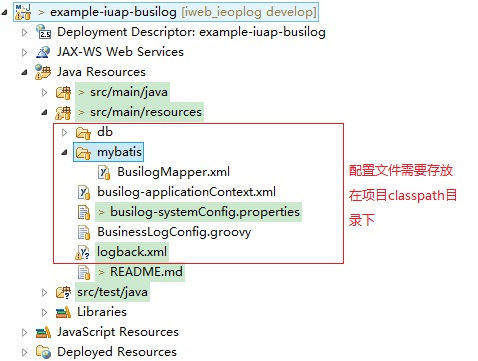

# 业务日志组件概述 #
## 业务需求 ##
一个现实场景：  
我们对于记录（也叫业务日志）的操作，很多时候是这样编码的：  

		// 创建一家公司
		public Organization createCompany(CompanyDto dto) {
			// 执行业务方法
			companyDAO.save(dto);
			// 记录日志
			LogDAO.save(new BusinessLog(userDAO.getSubjectName() 
					+ "，创建子公司：" + dto.getCompanyName()));
		}
最后结果就是：  
1. 新公司的创建  
2. 业务日志：张三，创建子公司：广州子公司  
咋一看这样写没有什么问题，但是其中有一个最大的问题：**业务逻辑和日志逻辑的混在一起。**
如果业务逻辑和日志逻辑足够复杂的时候，你可以想像你的代码就如同意大利面一样。以后维护的时候，就会变成人间地狱！  
##解决方案##
业务日志组件可以解决此问题：**业务逻辑和日志逻辑“分离”！**  
业务日志组件的目标  
1. 日志的记录对业务方法尽量**无侵入**  
2. 尽最大可能不影响业务方法的性能  
3. 系统及日志模板配置简单  
4. 日志持久化(也称为导出日志)方式灵活  
5. 修改日志模板而不需要重启应用  
事实上，要达到真正的无侵入是不可能的，业务日志组件对业务方法的侵入只不过是要在业务方法上加上一个注解。

# 整体设计 #
## 依赖环境 ##
组件采用Maven进行编译和打包发布，外提供的依赖方式如下：

		<dependency>
			<groupId>com.yonyou.iuap</groupId>
			<artifactId>iuap-busilog</artifactId>
			<version>${iuap.modules.version}</version>
		</dependency>

${iuap.modules.version} 为平台在maven私服上发布的组件的version。
## 功能结构 ##
业务与日志分离的原理是采用Spring AOP的拦截机制进行。
## 流程说明 ##
组件对使用@BusilogConfig("业务方法别名")注解的业务方法，通过Spring AOP进行拦截。当Spring察觉到被注解的业务方法被调用的时候，即可对此方法进行日志记录。  
其中，本组件通过Groovy脚本配置日志模版，定义拦截的业务方法的参数。日志注解@BusilogConfig("业务方法别名")用来给需要日志记录的方法链接日志模版，不同的业务方法可以有不同的日志模板。同时对于日志内容的输出也是可配置的，用户可以自定义来实现对业务日志的持久化操作。  

# 使用说明 #
## 组件包说明 ##
iuap-busilog组件提供采用Spring AOP拦截器机制，最终做到将记录日志与具体的业务方法分离开，日志模板采用groovy脚本配置的方式，拦截业务方法参数等，日志的输出用户可自行定义，也可使用已经提供的方式，输出到控制台或者输出到数据库中。
##组件配置##
**1:工程中引入对iuap-busilog组件的依赖**

		<dependency>
			<groupId>com.yonyou.iuap</groupId>
			<artifactId>iuap-busilog</artifactId>
			<version>${iuap.modules.version}</version>
		</dependency>

${iuap.modules.version} 为平台在maven私服上发布的组件的version。

**2:iuap-auth配置文件修改**

	从示例工程中拷贝并修改配置文件。修改方法参见下面开发步骤的介绍。	
	busilog-applicationContext.xml
	busilog-systemConfig.properties

**3:使用数据库时需要拷贝的文件**

	拷贝src\main\resources\mybatis目录到busilog-applicationContext.xml同级目录
	同时增加配置文件中
	busilog-applicationContext.xml
	busilog-systemConfig.properties
	有关数据库的配置，配置方法参见下面开发步骤的介绍。	

## 工程样例 ##

maven私服上发布的有示例工程，用户可将示例工程下载下来，导入到工作区。示例工程中有较为完整的对iuap-busilog组件的使用示例代码。

## 开发步骤 ##
1. 引入组件jar包  
如果项目是maven工程，直接使用如下依赖：  
		<dependency>
			<groupId>com.yonyou.iuap</groupId>
			<artifactId>iuap-busilog</artifactId>
			<version>${iuap.modules.version}</version>
		</dependency>

${iuap.modules.version} 为平台在maven私服上发布的组件的version。

2. 执行数据库脚本  

依次执行examples项目下sql目录中的dll.sql、index.sql、dml.sql建立数据库并初始化数据。

3. spring集成（配置文件参见组件的示例工程example-iuap-busilog）  
需要添加的配置文件及存放目录示意图：  

其中：  
 - BusinessLogConfig.groovy：日志输出模板，配置及意义，见**扩展机制**  
 - busilog-applicationContext.xml： 
  

		    
		    <!-- 将需要进行日志记录的业务类注入到Spring中进行管理 -->
		    <bean id="exampleService" class="com.yonyou.uap.busiog.service.ExampleService"></bean> 
该文件无须修改，需要修改的配置均放在busilog-systemConfig.properties文件中。文件主要内容包括：    
     1. 日志拦截器的注入。  
     2. AOP切入点的定义。
     3. 一步线程池的配置。
     4. mybatis数据源配置。
 - busilog-systemConfig.properties：配置组件相关参数

			#日志开关
			yonyou.businesslog.enable=true
			#指定拦截的业务方法，使用Spring的切入点n写法
			pointcut=execution(public * busilog.*..*Ser*.*(..))
			#pointcut=execution(public com.yonyou.busilog.BusinessService.*(..))
			#指定日志导出器IBusiLogWriter接口的实现。默认有：BusiLogConsoleWriter
			#businessLogExporter=com.yonyou.uap.ieop.busilog.writer.BusiLogConsoleWriter
			businessLogExporter=com.yonyou.uap.busilog.BusiLogDBWriter
			#<property name="threadPoolTaskExecutor" ref="threadPoolTaskExecutor" />
			
			#线程池配置
			#核心线程数
			log.threadPool.corePoolSize=2
			#最大线程数
			log.threadPool.maxPoolSize=5
			#队列最大长度
			log.threadPool.queueCapacity=8
			#线程池维护线程所允许的空闲时间
			log.threadPool.keepAliveSeconds=100
			#线程池对拒绝任务(无线程可用)的处理策略log.threadPool.rejectedExecutionHandler=java.util.concurrent.ThreadPoolExecutor$CallerRunsPolicy
			#如果指定日志输出到数据库，还需要对数据库进行配置
			#数据库连接配置
			driver=com.mysql.jdbc.Driver
			url=jdbc:mysql://20.12.24.214:3306/busilog_saas
			busilog_username=root
			busilog_password=root
			#定义初始连接数
			initialSize=100
			#定义最大连接数
			maxActive=500
			#定义最大空闲
			maxIdle=0
			#定义最小空闲
			minIdle=10
			#定义最长等待时间
			maxWait=90000

 - BusilogMapper.xml：配置数据库与实体的对应关系以及对实体操作的配置文件。无须修改。

4.	为业务方法加上annotation  
这个别名必须符合Java方法名的命名规则，给业务方法加别名的目的是为了方便业务方法与日志模板之间的映射。  

		package com.yonyou.uap.busiog.service;

		import com.yonyou.uap.ieop.busilog.config.annotation.BusiLogConfig;

		public class ExampleService {
	
			@BusiLogConfig("ExampleService_save")
			public void save(String param0) {
				System.out.println(param0);
			}
			@BusiLogConfig("ExampleService_delete")
			public void delete(String param0){
				System.out.println(param0);
		
			}
		}

## 常用接口 ##
### 删除指定的日志记录 ###
**描述**  
实现业务日志的删除。  
如果用户将业务日志输出到数据库中，此接口可以实现对指定ID的记录进行删除。  
**请求方法**  
com.yonyou.uap.busilog.service.BusiLogService.delete(String)  
**请求方式**  
服务调用  
**请求参数说明**  
<table>
  <tr>
    <th>   参数字段   </th>
    <th>   必选   </th>
    <th>   类型   </th>
    <th>   长度限制   </th>
    <th>   说明   </th>
  </tr>
  <tr>
    <td>   busilogid   </td>
    <td>   True   </td>
    <td>   String   </td>
    <td>   40   </td>
    <td>   业务日志ID   </td>
  </tr>
</table>
**返回参数说明**  
int 0表示失败，1表示成功

### 业务日志查询API ###
**描述**  
查询所有的业务日志。  
如果用户将业务日志输出到数据库中，此接口可以查询所有的业务日志记录。  
**请求方法**  
com.yonyou.uap.busilog.service.BusiLogService.findAll()  
**请求方式**  
服务调用  
**请求参数说明**  
无  
**返回参数说明**
List<Busilog>

## 扩展机制 ##
### 日志模板 ###
是一个groovy文件，在这个groovy文件中，你可以写Java代码，也可以写groovy代码。这样，就可以达到最大的灵活；同时，配置起来又不复杂。目前我们支持两种配置方式：单文件配置方式和多文件配置方式。  

**单文件配置：**  

1. 在类路径下加入'BusinessLogConfig.groovy'   
2. 文件模板为：   

		class BusinesslogConfig {
		    //必须
		    def context
		
		    //InvoiceApplicationImpl_addInvoice为业务方法别名
		    def InvoiceApplicationImpl_addInvoice() {
		        "日志内容"
		    }
		
		    def ProjectApplicationImpl_findSomeProjects() {
		        [category:"项目操作", logs:"查找项目"]
		    }
		
		}
3. 配置模板实际上是一个Groovy类，你可以在类中定义任何方法。如果方法为某个业务方法的别名（使用'@BusilogConfig'注解）那么，我们就认为它是一个业务日志方法。它的返回值（return或者放在方法最后一行的变量）将会被Set到'com.yonyou.uap.ieop.busilog.BusinessLog'的实例中。   

日志方法返回值有两种情况：  
1. 只返回一个String类型的日志文本；  
2. 返回一个Map，这个Map包括Key为'category'的日志分类及日志文本。  

在类中，还可以使用Groovy定义变量的方法：'def context' 定义一个变量。这个变量实际上是一个Map。 Map中存储的是业务方法的 '返回值'、'参数'。如果需要，你可以存储任何你需要的数据。你可以从这个context中取出你需要的内容，填充到你的日志中。至于如何取context中的内容，请看：  
*在日志模板中取'context'的内容：*
<table>
  <tr>
    <th>key</th>
    <th>value</th>
  </tr>
  <tr>
    <td>_methodReturn</td>
    <td>业务方法返回值</td>
  </tr>
  <tr>
    <td>_param</td>
    <td>业务方法的参数, _param0代表第一个参数 _param1代表第二个参数，依此类推</td>
  </tr>
  <tr>
    <td>_executeError</td>
    <td>业务方法执行失败的异常信息</td>
  </tr>
  <tr>
    <td>_businessMethod</td>
    <td>业务方法</td>
  </tr>
  <tr>
    <td>_user</td>
    <td>业务方法操作人</td>
  </tr>
  <tr>
    <td>_time</td>
    <td>业务方法操作时间</td>
  </tr>
  <tr>
    <td>_ip</td>
    <td>ip地址</td>
  </tr>
</table>

**多文件配置：**  

当业务系统非常复杂的时候，一个日志配置文件是不足够的。我们提供多文件的配置方式  

1. 在类路径中加入'businessLogConfig'文件夹。  
2. 在该文件夹中加入日志配置文件，文件名任意，只要符合Groovy类文件的命名规范即可。  
注：多文件配置方式与单文件配置方式不兼容。在此业务日志组件中，单文件配置方式优先。businessLogConfig'文件夹中的所有以'.groovy'结尾的文件都将被作为日志配置文件。

### 数据库存储 ###
业务日志组件提供了日志的数据库存储方式，支持替换为自定义的日志存储方式  
步骤如下：  

1. 开发人员通过实现接口com.yonyou.uap.ieop.busilog.writer.itf.
IBusiLogWriter  
2. 在spring的properties文件中，将如下属性替换为自定义的实现类  
businessLogExporter=com.yonyou.uap.ieop.busilog.writer.BusiLogConsoleWriter  

