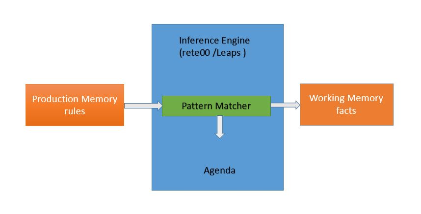

# 规则引擎概述 #

## 业务需求 ##

在软件系统中，应市场要求业务规则经常变化，为了快速低成本的更新系统
适应业务规则，同时不需修改程序代码，只需将规则改变即可满足要求。规则引擎正式在这样的背景下产生，它是一种嵌套在应用程序中的组件，实现将业务规则从应用程序代码中分离出来。使用规则引擎可以将复杂多变的规则从硬编码中解放出来，以规则脚本的形式存放在文件中，使得规则的变更不需要修正代码重启机器就可以立即在线上环境生效。

##解决方案##

Drools是一个基于java的开源规则引擎，可通过规则文件的配置实现动态的业务需求，比如某购物商场中根据消费积分的多少来划分用户等级，随着业务变更，划分用户等级的消费积分的多少会有所变更，以前是1000积分就是银牌会员，现在要消费5000积分才能成为银牌会员。使用Drools只需修改规则文件，即可实现业务变化，无须更改代码。
Drools通过普通的java bean（专业术语称Fact）与规则进行相互传参和传值，规则文件中的规则可以对当前的对象进行任何的读写操作，调用该对象提供的方法等。

##功能说明##

1.	通过规则文件的配置实现动态的业务变更；
2.	支持规则定义与管理；
3.	支持规则库；
4.	根据事实数据和规则定义推算出结论；
6.	支持规则扩展；

# 整体设计 #

## 依赖环境 ##

直接从maven仓库中下载依赖文件如下：
```
		<dependency>
			<groupId>org.drools</groupId>
			<artifactId>drools-core</artifactId>
			<version>5.5.0.Final</version>
		</dependency>

		<dependency>
			<groupId>org.drools</groupId>
			<artifactId>drools-compiler</artifactId>
			<version>5.5.0.Final</version>
		</dependency>
		<dependency>
			<groupId>org.drools</groupId>
			<artifactId>knowledge-api</artifactId>
			<version>5.5.0.Final</version>
		</dependency>
		<dependency>
			<groupId>org.drools</groupId>
			<artifactId>knowledge-internal-api</artifactId>
			<version>5.5.0.Final</version>
		</dependency>
```

## 功能结构 ##



**原理介绍**

- rules 规则集合
- pattern Matcher 匹配规则处理
- facts 需要处理的事实的集合
- Agenda 执行推理算法得出结论

## 流程说明 ##

- 存放在 Production Memory（规则库）中的规则插入到工作内存中。
- 规则引擎把被存在 Working Memory（工作内存）中的facts（事实）和规则库里的模式进行匹配
- 匹配成功的规则再由 Agenda 负责具体执行推理算法中被激发规则的结论部分。

# 使用说明 #

## 组件包说明 ##

直接使用drools组件库，具体说明参见drools官网。

##组件配置##

直接从maven仓库中下载依赖文件。

## 工程样例 ##

结合示例工程（根据消费积分的多少来划分用户等级）的代码介绍Drools的基本使用方法。

## 开发步骤 ##

### 定义实体类 ###

参见例子工程中的com.toolkit.drools.bean.User类，包括属性和一些set get方法：
```
		/** 
		*用户积分
	 	*/
		private long credit;
		/**
		*用户等级
	 	*/
		private int rank;
```

### 定义drl规则文件 ###

参见例子工程rank-rule.drl文件：
```
	package com.sample
	import com.toolkit.drools.bean.User;
	// 钻石会员,积分大于50000
	rule "RANK_DIAMOND"
	no-loop  true
	lock-on-active true
	activation-group "user rank"
	
    when
        $user : User( credit >= 50000 ) 
    then
		$user.setRank(99);	
	end
```

规则文件包括三部分，package，import，rule。

1. package 
规则文件的逻辑区分，必须定义且放在规则文件第一行。
2. import  
导入规则文件需要使用到的外部变量，可以是一个类，也可以是类中的某一个可访问的静态方法 	
3. rule
定义一个规则，包括三部分：  
 - 属性部分：规则名称，是否重复执行，规则触发的优先级、组设置，过期时间、生效时间等。
 - 条件部分：定义当前规则的条件，when...... then......。
 - 结果部分： 当前规则条件满足后执行的操作，可以直接调用Fact对象的方法来操作应用。
 
### 定义外部调用接口和实现 ###

外部接口和实现中调用Drools规则引擎将drl配置文件和Fact实体解析出来，并提供给java程序直接调用的功能方法。
参见示例工程中
com.toolkit.drools.UserRule
com.toolkit.drools.UserRuleImpl类中的public int getUserRank(long credit)方法。

## 常用接口 ##

参见drools官网文档。

  
