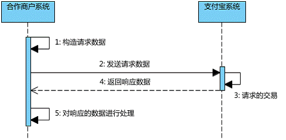
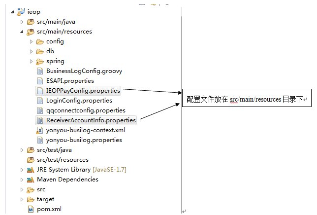

# 支付集成组件概述 #

## 功能简介 ##

通过此组件提供的REST服务，用户可以通过支付宝即时转账、扫码支付、网银支付，微信扫码，畅捷支付渠道来完成支付。   
支持的支付渠道如下:  

## 功能说明 ##

1. 支付宝快捷支付功能：付款方需要登录支付宝账户，通过支付宝即时转账功能，来完成支付。

2. 支付宝扫码支付功能：付款方通过支付宝客户端，扫描支付页面显示的二维码完成支付。

3. 支付宝网银支付功能： 付款方通过登录支付宝支持的网上银行完成支付。  

4. 支付宝担保支付功能：付款方可以选择担保支付的功能来完成网上购物。 

5. 微信扫码支付功能：付款方通过微信移动客户端，扫描支付页面的二维码来完成支付。

6. 畅捷支付功能：付款方选择畅捷支付方式之后，由畅捷支付引导用户完成支付。

7. 支持调用支付服务前检查

8. 支持支付宝支付退款功能


> 注：以上服务，需要商家购买对应支付平台的支付业务服务

# 整体设计 #

## 依赖环境 ##

组件采用Maven进行编译和打包发布，其对外提供的依赖方式如下：
```
	<dependency>
    	<groupId>com.yonyou.iuap</groupId>
    	<artifactId>iuap-pay</artifactId>
    	<version>${iuap.modules.version}</version>
    </dependency>
```
${iuap.modules.version} 为平台在maven私服上发布的组件的version。

## 工作流程 ##

### 支付宝支付的数据交互流程 ###




1. 构造请求数据  
商户根据【[支付宝提供的接口规则](https://doc.open.alipay.com/doc2/detail.htm?spm=0.0.0.0.ZyTzkF&treeId=62&articleId=103740&docType=1)】传入数据，程序根据传入的数据进行数据签名加密等操作，构造出符合支付宝接口规则的数据。
2. 发送请求数据  
把构造完成的数据集合，通过页面链接跳转或表单提交的方式传递给支付宝。
3. 支付宝对请求数据进行处理  
支付宝得到这些集合后，会先进行安全校验等验证，一系列验证通过后便会处理这次发送过来的数据请求。
4. 返回处理的结果数据  
对于处理完成的交易，支付宝会以两种方式把数据反馈给商户网站。    
	- 程序上自动进行，重新构造URL地址链接，通过自动跳转的方式跳回商户在请求时设定好的页面路径地址（参数return\_url，如果商户没有设定，则不会进行该操  
	- 支付宝服务器主动发起通知，调用商户在请求时设定好的页面路径（参数notify\_url，如果商户没有设定，则不会进行该操作）。
5. 对获取的返回结果数据进行处理  
商户在同步通知处理页面（参数return\_url指定页面文件）或服务器异步通知页面（参数notify\_url指定页面文件）获取支付宝返回的结果数据后，可以结合自身网站的业务逻辑进行数据处理（如：订单更新、自动充值到会员账号中等）。

### 微信扫码支付的交互流程 ###

1. 构造请求数据
后台按照微信支付【[统一下单API](https://pay.weixin.qq.com/wiki/doc/api/native.php?chapter=9_1)】的接口规则构造请求数据
2. 发送请求数据
把构造完成的数据集合，模拟浏览器post提交传递给微信支付服务器。
3. 返回处理的结果数据
微信支付服务器在对第二步传递的数据进行一系列校验分析处理后，会返回一个XML报文，在这个报文里包含了一个code\_url
4. 根据返回的数据，构造二维码
根据第三步生成的code\_url，在页面上生成一个二维码，引导用户来完成支付
	
### 畅捷支付的交互流程 ###

1. 构造请求数据
按照API文档规则构造请求数据
2. 发送请求数据
在JSP中，将构造好的数据提交到对应的Action。
3. 返回处理的结果数据
畅捷支付服务器，会将支付数据发送到在(1)中设置好的notifyUrl中，用户可对返回结果进行响应

# 使用说明 	#

## API接口 ##

### 支付宝快捷支付接口 ###

**描述**  
通过支付宝即时到帐服务，完成快捷支付的功能  
**请求方法**  
/pay/bill?pay\_type=ALI&key=vaule  
**请求方式**  
HTTP POST  
**请求参数说明**  
<table>
  <tr>
    <th><br>  参数字段<br>  </th>
    <th><br>  必选<br>  </th>
    <th><br>  类型<br>  </th>
    <th><br>  长度限制<br>  </th>
    <th><br>  说明<br>  </th>
  </tr>
  <tr>
    <td><br>  out_trade_no<br>  </td>
    <td><br>  True<br>  </td>
    <td><br>  String<br>  </td>
    <td><br>  64<br>  </td>
    <td><br>  商户网站唯一订单号<br>  </td>
  </tr>
  <tr>
    <td><br>  order_name<br>  </td>
    <td><br>  True<br>  </td>
    <td><br>  String<br>  </td>
    <td><br>  256<br>  </td>
    <td><br>  商品的标题/交易标题/订单标题/订单关键字等。该参数最长为128个汉字。<br>  </td>
  </tr>
  <tr>
    <td><br>  total_fee<br>  </td>
    <td><br>  True<br>  </td>
    <td><br>  Number<br>  </td>
    <td><br>  9<br>  </td>
    <td><br>  单笔交易金总额，单位为RMB-Yuan。取值范围为[0.01，1000000.00]，精确到小数点后两位<br>  </td>
  </tr>
  <tr>
    <td><br>  pay_type<br>  </td>
    <td><br>  True<br>  </td>
    <td><br>  String<br>  </td>
    <td><br>  10<br>  </td>
    <td><br>  支付类型。<br>  此处是支付宝快捷支付，为”ALI”<br>  </td>
  </tr>
</table>

### 支付宝网银支付接口 ###

**描述**  
通过支付宝支持的网上银行，完成网银支付功能  

**请求方法**  
/pay/bill?pay\_type=ALI\_BANK&key=vaule  
**请求方式**  
HTTP POST  
**请求参数说明**  
<table>
  <tr>
    <th><br>  参数字段<br>  </th>
    <th><br>  必选<br>  </th>
    <th><br>  类型<br>  </th>
    <th><br>  长度限制<br>  </th>
    <th><br>  说明<br>  </th>
  </tr>
  <tr>
    <td><br>  out_trade_no<br>  </td>
    <td><br>  True<br>  </td>
    <td><br>  String<br>  </td>
    <td><br>  64<br>  </td>
    <td><br>  商户网站唯一订单号<br>  </td>
  </tr>
  <tr>
    <td><br>  order_name<br>  </td>
    <td><br>  True<br>  </td>
    <td><br>  String<br>  </td>
    <td><br>  256<br>  </td>
    <td><br>  商品的标题/交易标题/订单标题/订单关键字等。该参数最长为128个汉字。<br>  </td>
  </tr>
  <tr>
    <td><br>  total_fee<br>  </td>
    <td><br>  True<br>  </td>
    <td><br>  Number<br>  </td>
    <td><br>  9<br>  </td>
    <td><br>  单笔交易金总额，单位为RMB-Yuan。取值范围为[0.01，1000000.00]，精确到小数点后两位<br>  </td>
  </tr>
  <tr>
    <td><br>  pay_type<br>  </td>
    <td><br>  True<br>  </td>
    <td><br>  String<br>  </td>
    <td><br>  1<br>  </td>
    <td><br>  支付类型。<br>  此处是支付宝网银支付，为” ALI_BANK”<br>  </td>
  </tr>
  <tr>
    <td><br>  pay_bank<br>  </td>
    <td><br>  True<br>  </td>
    <td><br>  String<br>  </td>
    <td><br>  10<br>  </td>
    <td><br>  银行简码。见下网银支付渠道附录：<br>  </td>
  </tr>
</table>

部分网银支付渠道附录：
<table>
  <tr>
    <th><br>  pay_bank （银行简码）<br>  </th>
    <th><br>  银行名称<br>  </th>
    <th><br>  pay_bank （银行简码）<br>  </th>
    <th><br>  银行名称<br>  </th>
  </tr>
  <tr>
    <td><br>  ICBC <br>  </td>
    <td><br>  中国工商银行<br>  </td>
    <td><br>  HZCB <br>  </td>
    <td><br>  杭州银行<br>  </td>
  </tr>
  <tr>
    <td><br>  ABC <br>  </td>
    <td><br>  中国农业银行<br>  </td>
    <td><br>  CEB <br>  </td>
    <td><br>  中国光大银行<br>  </td>
  </tr>
  <tr>
    <td><br>  CCB <br>  </td>
    <td><br>  中国建设银行<br>  </td>
    <td><br>  SHBANK <br>  </td>
    <td><br>  上海银行<br>  </td>
  </tr>
  <tr>
    <td><br>  SPDB <br>  </td>
    <td><br>  上海浦东发展银行<br>  </td>
    <td><br>  NBBANK <br>  </td>
    <td><br>  宁波银行<br>  </td>
  </tr>
  <tr>
    <td><br>  BOC <br>  </td>
    <td><br>  中国银行<br>  </td>
    <td><br>  SPABANK <br>  </td>
    <td><br>  平安银行<br>  </td>
  </tr>
  <tr>
    <td><br>  CMB <br>  </td>
    <td><br>  招商银行<br>  </td>
    <td><br>  BJRCB <br>  </td>
    <td><br>  北京农村商业银行<br>  </td>
  </tr>
  <tr>
    <td><br>  CIB <br>  </td>
    <td><br>  兴业银行<br>  </td>
    <td><br>  FDB <br>  </td>
    <td><br>  富滇银行<br>  </td>
  </tr>
  <tr>
    <td><br>  GDB <br>  </td>
    <td><br>  广发银行<br>  </td>
    <td><br>  PSBC <br>  </td>
    <td><br>  中国邮政储蓄银行<br>  </td>
  </tr>
  <tr>
    <td><br>  CMBC <br>  </td>
    <td><br>  中国民生银行<br>  </td>
    <td><br>  COMM <br>  </td>
    <td><br>  交通银行<br>  </td>
  </tr>
</table>

### 支付宝担保交易接口 ###

**描述**  
用户开通支付宝担保交易服务之后，通过此服务，完成担保交易  
**请求方法**  
/pay/bill?pay\_type=ALI\_GU&key=vaule  
**请求方式**  
HTTP POST  
**请求参数说明**  
<table>
  <tr>
    <th><br>  参数字段<br>  </th>
    <th><br>  必选<br>  </th>
    <th><br>  类型<br>  </th>
    <th><br>  长度限制<br>  </th>
    <th><br>  说明<br>  </th>
  </tr>
  <tr>
    <td><br>  out_trade_no<br>  </td>
    <td><br>  True<br>  </td>
    <td><br>  String<br>  </td>
    <td><br>  64<br>  </td>
    <td><br>  商户网站唯一订单号<br>  </td>
  </tr>
  <tr>
    <td><br>  order_name<br>  </td>
    <td><br>  True<br>  </td>
    <td><br>  String<br>  </td>
    <td><br>  256<br>  </td>
    <td><br>  商品或支付单简要描述。<br>  </td>
  </tr>
  <tr>
    <td><br>  order_name<br>  </td>
    <td><br>  True<br>  </td>
    <td><br>  String<br>  </td>
    <td><br>  256<br>  </td>
    <td><br>  商品或支付单简要描述。<br>  </td>
  </tr>
  <tr>
    <td><br>  logistics_type <br>  </td>
    <td><br>  True<br>  </td>
    <td><br>  String<br>  </td>
    <td><br>  256<br>  </td>
    <td><br>  物流类型。例如：EMS<br>  </td>
  </tr>
  <tr>
    <td><br>  logistics_fee <br>  </td>
    <td><br>  True<br>  </td>
    <td><br>  String<br>  </td>
    <td><br>  9<br>  </td>
    <td><br>  物流费用。单位为：RMB Yuan。精确到小数点后两位。缺省值为0元。<br>  </td>
  </tr>
  <tr>
    <td><br>  logistics_payment<br>  </td>
    <td><br>  True<br>  </td>
    <td><br>  String<br>  </td>
    <td><br>  256<br>  </td>
    <td><br>  物流支付类型。例如：BUYER_PAY <br>  </td>
  </tr>
  <tr>
    <td><br>  total_fee<br>  </td>
    <td><br>  True<br>  </td>
    <td><br>  Number<br>  </td>
    <td><br>  9<br>  </td>
    <td><br>  商品单价。单位为：RMB Yuan。取值范围为[0.01，1000000.00]，精确到小数点后两位。<br>  </td>
  </tr>
  <tr>
    <td><br>  pay_type<br>  </td>
    <td><br>  True<br>  </td>
    <td><br>  String<br>  </td>
    <td><br>  10<br>  </td>
    <td><br>  支付类型。<br>  此处是支付宝担保交易，为” ALI_GU”<br>  </td>
  </tr>
</table>

### 支付宝担保交易接口 ###

**描述**  
用户开通支付宝担保交易服务之后，通过此服务，完成担保交易  
**请求方法**  
/pay/bill?pay\_type=ALI\_GU&key=vaule  
**请求方式**  
HTTP POST  
**请求参数说明**  
<table>
  <tr>
    <th><br>  参数字段<br>  </th>
    <th><br>  必选<br>  </th>
    <th><br>  类型<br>  </th>
    <th><br>  长度限制<br>  </th>
    <th><br>  说明<br>  </th>
  </tr>
  <tr>
    <td><br>  out_trade_no<br>  </td>
    <td><br>  True<br>  </td>
    <td><br>  String<br>  </td>
    <td><br>  64<br>  </td>
    <td><br>  商户网站唯一订单号<br>  </td>
  </tr>
  <tr>
    <td><br>  order_name<br>  </td>
    <td><br>  True<br>  </td>
    <td><br>  String<br>  </td>
    <td><br>  256<br>  </td>
    <td><br>  商品或支付单简要描述。<br>  </td>
  </tr>
  <tr>
    <td><br>  order_name<br>  </td>
    <td><br>  True<br>  </td>
    <td><br>  String<br>  </td>
    <td><br>  256<br>  </td>
    <td><br>  商品或支付单简要描述。<br>  </td>
  </tr>
  <tr>
    <td><br>  logistics_type <br>  </td>
    <td><br>  True<br>  </td>
    <td><br>  String<br>  </td>
    <td><br>  256<br>  </td>
    <td><br>  物流类型。例如：EMS<br>  </td>
  </tr>
  <tr>
    <td><br>  logistics_fee <br>  </td>
    <td><br>  True<br>  </td>
    <td><br>  String<br>  </td>
    <td><br>  9<br>  </td>
    <td><br>  物流费用。单位为：RMB Yuan。精确到小数点后两位。缺省值为0元。<br>  </td>
  </tr>
  <tr>
    <td><br>  logistics_payment<br>  </td>
    <td><br>  True<br>  </td>
    <td><br>  String<br>  </td>
    <td><br>  256<br>  </td>
    <td><br>  物流支付类型。例如：BUYER_PAY <br>  </td>
  </tr>
  <tr>
    <td><br>  total_fee<br>  </td>
    <td><br>  True<br>  </td>
    <td><br>  Number<br>  </td>
    <td><br>  9<br>  </td>
    <td><br>  商品单价。单位为：RMB Yuan。取值范围为[0.01，1000000.00]，精确到小数点后两位。<br>  </td>
  </tr>
  <tr>
    <td><br>  pay_type<br>  </td>
    <td><br>  True<br>  </td>
    <td><br>  String<br>  </td>
    <td><br>  10<br>  </td>
    <td><br>  支付类型。<br>  此处是支付宝担保交易，为” ALI_GU”<br>  </td>
  </tr>
</table>

### 支付宝批量退款接口 ###

**描述**  
通过微信的扫码支付渠道，完成支付功能  
**请求方法**  
/refund/bill?refund_type=ALI&key=vaule  
**请求方式**  
HTTP POST  
**请求参数说明**  
<table>
  <tr>
    <th><br>  参数字段<br>  </th>
    <th><br>  必选<br>  </th>
    <th><br>  类型<br>  </th>
    <th><br>  长度限制<br>  </th>
    <th><br>  说明<br>  </th>
  </tr>
  <tr>
    <td><br>  batch_no<br>  </td>
    <td><br>  True<br>  </td>
    <td><br>  String<br>  </td>
    <td><br>  <br>  </td>
    <td><br>  必填，格式为：退款日期（8位）+流水号（3～24位）。不可重复，且退款日期必须是当天日期。流水号可以接受数字或英文字符，建议使用数字，但不可接受“000”。<br>  </td>
  </tr>
  <tr>
    <td><br>  batch_num<br>  </td>
    <td><br>  True<br>  </td>
    <td><br>  String<br>  </td>
    <td><br>  <br>  </td>
    <td><br>  必填(值为您退款的笔数,取值1~1000间的整数)。<br>  </td>
  </tr>
  <tr>
    <td><br>  detail_data<br>  </td>
    <td><br>  True<br>  </td>
    <td><br>  String<br>  </td>
    <td><br>  9<br>  </td>
    <td><br> <b> 单笔数据集参数说明</b>
<br>  1.单笔数据集格式为：第一笔交易退款数据集#第二笔交易退款数据集#第三笔交易退款数据集…#第N笔交易退款数据集；
<br>  2.交易退款数据集的格式为：原付款支付宝交易号^退款总金额^退款理由；
<br>  3.不支持退分润功能。
<br> <b>单笔数据集（detail_data）注意事项</b>
<br>  1.detail_data中的退款笔数总和要等于参数batch_num的值；
<br>  2.“退款理由”长度不能大于256字节，“退款理由”中不能有“^”、“|”、“$”、“#”等影响detail_data格式的特殊字符；
<br>  3.detail_data中退款总金额不能大于交易总金额；
<br>  4.一笔交易可以多次退款，退款次数最多不能超过99次，需要遵守多次退款的总金额不超过该笔交易付款金额的原则。
<br>  </td>
  </tr>
  <tr>
    <td><br>  notify_url<br>  </td>
    <td><br>  True<br>  </td>
    <td><br>  String<br>  </td>
    <td><br>  10<br>  </td>
    <td><br>  http://iuap.yonyou.com/notify_url.jsp<br>  </td>
  </tr>
</table>
			
### 畅捷支付接口 ###

**描述**  
通过畅捷支付提供的支付能力，商户向畅捷通发起支付订单请求，完成支付  
**请求方法**  
/pay/bill?pay\_type=CHANJETPAY&key=vaule  
**请求方式**  
HTTP POST  
**请求参数说明**  
<table>
  <tr>
    <th><br>  参数字段<br>  </th>
    <th><br>  必选<br>  </th>
    <th><br>  类型<br>  </th>
    <th><br>  长度限制<br>  </th>
    <th><br>  说明<br>  </th>
  </tr>
  <tr>
    <td><br>  inputCharset<br>  </td>
    <td><br>  False<br>  </td>
    <td><br>  String<br>  </td>
    <td><br>  2<br>  </td>
    <td><br>  固定选择值：1，2，3<br>  1:utf-8;2:gbk;3:gbk2312<br>  </td>
  </tr>
  <tr>
    <td><br>  version<br>  </td>
    <td><br>  True<br>  </td>
    <td><br>  String<br>  </td>
    <td><br>  10<br>  </td>
    <td><br>  固定值：v1.0注意为小写字母<br>  </td>
  </tr>
  <tr>
    <td><br>  signType<br>  </td>
    <td><br>  True<br>  </td>
    <td><br>  String<br>  </td>
    <td><br>  2<br>  </td>
    <td><br>  固定值：2 机构证书签名，0<br>   md5<br>  </td>
  </tr>
  <tr>
    <td><br>  pay_type<br>  </td>
    <td><br>  True<br>  </td>
    <td><br>  String<br>  </td>
    <td><br>  10<br>  </td>
    <td><br>  支付类型。此处为"CHANJETPAY"<br>  </td>
  </tr>
  <tr>
    <td><br>  bgUrl<br>  </td>
    <td><br>  False<br>  </td>
    <td><br>  String<br>  </td>
    <td><br>  256<br>  </td>
    <td><br>  需要绝对地址<br>  </td>
  </tr>
  <tr>
    <td><br>  notifyUrl<br>  </td>
    <td><br>  False<br>  </td>
    <td><br>  String<br>  </td>
    <td><br>  256<br>  </td>
    <td><br>  需要绝对地址<br>  </td>
  </tr>
  <tr>
    <td><br>  businessId<br>  </td>
    <td><br>  True<br>  </td>
    <td><br>  String<br>  </td>
    <td><br>  50<br>  </td>
    <td><br>  00WGFK210016（间连）<br>  </td>
  </tr>
  <tr>
    <td><br>  platIdtfy<br>  </td>
    <td><br>  True<br>  </td>
    <td><br>  String<br>  </td>
    <td><br>  50<br>  </td>
    <td><br>  T系列哪个产品<br>  </td>
  </tr>
  <tr>
    <td><br>  merchantId<br>  </td>
    <td><br>  True<br>  </td>
    <td><br>  String<br>  </td>
    <td><br>  50<br>  </td>
    <td><br>  畅捷通系统提供<br>  字符串、字母、数字、-、_,字母数字开头，交易中唯一，商户可以通过商户号登录到畅捷通为商户提供的平台<br>  </td>
  </tr>
  <tr>
    <td><br>  orderId<br>  </td>
    <td><br>  True<br>  </td>
    <td><br>  String<br>  </td>
    <td><br>  50<br>  </td>
    <td><br>  字符串、字母、数字、-、_,字母数字开头，交易中唯一<br>  </td>
  </tr>
  <tr>
    <td><br>  orderDate<br>  </td>
    <td><br>  True<br>  </td>
    <td><br>  String<br>  </td>
    <td><br>  8<br>  </td>
    <td><br>  商户订单日期格式yyyyMMdd<br>  </td>
  </tr>
  <tr>
    <td><br>  payType<br>  </td>
    <td><br>  False<br>  </td>
    <td><br>  String<br>  </td>
    <td><br>  1<br>  </td>
    <td><br>  间连方式'False，直连方式,'True，企业银行是1，个人银行是2；<br>  </td>
  </tr>
  <tr>
    <td><br>  bankType<br>  </td>
    <td><br>  False<br>  </td>
    <td><br>  String<br>  </td>
    <td><br>  15<br>  </td>
    <td><br>  如果为直连模式，提供此信息，为用户需要跳转的网上银行编号，畅捷通需要提供查询接口为商户提供支持的银行列表<br>  如果为空值，则为收银台模式。<br>  </td>
  </tr>
  <tr>
    <td><br>  payeeBankAccount<br>  </td>
    <td><br>  False<br>  </td>
    <td><br>  String<br>  </td>
    <td><br>  30<br>  </td>
    <td><br>  收款方银行帐号<br>  </td>
  </tr>
  <tr>
    <td><br>  payeeBankType<br>  </td>
    <td><br>  False<br>  </td>
    <td><br>  String<br>  </td>
    <td><br>  20<br>  </td>
    <td><br>  收款方银行编号<br>  </td>
  </tr>
  <tr>
    <td><br>  payeeBankName<br>  </td>
    <td><br>  False<br>  </td>
    <td><br>  String<br>  </td>
    <td><br>  20<br>  </td>
    <td><br>  收款方银行名称<br>  </td>
  </tr>
  <tr>
    <td><br>  payeeName<br>  </td>
    <td><br>  False<br>  </td>
    <td><br>  String<br>  </td>
    <td><br>  20<br>  </td>
    <td><br>  收款方姓名、收款方银行名称<br>  </td>
  </tr>
  <tr>
    <td><br>  deviceId<br>  </td>
    <td><br>  False<br>  </td>
    <td><br>  String<br>  </td>
    <td><br>  20<br>  </td>
    <td><br>  终端id，二维码信息<br>  </td>
  </tr>
  <tr>
    <td><br>  loginName<br>  </td>
    <td><br>  False<br>  </td>
    <td><br>  String<br>  </td>
    <td><br>  30<br>  </td>
    <td><br>  系统唯一识别用户的标志，如用户登录名称，手机号，邮箱等；<br>  </td>
  </tr>
  <tr>
    <td><br>  payerName<br>  </td>
    <td><br>  False<br>  </td>
    <td><br>  String<br>  </td>
    <td><br>  30<br>  </td>
    <td><br>  英文或中文字符、收款方银行名称<br>  </td>
  </tr>
  <tr>
    <td><br>  payerCardType<br>  </td>
    <td><br>  False<br>  </td>
    <td><br>  String<br>  </td>
    <td><br>  2<br>  </td>
    <td><br>  01:信用卡；02:借记卡<br>  </td>
  </tr>
  <tr>
    <td><br>  payerContactMbl<br>  </td>
    <td><br>  False<br>  </td>
    <td><br>  String<br>  </td>
    <td><br>  20<br>  </td>
    <td><br>  1：邮件；2：手机<br>  </td>
  </tr>
  <tr>
    <td><br>  payerContactMal<br>  </td>
    <td><br>  False<br>  </td>
    <td><br>  String<br>  </td>
    <td><br>  50<br>  </td>
    <td><br>  字符串、根据payerContactType的方式填写对应字符<br>  </td>
  </tr>
  <tr>
    <td><br>  orderAmount<br>  </td>
    <td><br>  True<br>  </td>
    <td><br>  String<br>  </td>
    <td><br>  （13，2）<br>  </td>
    <td><br>  以分为单位。<br>  </td>
  </tr>
  <tr>
    <td><br>  amtType<br>  </td>
    <td><br>  True<br>  </td>
    <td><br>  String<br>  </td>
    <td><br>  2<br>  </td>
    <td><br>  格式：01（人民币）<br>  </td>
  </tr>
  <tr>
    <td><br>  orderTime<br>  </td>
    <td><br>  True<br>  </td>
    <td><br>  String<br>  </td>
    <td><br>  19<br>  </td>
    <td><br>  格式：yyyy-MM-ddhh:mm:ss<br>  </td>
  </tr>
  <tr>
    <td><br>  expireTime<br>  </td>
    <td><br>  False<br>  </td>
    <td><br>  String<br>  </td>
    <td><br>  19<br>  </td>
    <td><br>  格式：yyyy-MM-ddhh:mm:ss<br>  </td>
  </tr>
  <tr>
    <td><br>  goodsId<br>  </td>
    <td><br>  False<br>  </td>
    <td><br>  String<br>  </td>
    <td><br>  50<br>  </td>
    <td><br>  英文或者中文字符串<br>  </td>
  </tr>
  <tr>
    <td><br>  productName<br>  </td>
    <td><br>  False<br>  </td>
    <td><br>  String<br>  </td>
    <td><br>  256<br>  </td>
    <td><br>  英文或者中文字符串、收款方银行名称<br>  先utf-8，然后base64， urlencode为utf-8<br>  </td>
  </tr>
  <tr>
    <td><br>  productNum<br>  </td>
    <td><br>  False<br>  </td>
    <td><br>  String<br>  </td>
    <td><br>  8<br>  </td>
    <td><br>  整型数字<br>  </td>
  </tr>
  <tr>
    <td><br>  productDesc<br>  </td>
    <td><br>  False<br>  </td>
    <td><br>  String<br>  </td>
    <td><br>  600<br>  </td>
    <td><br>  多件商品{商品名称,件数},{商品名称,件数},收款方银行名称<br>  先utf-8，然后base64， urlencode为utf-8<br>  </td>
  </tr>
  <tr>
    <td><br>  redoFlag<br>  </td>
    <td><br>  True<br>  </td>
    <td><br>  String<br>  </td>
    <td><br>  1<br>  </td>
    <td><br>  0：没有支付成功，可以多次提交；<br>  1：仅1次提交；<br>  建议虚拟产品选择0<br>  </td>
  </tr>
  <tr>
    <td><br>  merPriv<br>  </td>
    <td><br>  False<br>  </td>
    <td><br>  String<br>  </td>
    <td><br>  100<br>  </td>
    <td><br>  　商户私有信息<br>  </td>
  </tr>
  <tr>
    <td><br>  Expand<br>  </td>
    <td><br>  False<br>  </td>
    <td><br>  String<br>  </td>
    <td><br>  100<br>  </td>
    <td><br>  　商户扩展信息<br>  </td>
  </tr>
  <tr>
    <td><br>  expand2<br>  </td>
    <td><br>  False<br>  </td>
    <td><br>  String<br>  </td>
    <td><br>  100<br>  </td>
    <td><br>  　商户扩展信息2<br>  </td>
  </tr>
  <tr>
    <td><br>  signMsg<br>  </td>
    <td><br>  True<br>  </td>
    <td><br>  String<br>  </td>
    <td><br>  256<br>  </td>
    <td><br>  见下方的签名信息描述，参与签名的val为原值，不为编码后的值<br>  </td>
  </tr>
</table>
签名信息描述：所有值，为空的时候也参与。  

md5签名的方式为：

```
bgUrl=&notifyUrl=&businessId=&platIdtfy=&merchantId=&orderId=&orderDate=&bankType=&payeeBankAccount=&payeeBankType=&payeeBankName=&payeeName=&deviceId=&payerName=&payerCardType=&payerContactMbl=&payerContactMal=&orderAmount=&amtType=&orderTime=&expireTime=&goodsId=&productName=&productNum=&productDesc=&redoFlag=&merPriv=&expand=&expand2=&key=商户密钥
```

## 开发步骤 ##

** 1. 将配置文件和相应JSP文件放到指定目录  **

  
  
配置文件说明：  
IEOPPayConfig.properties：支付组件的配置信息，基本不用修改  
ReceiverAccountInfo.properties：收款方账户信息，需要将组件支持的支付渠道用户信息填充  
aliPay.jsp、chanjetPay.jsp、wxscanPay.jsp：分别是支付宝、微信扫码、畅捷支付对应的支付引导JSP，一般存放在系统的WEB-INF目录下，为了便于管理和层次清晰，建议统一放在pay\_page文件夹中，JSP内容不需要修改  
notify\_url.jsp、return\_url.jsp：这两个页面分别对应支付参数中的notify\_url和return\_url，页面内容可以作为参考  
pay\_fail.jsp、pay\_success.jsp：分别对应支付成功和支付失败之后的逻辑处理页面，仅供参考  

** 2. 配置扫描路径，确保com.yonyou.uap.ieop.pay 路径下的controller被扫描到 **
   
```
		<context:component-scan base-package=" com.yonyou.uap.ieop.pay">
			<context:exclude-filter type="annotation" expression="org.springframework.stereotype.Controller"/>
			<context:exclude-filter type="annotation" expression="org.springframework.web.bind.annotation.ControllerAdvice"/></context:component-scan>
```

** 3. 发送HTTP请求到RESTful服务接口 **

在前端页面可以通过aJax请求或者提交form表单等方式，通过POST请求，把数据发送到pay/bill，参数格式参见**API接口**，组件将会引导用户完成支付。  
一个简单的前台发起支付请求的例： 
 
```
	<form name="payment_form" action="<%=path%>/pay/bill" method="post" target="_self">
			<div id="form_body" >
				<dl class="content">
					<div>
						<dt nowrap><label class="red-star">*</label>支付金额（元）：</dt>
						<dd nowrap><strong><input type="text" name="total_fee" value="0.01" /></strong></dd>
					</d
					<div>
						<dt nowrap>订单标题：</dt>
						<dd nowrap><strong><input type="text" name="order_name" value="配备Retina显示屏的新一代MacBook" /></strong></dd>
					</div>
					<div>
						<dt nowrap>订单号：</dt>
						<dd nowrap><strong><input type="text" name="out_trade_no" value="2016-01-26-002" /></strong></dd>
					</div>
	......
	</form>
```

其中，payOrderForm是一个支付表单，内容为各支付渠道的参数，具体各支付渠道需要传入哪些参数，请参考**API接口**

** 4. 支付前校验 **

支付校验需要实现接口com.yonyou.uap.ieop.pay.service.IOrderPayValidateService
退款校验需要实现接口com.yonyou.uap.ieop.pay.service.IOrderRefundValidateService
用户可在实现类validate方法中对支付参数进行校验，保证支付订单的正确性。
实现类需要使用@service注解或者在spring中注入该实现类，具体参考示例工程


** 5. 处理支付结果  **

接口com.yonyou.uap.ieop.pay.service.PayService提供了getPayResult(HttpServletRequest request)方法，用户可以通过实现此接口来完成对支付结果的获取，然后对支付结果进行下一步的业务逻辑处理。


