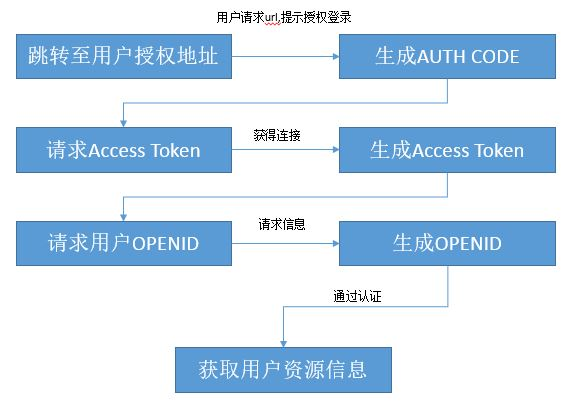

# 第三方登录组件概述 #

## 业务需求 ##

身在一个离不开网络的时代，每天都面对着不同的登陆界面，能有一种简单的登陆方式显得很重要。第三方登陆方便了用户日常的网络生活，登陆方便快捷，并且很多资料信息可以公用，也可将自己在某个平台的动态信息同步到各个平台。

## 解决方案 ##

iuap-sso第三方登录组件是将各主流通讯软件以及门户网站作为登录方式，通过Oauth2.0协议，在不获取第三方账号安全信息的前提下，通过第三方账号的认证，登录自有系统。  


## 功能说明 ##

1. 支持Oauth2.0协议
2. 支持微信帐号登录授权，使用部分微信信息，登录本网站；
3. 支持QQ帐号登录授权，登录本网站；
4. 支持新浪微帐号来授权，登录本网站；


# 整体设计 #

## 依赖环境 ##

组件采用Maven进行编译和打包发布，其对外提供的依赖方式如下：
```
	<dependency>
	  <groupId>com.yonyou.iuap</groupId>
	  <artifactId>iuap-sso</artifactId>
	  <version>${iuap.modules.version}</version>
	</dependency>
```
${iuap.modules.version} 为平台在maven私服上发布的组件的version。

## 功能结构 ##



**基本过程**

- 得到授权码code
- 获取access token
- 通过access token获取OpenId
- 得到access token 和 OpenId调用API，获取用户授权信息。

## 流程说明 ##

- 登录主页面加载的第三方登录按钮，调用LoginServlet。
- 根据传入第三方系统类型，转入第三方登录系统登录界面。
- 登录认证成功后，获取登录信息，包括第三方登录token、用户信息等。
- 登录后调用预留处理接口，将登录信息传入，供本系统做后续操作。

登录页面调用com.yonyou.uap.ieop.login.servlet.LoginServlet，传入登录参数。其中，登录类型LoginType=WECHAT（目前提供微信：WECHAT ，新浪微博：WEIBO，qq：QQ三种方式）。  
根据传入的登录类型，调用不同IloginPubService的实现。  
以QQ为例，调用腾讯平台提供不同接口，分别根据AppKey和AppId获取用户认证code，认证token，以及查询qq用户信息，并转化为统一用户登录信息，调用 `com.yonyou.uap.ieop.login.afterlogin.IafterloginService`默认实现类`com.yonyou.uap.ieop.login.afterlogin.ShiroAfterloginService`的doAfterLogin.  

```
		/**
		 * <p>Title: doAfterLogin</p>
		 * <p>Description: 第三方登录成功后，自有系统登录，并进行用户信息关联存储</p>
		 * @param request
		 * @param response
		 * @param info
		 */
		publicvoid doAfterLogin(HttpServletRequest request,
				HttpServletResponse response,LoginInfo info);  
```

# 使用说明 #

## 组件包说明 ##

iuap-sso组件目前提供微信：WECHAT ，新浪微博：WEIBO，qq：QQ三种方式的第三方登陆平台，根据传入的登录类型，调用不同IloginPubService的实现。  
以QQ为例，调用腾讯平台提供不同接口，分别根据AppKey和AppId获取用户认证code，认证token，以及查询qq用户信息，并转化为统一用户登录信息，调用iuap-sso组件提供的接口最终在第三方登录成功后，进行自有系统登录，并进行用户信息关联存储。

##组件配置##

**web.xml下配置登录servlet和回调servlet**  

```
		<servlet>
			<servlet-name>login_servlet</servlet-name>
		<servlet-class>com.yonyou.uap.ieop.login.servlet.LoginServlet</servlet-class>
		</servlet>
	    <servlet-mapping>
			<servlet-name>login_servlet</servlet-name>
			<url-pattern>/login_servlet</url-pattern>     
		</servlet-mapping>
	    <!--第三方 qq登录完成后 回调-->
		<servlet>
			<servlet-name>return_servlet</servlet-name>
		<servlet-class>com.yonyou.uap.ieop.login.servlet.QQAfterLoginServlet</servlet-class>
		</servlet>
		<servlet-mapping>
			<servlet-name>return_servlet</servlet-name>
			<url-pattern>/extlogin/qq</url-pattern>    
		</servlet-mapping>  
```

其中，组件已支持的回调Servlet有：  

QQ为`com.yonyou.uap.ieop.login.servlet.QQUserInfoServlet`  
微信为 `com.yonyou.uap.ieop.login.servlet.WeChatAfterLoginServlet`  
微博为`com.yonyou.uap.ieop.login.servlet.WeiboAfterLoginServlet`    
如果需要支持多个第三方平台登录，需要将对应平台的回调servlet添加到web.xml配置文件中。

## 工程样例 ##

maven库上提供了iuap-sso组件的示例工程iuap-sso-example-1.0.1.zip，下载后将示例工程导入到工作区。示例工程中有较为完整的对iuap-sso组件的使用示例代码。

## 开发步骤 ##

### 与Spring整合 ###

**web.xml下配置登录servlet和回调servlet**  
```
		<servlet>
			<servlet-name>login_servlet</servlet-name>
		<servlet-class>com.yonyou.uap.ieop.login.servlet.LoginServlet</servlet-class>
		</servlet>
	    <servlet-mapping>
			<servlet-name>login_servlet</servlet-name>
			<url-pattern>/login_servlet</url-pattern>     
		</servlet-mapping>
	    <!--第三方 qq登录完成后 回调-->
		<servlet>
			<servlet-name>return_servlet</servlet-name>
		<servlet-class>com.yonyou.uap.ieop.login.servlet.QQAfterLoginServlet</servlet-class>
		</servlet>
		<servlet-mapping>
			<servlet-name>return_servlet</servlet-name>
			<url-pattern>/extlogin/qq</url-pattern>    
		</servlet-mapping>  
```

其中，组件已支持的回调Servlet有：  

QQ为`com.yonyou.uap.ieop.login.servlet.QQUserInfoServlet`  
微信为 `com.yonyou.uap.ieop.login.servlet.WeChatAfterLoginServlet`  
微博为`com.yonyou.uap.ieop.login.servlet.WeiboAfterLoginServlet`    
如果需要支持多个第三方平台登录，需要将对应平台的回调servlet添加到web.xml配置文件中。  


### 前台调用 ###

**前台加入第三方登录按钮并配置相应链接至servlet**  

```
	<a href=" /login_servlet?LoinType=QQ&isLogin=true" title="QQ">QQ登录</a>  
```

### 配置文件 ###


** 1. 配置对应第三方系统的配置文件 **

修改qqconnectconfig.properties(此文件需要放在工程的class path路径下)内容。其中：app_ID和app_KEY为支持等三方登录功能的平台申请的ID和KEY，redirect_URI为用户在第三方平台登录授权后回调的URI地址，需要与回调servlet对应。

```
	app_ID = 101248396
	app_KEY = c1b2f603ce729addc4d63d61c915d00c.
	redirect_URI = http://xxxx:8080/xxxx/extlogin/qq  
```

** 2. 指定登录成功后的逻辑处理Service **

本地创建`com.yonyou.uap.ieop.login.afterlogin.ShiroAfterloginService`类并继承`com.yonyou.uap.ieop.login.afterlogin.IafterloginService`
或在*LoginConfig.properties*(此文件需要放在工程的class path路径下)中配置为其他处理类
`AfterLogin.do = com.yonyou.uap.ieop.login.afterlogin.ShiroAfterloginService`
在`doAfterLogin`方法中处理自有系统原来的登录逻辑。  


## 常用接口 ##
- LoginServlet
<table>
  <tr>
    <th><br>  参数字段<br>  </th>
    <th><br>  必选<br>  </th>
    <th><br>  类型<br>  </th>
    <th><br>  长度限制<br>  </th>
    <th><br>  说明<br>  </th>
  </tr>
  <tr>
    <td><br>  LoginType<br>  </td>
    <td><br>  True<br>  </td>
    <td><br>  String<br>  </td>
    <td><br>  20<br>  </td>
    <td><br>  登录类型(WECHAT、QQ、WEIBO)<br>  </td>
  </tr>
</table>  

**返回参数说明**  
`LoginInfo info：统一用户登陆信息`  
