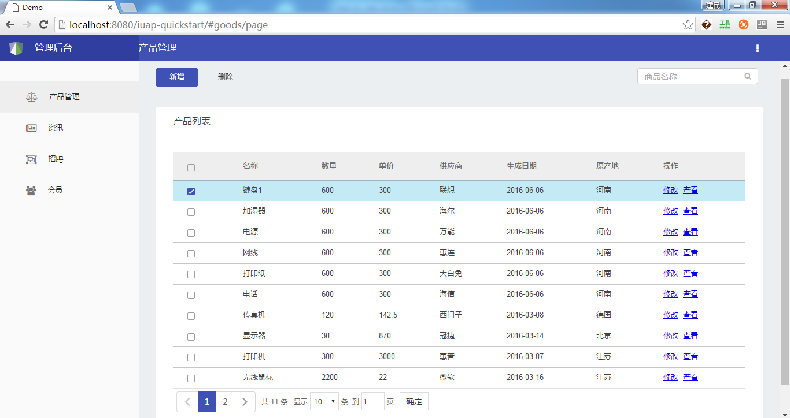
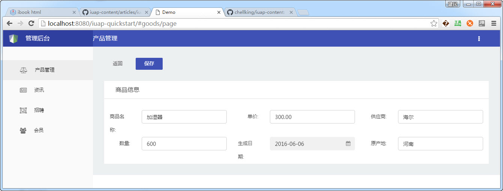
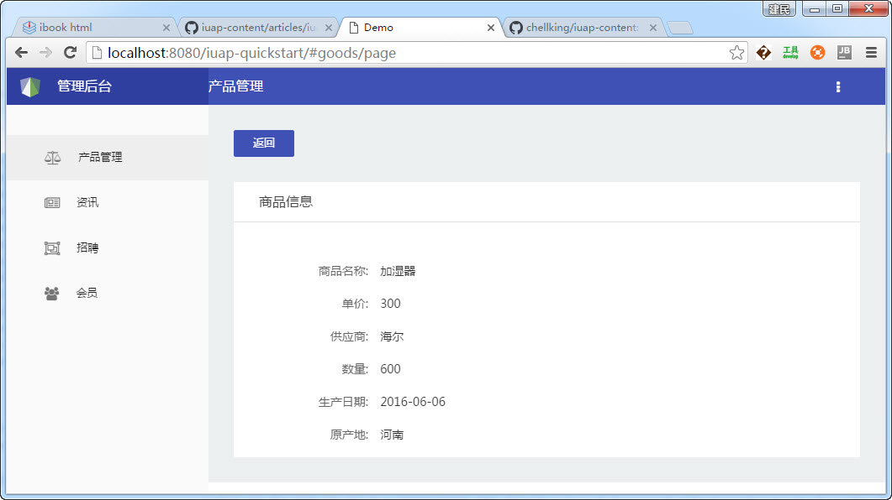

# iuap快速开发

通过阅读快速入门文档，开发者可以用setp by step的方式掌握如何使用iuap Studio开发出产品实现如下目标：

- 掌握DevTool和 iuap Studio 的初始化和基本配置
- 掌握通过 iuap Studio 创建新的 iuap 工程
- 掌握如何开发服务端的Entity、Dao、Service、Controller类
- 掌握如何编辑前端的模块js和html
- 掌握如何利用工具使用jetty调试工程
- 熟悉如何使用Maven进行打包部署

按照此文档开发出的简单增改删查示例的效果如下：
     

修改界面：

查看界面：

