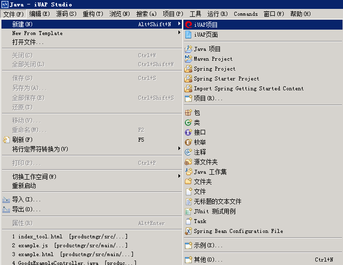
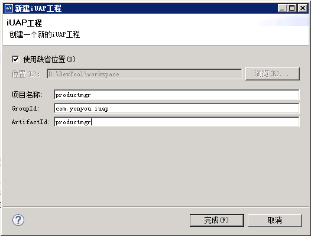
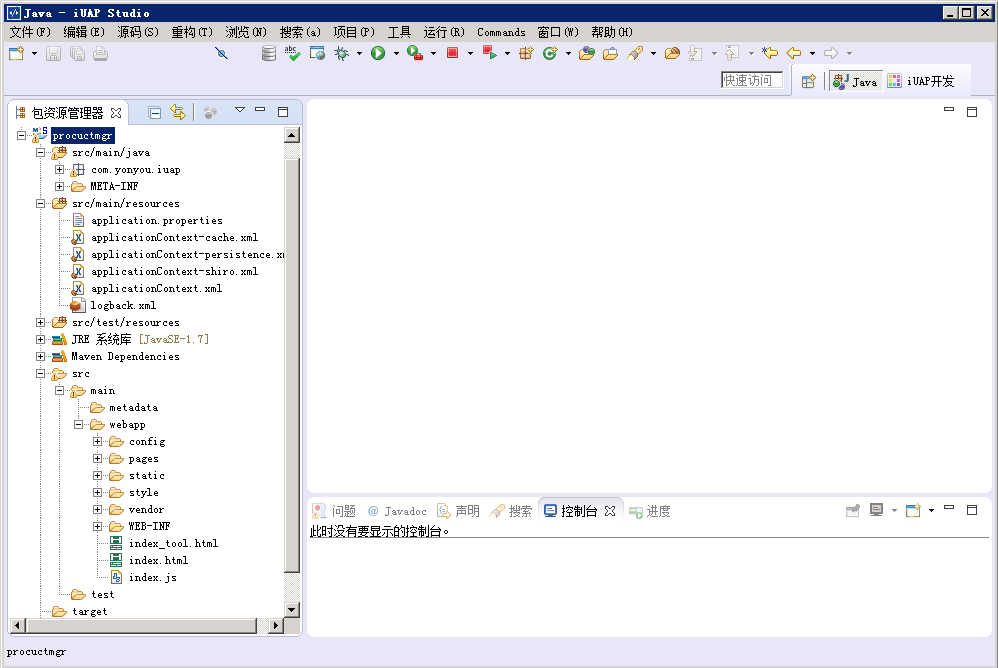
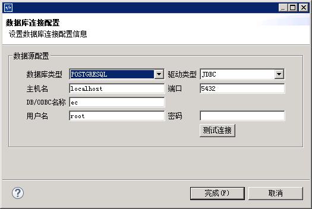
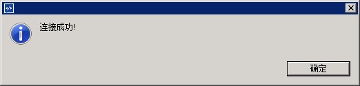
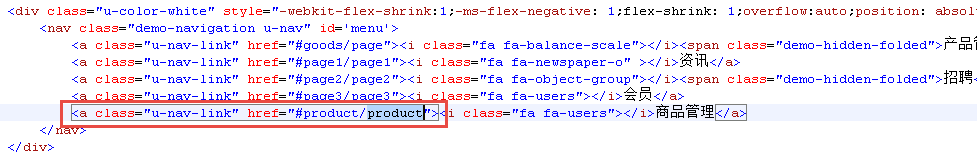

# 创建新工程

## 新建iuap工程

1）选择文件菜单下的新建下的iuap项目

 
2）输入工程名和ArtifactId，单击完成按钮

3）创建成功后，可以选择熟悉的开发视图，如java视图，新建的默认项目结构如下图:

4）工程模板中默认引入了部分组件，以spring方式集成，webapp中默认引入了iuap design的相关脚本

5）右键工程，选择iuap tools下的数据库连接配置，设置数据库连接的相关属性如下

 

6）点击测试连接，测试数据库服务的连通性

## 新建功能菜单

1）打开默认示例模板的index.html，添加作为示例的“商品管理”菜单

2）根据后续的步骤，创建后台类和前端的脚本，挂接菜单。注意，模板工程中只是示例性给出菜单和页面的布局，具体菜单和样式可以根据业务上的情况定制。

