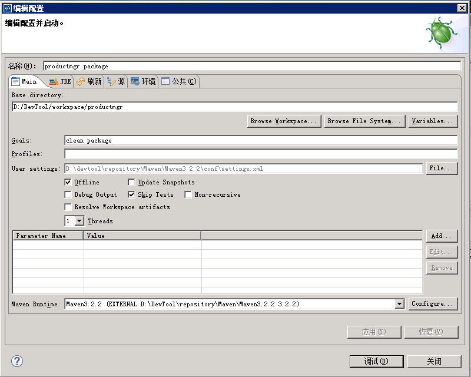
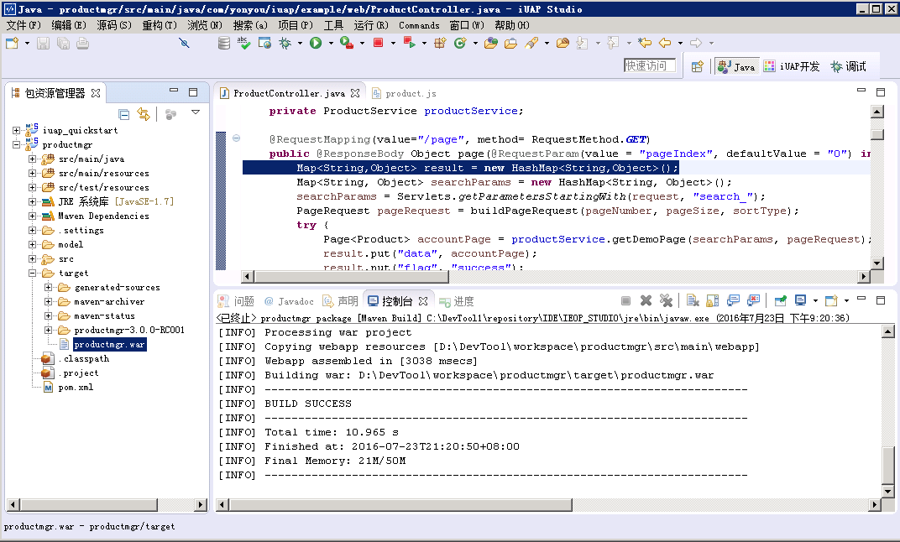
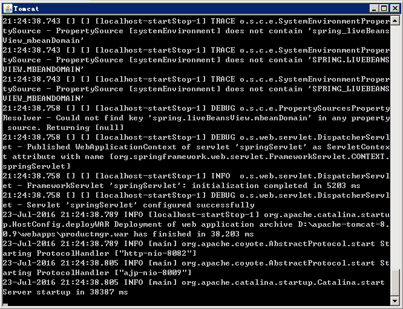
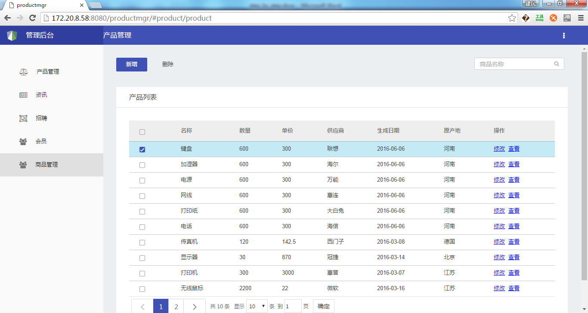

# 打包部署

1）	在工程名上右键，选择调试方式下的Maven build…

2）	在Goals选项内输入clean package，如果无测试代码，勾选SkipTests选项，点击应用、调试
 
 
 
3）	运行完成后，控制台显示成功，在工程的target目录下已经打出工程的war包，位置如下
 
  
 
4）	保证数据库服务启动，将war包放置在tomcat的webapps目录下，启动tomcat，如下图：
 
  
 
5）	在浏览器中输入地址，访问应用效果和调试阶段相同

 
 
 
