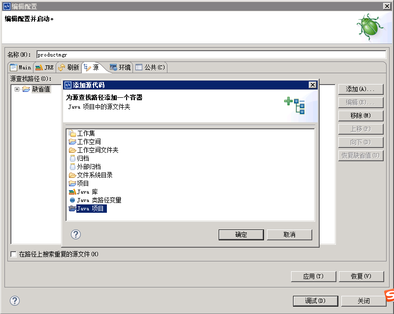
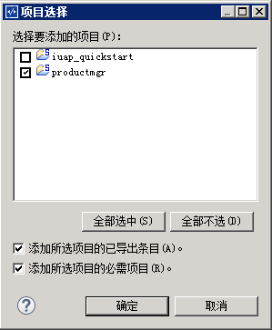
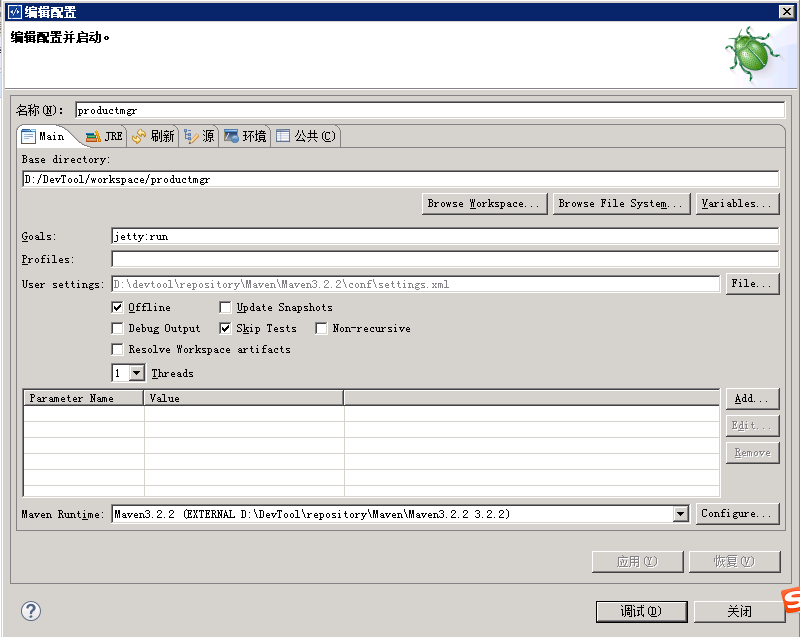
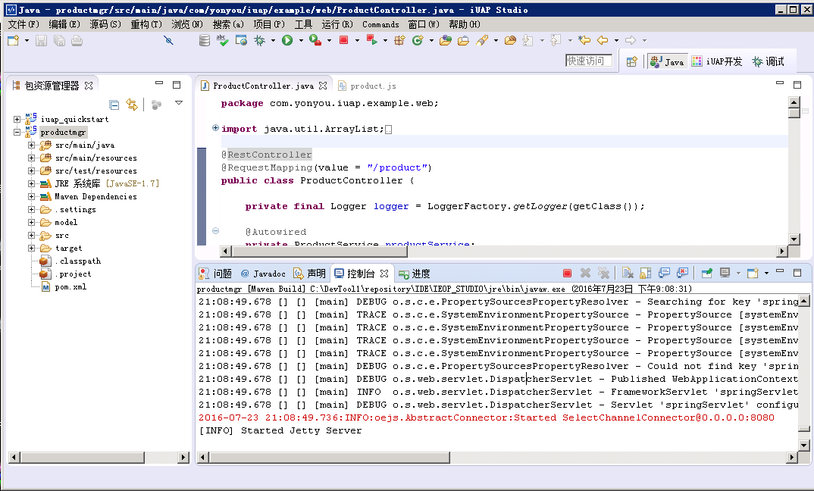
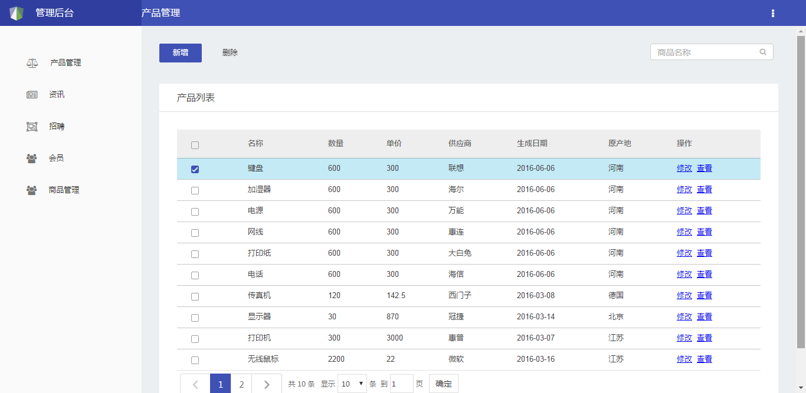
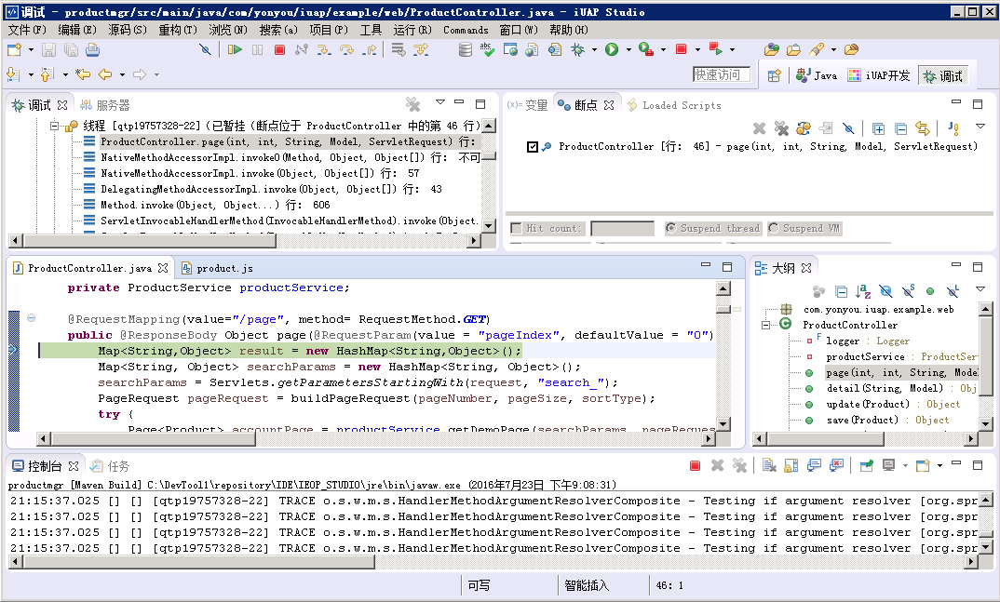
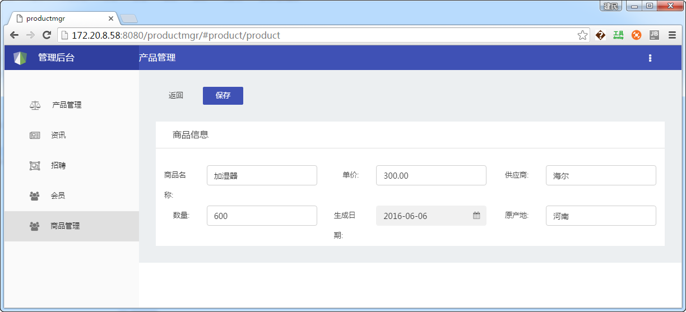

# 工程调试运行

1）工程右键，选择调试方式下的Maven build…，在“源”页签，点击添加，选择java项目
 

2）添加java项目，勾选productmgr，点击确定
 

3）切换到Main页签，在Goals选项下输入jetty:run，勾选Skip Tests，点击应用-调试

4）启动jetty成功后，可以看到控制台输出如下：

5）浏览器中输入http://localhost:8080/productmgr，访问应用效果如下：

6）在后台类ProductController类的page方法内打断点，点击商品管理菜单，可以断点调试后端代码

7）商品管理中包含基础的增改删查的功能，对应product.js中的功能，用户可以具体调整业务逻辑
 

