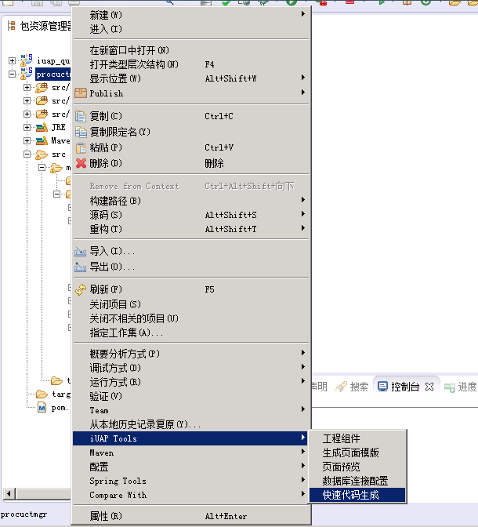
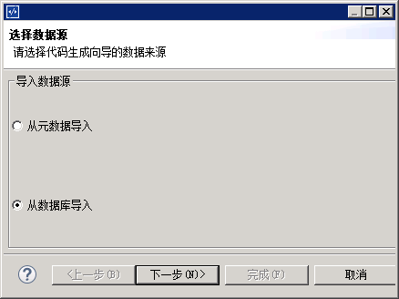
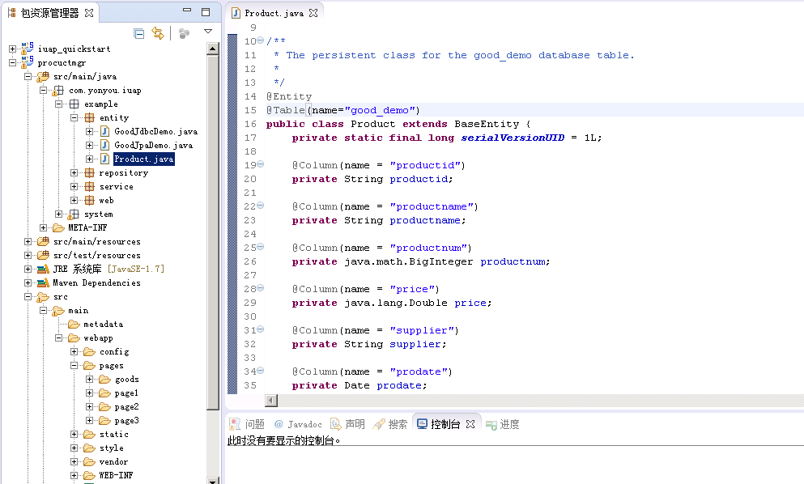
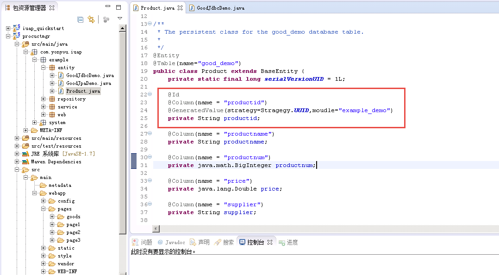
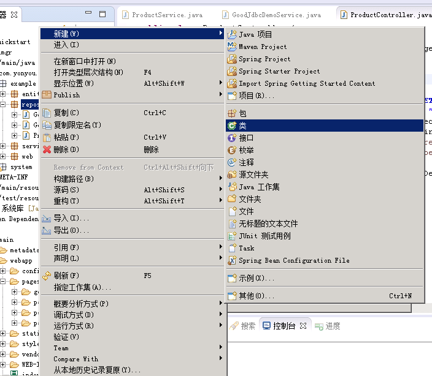
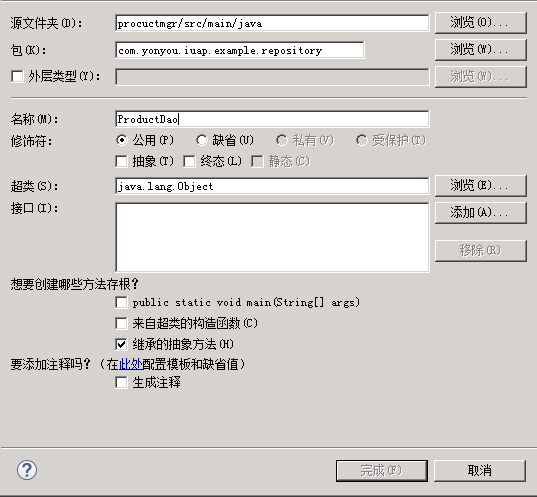
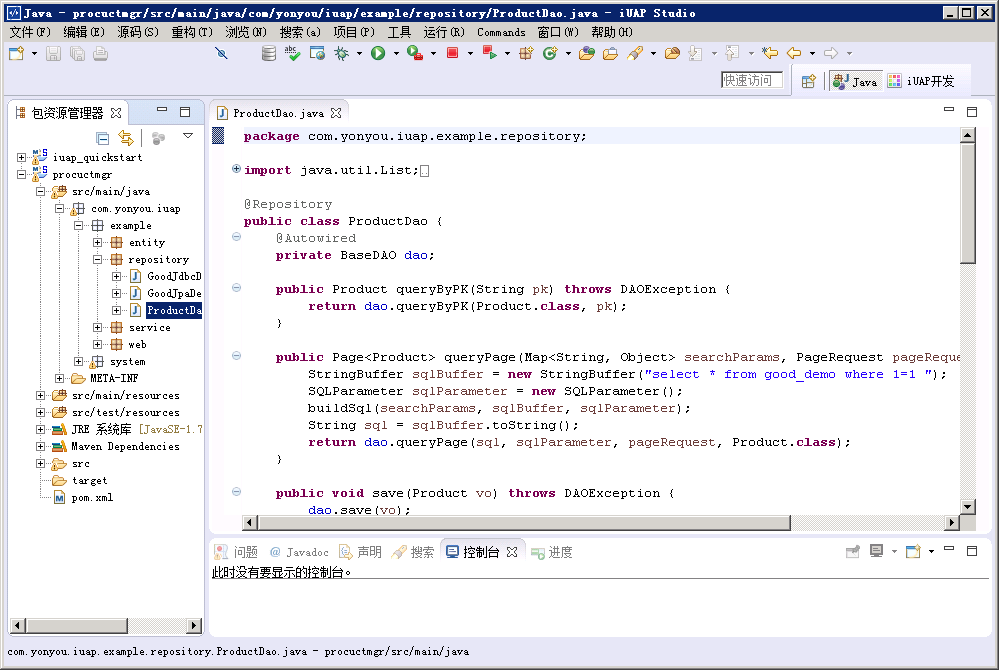
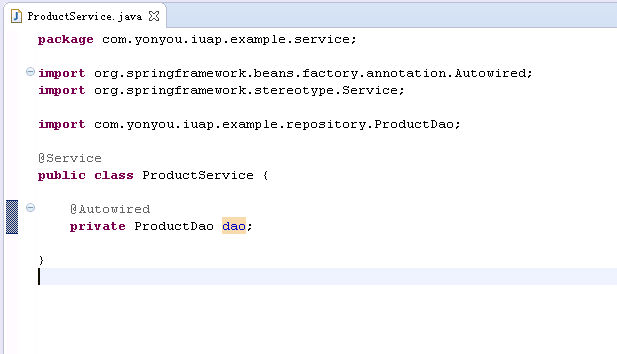
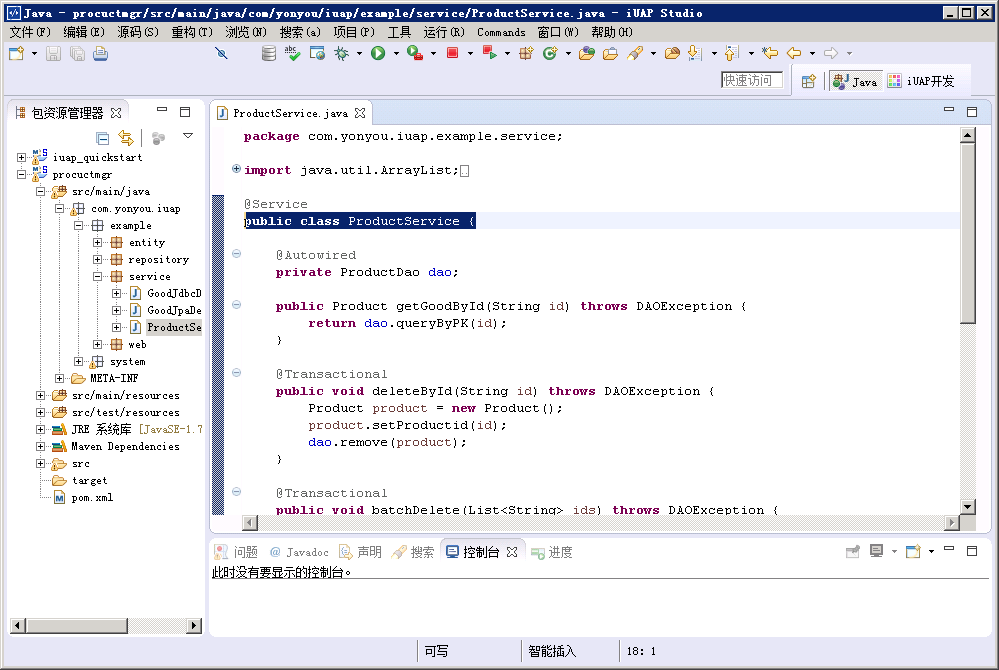
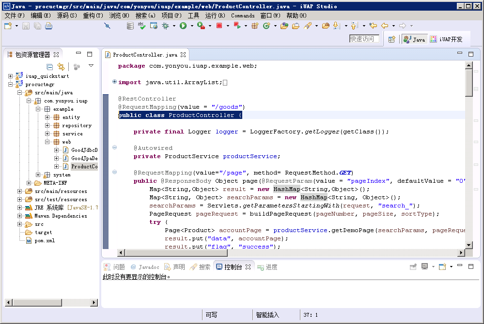

# 后端开发

## 创建数据库表
1）	创建业务需要的数据库表，示例中以简单的商品表为例：

```
CREATE TABLE
    good_demo
    (
        productid CHARACTER VARYING NOT NULL,
        productname CHARACTER VARYING,
        productnum BIGINT,
        price DOUBLE PRECISION,
        supplier CHARACTER VARYING,
        prodate DATE,
        orgin CHARACTER VARYING,
        ts TIMESTAMP(6) WITHOUT TIME ZONE
);
```

## 创建实体类
1）	右键工程，选择iuap tools下的快速代码生成

 

2）	选择从数据库导入，点击下一步按钮



3）	选择数据表，选中需要生成代码的列，调整不能识别的字段


4）	点击下一步，选择代码要生成的包名和类名


5）	点击完成，生成对应的代码如下



6）	在productid上添加主键的注解如下

```
@Id和@GeneratedValue(strategy=Stragegy.UUID,moudle="example_demo")

```


7）	请确保注解引入的包为iuap-jdbc组件中的包

```
import com.yonyou.iuap.persistence.jdbc.framework.annotation.GeneratedValue;
import com.yonyou.iuap.persistence.jdbc.framework.annotation.Id;
import com.yonyou.iuap.persistence.jdbc.framework.annotation.Stragegy;

```

## 编写dao类

1）	在repository包下新建数据库操作类ProductDao并添加@Repository注解





```
@Repository
public class ProductDao

```

2）	注入BaseDao

```
@Autowired
private BaseDAO dao;

```

3）	编写增改删查需要的几个方法，完整代码如下



``` 
package com.yonyou.iuap.example.repository;
import java.util.List;
import java.util.Map;

import org.apache.commons.lang3.StringUtils;
import org.springframework.beans.factory.annotation.Autowired;
import org.springframework.data.domain.Page;
import org.springframework.data.domain.PageRequest;
import org.springframework.stereotype.Repository;

import com.yonyou.iuap.example.entity.Product;
import com.yonyou.iuap.persistence.bs.dao.BaseDAO;
import com.yonyou.iuap.persistence.bs.dao.DAOException;
import com.yonyou.iuap.persistence.jdbc.framework.SQLParameter;

@Repository
public class ProductDao {
	@Autowired
	private BaseDAO dao;
	
	public Product queryByPK(String pk) throws DAOException {
		return dao.queryByPK(Product.class, pk);
	}

	public Page<Product> queryPage(Map<String, Object> searchParams, PageRequest pageRequest) throws DAOException {
		StringBuffer sqlBuffer = new StringBuffer("select * from good_demo where 1=1 ");
		SQLParameter sqlParameter = new SQLParameter();
		buildSql(searchParams, sqlBuffer, sqlParameter);
		String sql = sqlBuffer.toString();
		return dao.queryPage(sql, sqlParameter, pageRequest, Product.class);
	}

	public void save(Product vo) throws DAOException {
		dao.save(vo);
	}

	public void remove(Product vo) throws DAOException {
		dao.remove(vo);
	}

	public void remove(List<Product> vos) throws DAOException {
		dao.remove(vos);
	}

	//业务开发根据自己的需求，修改查询条件的拼接方式
	private void buildSql(Map<String, Object> searchParams, StringBuffer sqlBuffer, SQLParameter sqlParameter) {
		
		int index = 0;
		StringBuffer sb = new StringBuffer();
		for (Map.Entry<String, Object> entry : searchParams.entrySet()) {
			String[] keySplit = entry.getKey().split("_");
			if (keySplit.length == 2) {
				String columnName = keySplit[1];
				String compartor = keySplit[0];
				Object value = entry.getValue();
				if (value != null && StringUtils.isNotBlank(value.toString())) {
					
					sb.append(columnName).append(" ").append(compartor).append(" ? ");
					// 处理模糊查询
					value = "like".equalsIgnoreCase(compartor) ? "%" + value + "%" : value;
					sqlParameter.addParam(value);
					index ++;
					
					if(index != searchParams.keySet().size()){
						sb.append(" or ");
					}
				}
			}
		}
		
		String conditionSql = sb.toString();
		if(StringUtils.isNoneBlank(conditionSql)){
			sqlBuffer.append(" and (" + conditionSql.toString() + ");");
		}
		
	}
}

```

## 编写Service类

1）在service包下新建ProductService类

2）ProductService类中加入@Service注解

```
@Service
public class ProductService

```

3）注入ProductDao



4）	编写增改删除的几个方法，在新增和修改方法上加事务控制的注解@Transactional

5）	完整示例代码如下

```
package com.yonyou.iuap.example.service;

import java.util.ArrayList;
import java.util.List;
import java.util.Map;

import org.springframework.beans.factory.annotation.Autowired;
import org.springframework.data.domain.Page;
import org.springframework.data.domain.PageRequest;
import org.springframework.stereotype.Service;
import org.springframework.transaction.annotation.Transactional;

import com.yonyou.iuap.example.entity.Product;
import com.yonyou.iuap.example.repository.ProductDao;
import com.yonyou.iuap.persistence.bs.dao.DAOException;

@Service
public class ProductService {
	
	@Autowired
	private ProductDao dao;
	
	public Product getGoodById(String id) throws DAOException {
		return dao.queryByPK(id);
	}

	@Transactional
	public void deleteById(String id) throws DAOException {
		Product product = new Product();
		product.setProductid(id);
		dao.remove(product);
	}
	
	@Transactional
	public void batchDelete(List<String> ids) throws DAOException {
		List<Product> deleteVos = new ArrayList<Product>();
		for (int i = 0; i < ids.size(); i++) {
			Product product = new Product();
			product.setProductid(ids.get(i));
			deleteVos.add(product);
		}
		if (deleteVos.size() > 0) {
			dao.remove(deleteVos);
		}
	}
	
	@Transactional
	public Product saveEntity(Product entity) throws DAOException {
		dao.save(entity);
		return entity;
	}

	public Page<Product> getDemoPage(Map<String, Object> searchParams, PageRequest pageRequest) throws DAOException {
		return dao.queryPage(searchParams, pageRequest);
	}
}

```



## 编写Controller类

1）	新建Controller类并声明Logger

```
private final Logger logger = LoggerFactory.getLogger(getClass());

```

2）	配置基础映射URL

```
@RestController
@RequestMapping(value = "/product")
public class ProductController {
	private final Logger logger = LoggerFactory.getLogger(getClass());
}

```

3）	注入ProductService

```
@Autowired
private ProductService productService;

```

4）	参考示例，编写分页查询、详情、保存、删除等方法，完成代码如下 



```
package com.yonyou.iuap.example.web;

import java.util.ArrayList;
import java.util.HashMap;
import java.util.List;
import java.util.Map;

import javax.servlet.ServletRequest;

import net.sf.json.JSONArray;
import net.sf.json.JSONObject;

import org.apache.commons.lang3.StringUtils;
import org.slf4j.Logger;
import org.slf4j.LoggerFactory;
import org.springframework.beans.factory.annotation.Autowired;
import org.springframework.data.domain.Page;
import org.springframework.data.domain.PageRequest;
import org.springframework.data.domain.Sort;
import org.springframework.data.domain.Sort.Direction;
import org.springframework.ui.Model;
import org.springframework.web.bind.annotation.PathVariable;
import org.springframework.web.bind.annotation.RequestBody;
import org.springframework.web.bind.annotation.RequestMapping;
import org.springframework.web.bind.annotation.RequestMethod;
import org.springframework.web.bind.annotation.RequestParam;
import org.springframework.web.bind.annotation.ResponseBody;
import org.springframework.web.bind.annotation.RestController;
import org.springside.modules.web.Servlets;

import com.yonyou.iuap.example.entity.Product;
import com.yonyou.iuap.example.service.ProductService;
import com.yonyou.iuap.persistence.vo.pub.VOStatus;

@RestController
@RequestMapping(value = "/product")
public class ProductController {

	private final Logger logger = LoggerFactory.getLogger(getClass());
	
	@Autowired
	private ProductService productService;
	
	@RequestMapping(value="/page", method= RequestMethod.GET)
	public @ResponseBody Object page(@RequestParam(value = "pageIndex", defaultValue = "0") int pageNumber, @RequestParam(value = "pageSize", defaultValue = "10") int pageSize, @RequestParam(value = "sortType", defaultValue = "auto") String sortType, Model model, ServletRequest request) {
		Map<String,Object> result = new HashMap<String,Object>();
		Map<String, Object> searchParams = new HashMap<String, Object>();
		searchParams = Servlets.getParametersStartingWith(request, "search_");
		PageRequest pageRequest = buildPageRequest(pageNumber, pageSize, sortType);
		try {
			Page<Product> accountPage = productService.getDemoPage(searchParams, pageRequest);
			result.put("data", accountPage);
			result.put("flag", "success");
			result.put("msg", "查询数据成功!");
		} catch (Exception e) {
			String errMsg = "查询数据详情失败!";
			result.put("flag", "fail");
			result.put("msg", errMsg);
			logger.error(errMsg, e);
		}
		return result;
	}
	
    /**
	 * 进入详情界面
	 * 
	 * @param id
	 * @param model
	 * @return 需要更新的实体的json结构
	 */
	@RequestMapping(value = "detail/{id}", method = RequestMethod.GET)
	public @ResponseBody Object detail(@PathVariable("id") String id, Model model) {
		Map<String, Object> result = new HashMap<String, Object>();
		try {
			Product entity = productService.getGoodById(id);
			result.put("data", entity);
			result.put("flag", "success");
			result.put("msg", "查询数据详情成功!");
		} catch (Exception e) {
			String errMsg = "查询数据详情失败!";
			result.put("flag", "fail");
			result.put("msg", errMsg);
			logger.error(errMsg, e);
		}
		return result;
	}
	
	/** 更新 */
	@RequestMapping(value = "update", method = RequestMethod.POST)
	public @ResponseBody Object update(@RequestBody Product entity) {
		Map<String,Object> result = new HashMap<String,Object>();
		try {
			//设置状态为更新，才会持久化
			entity.setStatus(VOStatus.UPDATED);
			entity = productService.saveEntity(entity);
			result.put("data", entity);
			result.put("msg", "更新成功!");
			result.put("flag", "success");
		} catch (Exception e) {
			result.put("msg", "更新失败!");
			result.put("flag", "fail");
			logger.error("更新出错!",e);
		}
        return result;  
	}
	
	/** 新增保存 */
	@RequestMapping(value = "save", method = RequestMethod.POST)
	public @ResponseBody Object save(@RequestBody Product entity) {
		Map<String,Object> result = new HashMap<String,Object>();
		try {
			//设置状态为NEW，才会插入新数据
			entity.setStatus(VOStatus.NEW);
			entity = productService.saveEntity(entity);
			result.put("msg", "保存成功!");
			result.put("data", entity);
			result.put("flag", "success");
		} catch (Exception e) {
			result.put("msg", "保存失败!");
			result.put("flag", "fail");
			logger.error("保存出错!",e);
		}
        return result;  
	}
	
    /**
     * 删除实体
     */
    @RequestMapping(value = "del", method = RequestMethod.POST)
	public @ResponseBody Object delete(ServletRequest request) {
    	Map<String,Object> result = new HashMap<String,Object>();
    	try {
    		String jsonStr = request.getParameter("data");
    		
    		if(StringUtils.isNotBlank(jsonStr)){
    			JSONArray jsonArray = JSONArray.fromObject(jsonStr);
    			List<String> ids = new ArrayList<String>();
    			for (int i = 0; i < jsonArray.size(); i++) {
    				JSONObject jb = (JSONObject)jsonArray.get(i);
    				String pid = jb.getString("productid");
    				ids.add(pid);
				}
        		
    			result.put("flag", "success");
    			result.put("msg", "删除数据成功!");
    			productService.batchDelete(ids);
    		} else {
    			result.put("flag", "fail");
    			result.put("msg", "请选择要删除的数据!");
    		}
		} catch (Exception e) {
			String errmsg = "删除数据失败!";
			logger.error(errmsg, e);
			result.put("flag", "fail");
			result.put("msg", errmsg);
		}
    	return result;
	}
	
	
	/**
	 * 创建分页请求简单示例，业务上按照自己的需求修改.
	 */
	private PageRequest buildPageRequest(int pageNumber, int pagzSize, String sortType) {
		Sort sort = null;
		if ("auto".equals(sortType)) {
			sort = new Sort(Direction.DESC, "ts");
		} else if ("productname".equals(sortType)) {
			sort = new Sort(Direction.ASC, "productname");
		}
		return new PageRequest(pageNumber, pagzSize, sort);
	}
}
```

