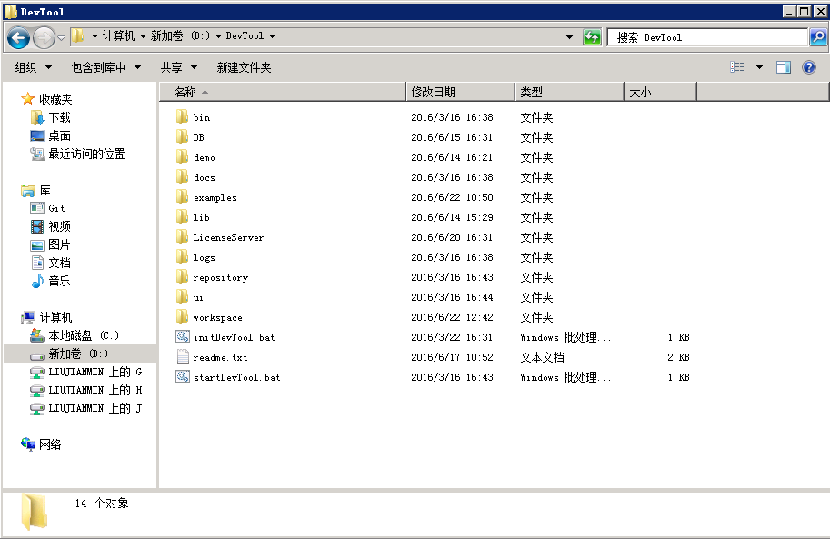
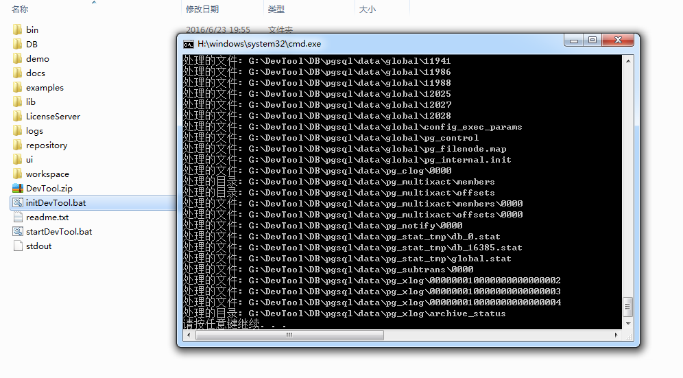
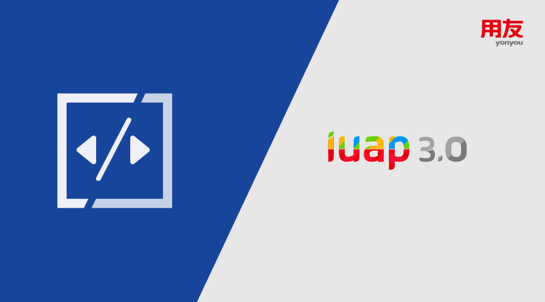
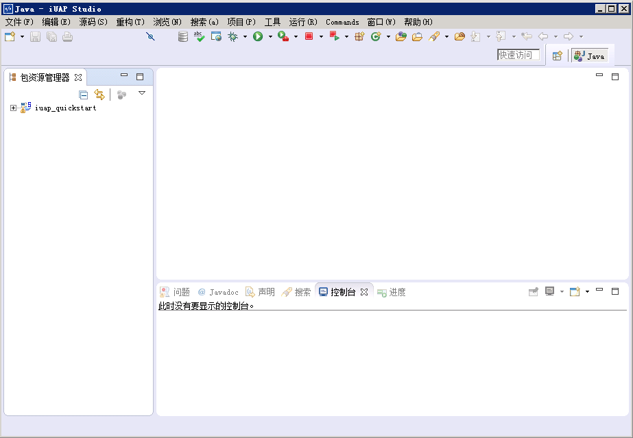
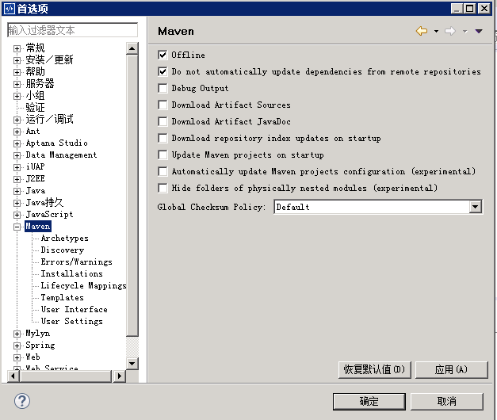
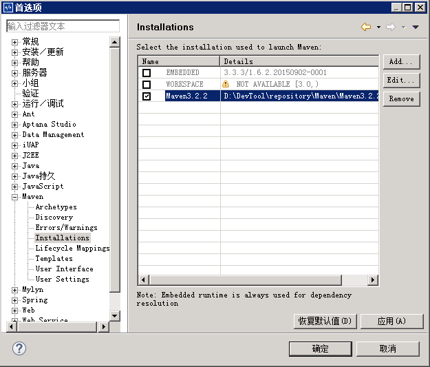
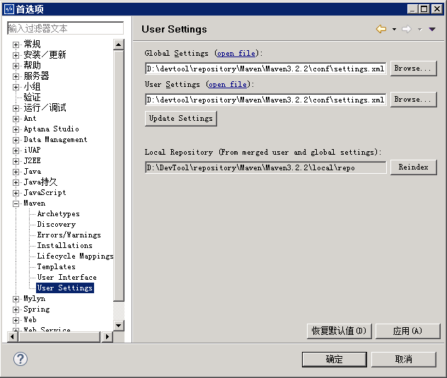

# 开发工具配置

## 获取并解压开发工具安装盘

>  安装使用请看“[安装页面](#/platform3/articles/iuap-develop/3-/an_zhuang_shi_yong.html)”

1）将获取到的DevTool开发工具包解压到D盘的根目录，解压后目录结构如下：

 
2）打开reademe.txt浏览开发工具包使用的注意事项

## 工具初始化

1）以管理员身份运行根目录下的initDevTool.bat
 

2）进入DevTool的bin目录，双击startPgsql.bat启动开发数据库PostgreSQL

 
## 启动iuap Studio

1）进入到DevTool的根目录，双击startDevTool.bat

 

2）进入iuap studio的主界面，显示如下
 

 
## 检查Maven配置

1）打开Studio的窗口下首选项，选择Maven菜单

2）选中Maven下的Installations，检查使用的Maven是否为DevTool下的Maven

3）选中Maven下的User Settings，检查配置文件指定的位置是否正确

