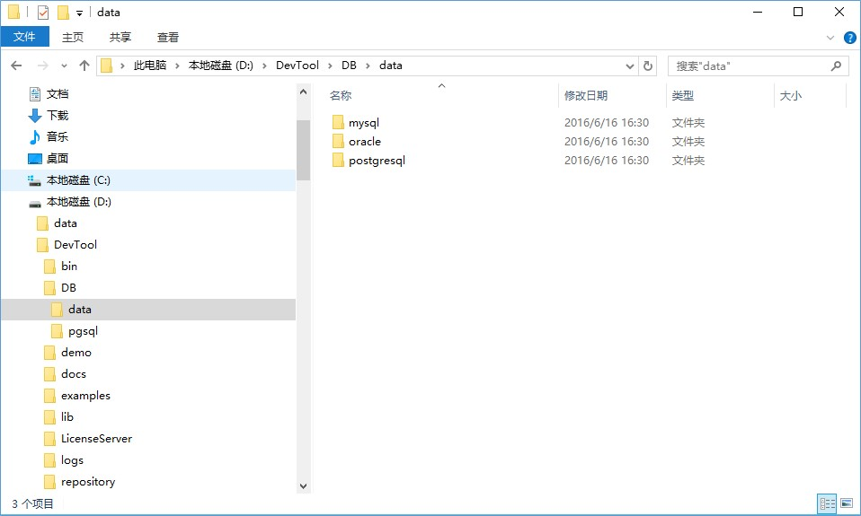

# 工具初始化

我们默认设置了一套Windows操作系统“D:/”盘下的设置，对不熟悉开发的人员完全可以一次性初始化好环境的路径等设置，以管理员身份运行根目录下的initDevTool.bat，初始化开发工具，此命令主要是设置配置文件目录，数据库数据权限等。

```如果首次运行bin目录下startPgsql.bat不成功，请执行DevTool\DB\pgsql文件夹下vcredist_x86.exe，安装必要的运行库。```

工具开发调试默认使用的是postgresql，开发者也可以选择本机的mysql，执行DB\data下对应的数据库脚本即可初始化数据库。




