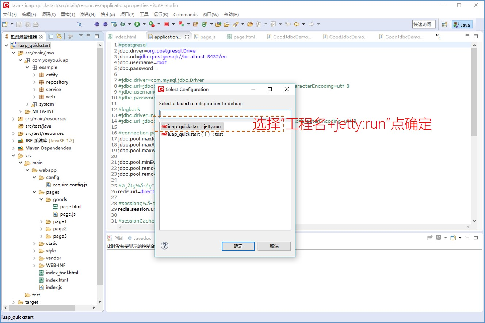

# 调试环境说明

运行调试方式打开Jetty服务器，请参看下图步骤：

如果你已经增加或运行过多个Maven:build目标，那么会出现下面的页面提供选择：

到这是项目就可以在调试方式下运行并访问页面了。

在工程的`src/test/resources`下默认放置了部分调试用的配置文件，此类资源文件在打包时候不会被集成到war包中，建议开发者在加入测试类的配置文件时，也放置在此目录下。  
如果需要打包进war包的配置文件，可以参考示例放置在`src/main/resources`中，也可以自行制定目录。  

`pom.xml`中对其的依赖位置为：

用户可以制定调试的名称和端口号。
数据库连接信息默认存储在`application.properties`中，此配置文件也是后续技术组件中使用的默认的属性文件。开发者可以在此文件中配合spring的配置文件，指定数据库连接信息、缓存连接url等。

  