# 前端开发

在进行前端开始时，需要先新建数据模型，使用工具生成对应的html、js页面。再根据具体的业务逻辑修改页面内容。

## 新建数据模型

1）切换到iuap开发视图，工程上右键选择新建下的新建数据模型

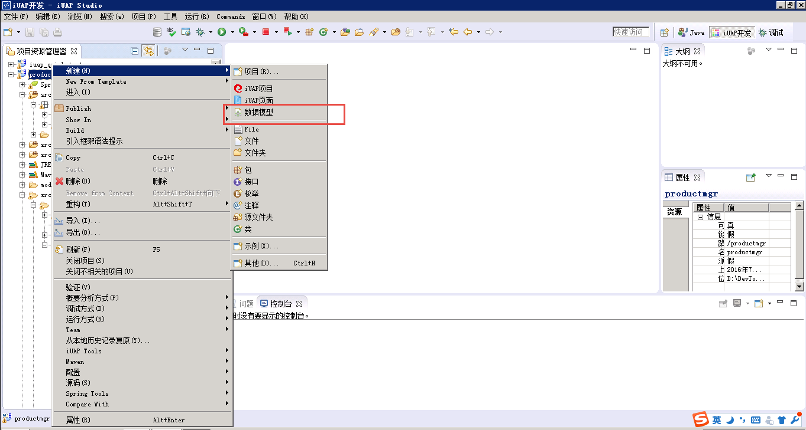

2）输入文件名为product.model，点击下一步

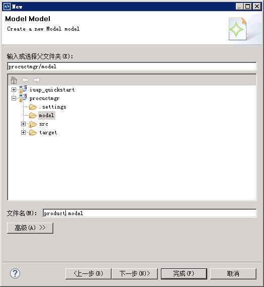

3）选择实体类为Product，点击下一步

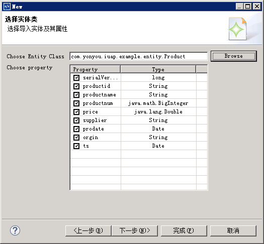

4）使用默认的UTF-8编码，点击完成

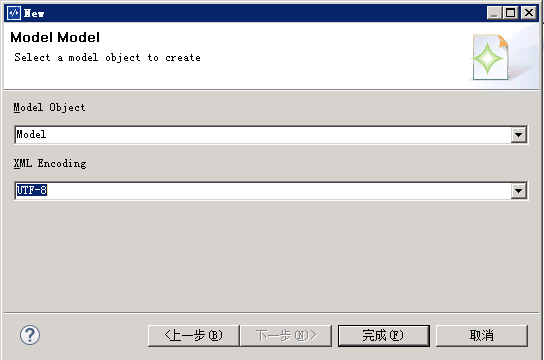

5）工具生成数据模型文件，如下图

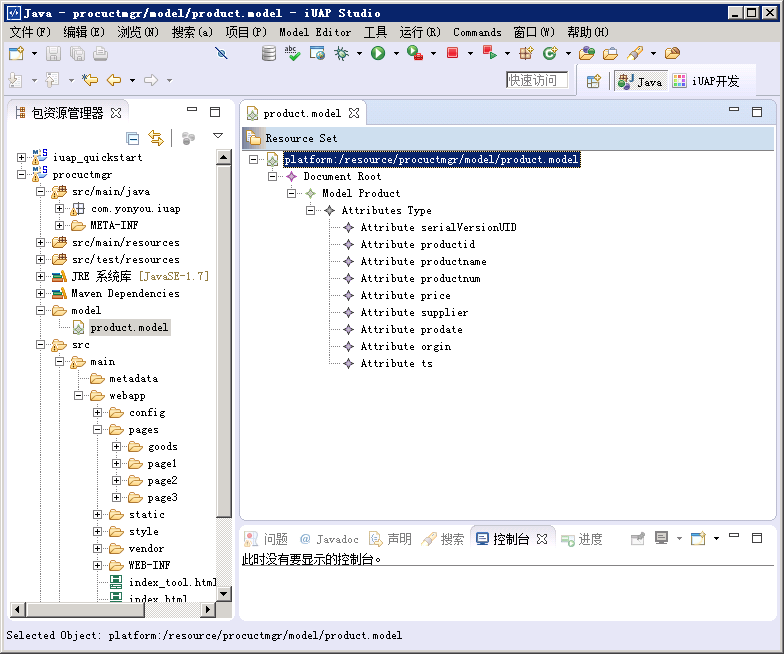

## 新建iuap页面

1）在webapp的pages下右键新建iuap页面，点击下一步

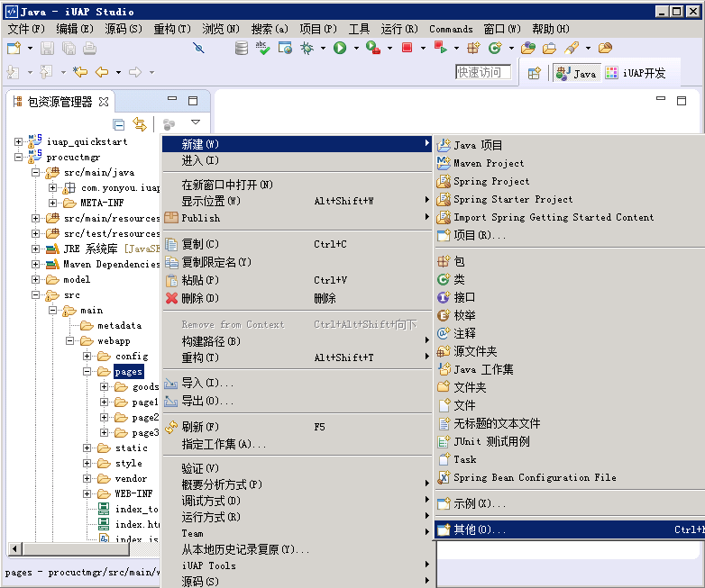
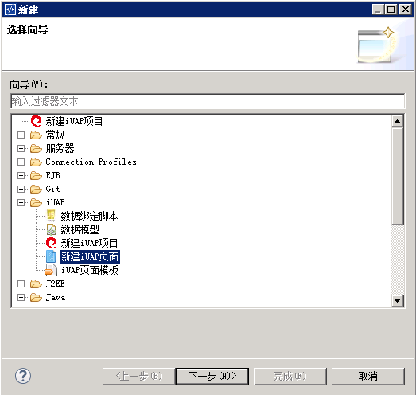
 
也可以切换到iuap开发视图，在webapp下的pages目录右键，选择新建下的iuap页面

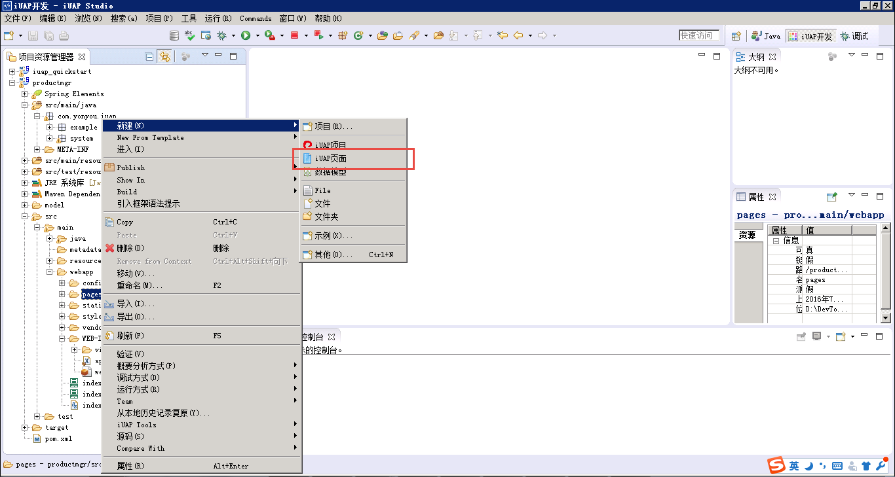

2）输入页面目录名称为product，勾选使用数据模型，点击下一步

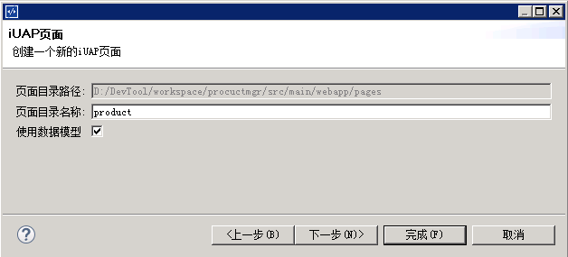

3）选择数据模型为Product，勾选右下角的选择，点击完成

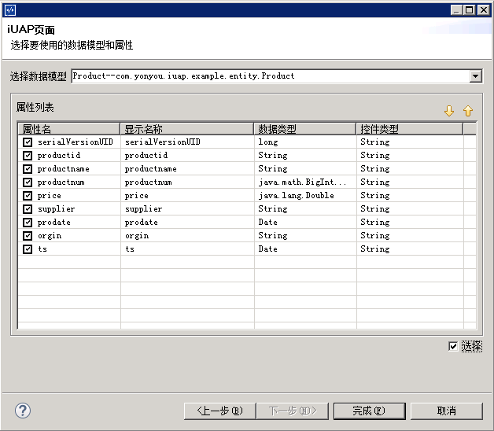

4）工具为用户生成功能模块的js文件和html片段，所在位置如下图

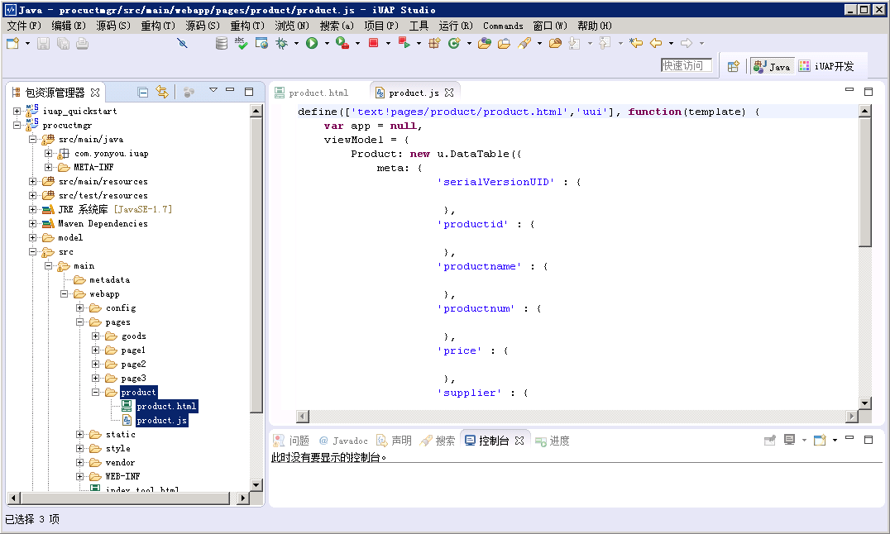

## js文件

开发工具会根据业务场景生成最基本的js文件，用户还需根据业务完善DataTable的定义、添加依赖的js以及添加具体的事件处理。深入理解DataTable请点击[这里](http://design.yyuap.com/dist/pages/kero/dataTableUse.html)。

### viewModel定义

在viewModel中需要定义DataTable，每个DataTable里面都会有`meta`，这里的`meta`指模型的字段信息，其中的`key`为字段名，`value`为字段属性信息，属性信息可自定义。没有字段属性时，可以为空对象，这些字段的属性值在控件模型中会被使用到，主要用于控制表单输入、字段显示格式等业务特性。

工具生成的js文件包括最基本的DataTable信息，`meta`中各个字段的属性用户需要根据业务需求来定义。下面实例代码在原有的基础上增加了`type`属性

```
mainDataTable: new u.DataTable({
	meta: {
		'productid':{
			type:'string'
		},//productid类型为 string
		'productname': {
			type: 'string'
		},
		'productnum': {
			type: 'integer'
		},//productnum类型为整形
		'price': {
			type: 'float'
		},//price类型为浮点型
		'supplier': {
			type: 'string'
		}, //供应商
		'prodate': {
			type: 'date'
		}, //prodate类型为时间
		'orgin': {
			type: 'string'
		} //原产地
	},
	pageSize: 10
})
```

### 增加事件

一些交互的js事件，需要在viewModel定义了，方便html页面的中dom元素进行事件绑定。最常用的业务事件无非就是查询、增加、删除、修改等。下面就以删除事件为例进行说明：

```
//删除某行
delRow: function() {
	//获取选中的行号
	var selectArray = viewModel.mainDataTable.selectedIndices();
	//用户未选择行时，return
	if (selectArray.length < 1) {
		u.messageDialog({
			msg: "请选择要删除的行!",
			title: "提示",
			btnText: "OK"
		});
		return;
	}
	//选中的行数大于0时，弹出框用户点击确认进行删除
	u.confirmDialog({
	    msg: "是否确认删除？",
	    title: "测试确认",
	    onOk: function () {
		$.ajax({
			url:ctrlBathPath+'/del',
			type:'post',
			data:{data:JSON.stringify(viewModel.mainDataTable.getSimpleData({type:'select',fields:['productid']}))},
			success: function(){
				u.showMessage('删除成功！');
				viewModel.events.queryMain();
			}
		});
	    },
	    onCancel: function () {
		
	    }
	});
}
```

[查看完整js代码](../../res/qian_duan_kai_fa_js.html)

## html文件

用户可以根据需求先搭建整个页面的布局，然后使用工具拖拽生成所需的控件，生成的控件代码需要微调

### 拖拽基本元素

打开生成的html页面，选择左侧的控件元素并拖拽到代码中。下图拖拽了一个基本的按钮
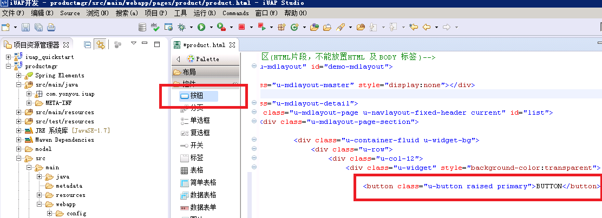

简单的拖拽就可以实现一个基本的dom元素，用户还可以增加一些样式，丰富动态效果。具体的控件样式参考[neoui](http://design.yyuap.com/dist/pages/neoui/index.html)文档说明。
### 调整拖拽后的代码

拖拽后的代码需要根据业务微调，以表格为例进行说明。

拖拽前的代码：

```
<table class="u-table" style="width:100%;">
    <thead>
        <tr>
            <th>serialVersionUID</th>
            <th>productid</th>
            <th>productname</th>
            <th>productnum</th>
            <th>price</th>
            <th>supplier</th>
            <th>prodate</th>
            <th>orgin</th>
            <th>ts</th>
        </tr>
    </thead>
    <tbody>
        <tr>
            <td data-bind="text:Product['ref']('serialVersionUID')"></td>
            <td data-bind="text:Product['ref']('productid')"></td>
            <td data-bind="text:Product['ref']('productname')"></td>
            <td data-bind="text:Product['ref']('productnum')"></td>
            <td data-bind="text:Product['ref']('price')"></td>
            <td data-bind="text:Product['ref']('supplier')"></td>
            <td data-bind="text:Product['ref']('prodate')"></td>
            <td data-bind="text:Product['ref']('orgin')"></td>
            <td data-bind="text:Product['ref']('ts')"></td>
        </tr>
    </tbody>
</table>

```
#### 去掉无用的内容

可以看到生产的表格`td`、`th`中`serialVersionUID`、`productid`、`ts`这些是不希望显示出来的，所以需要开发者自己删除。

#### 绑定事件

给相关dom元素添加事件，绑定事件的方法是使用[knockout](http://design.yyuap.com/dist/pages/kero/knockout.html)绑定的,也可以通过普通的js、jquery设置。这里利用knockout语法，进行相关的事件绑定。

例如在`a`标签中绑定在js文件中定义的`delRow`方法

```
	<a href="javascript:;" class="m-r-sm" data-bind="click:delRow.bind()">删除</a>
```

[查看完整html代码](../../res/qian_duan_kai_fa_html.html)

	注意：js的数据模型中的字段定义务必和html中的数据绑定处的字段名称一致