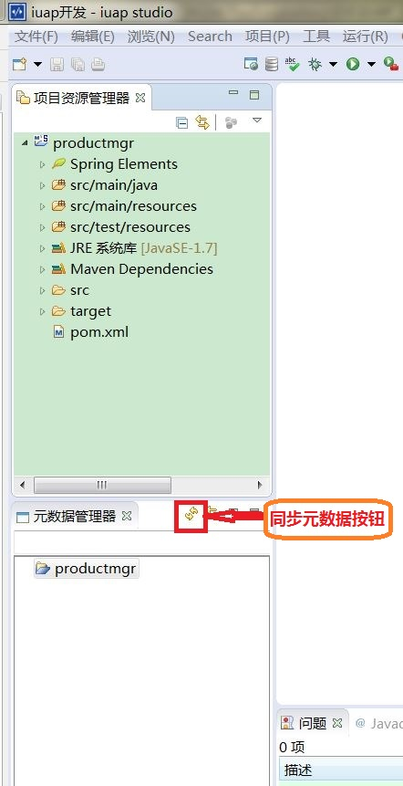
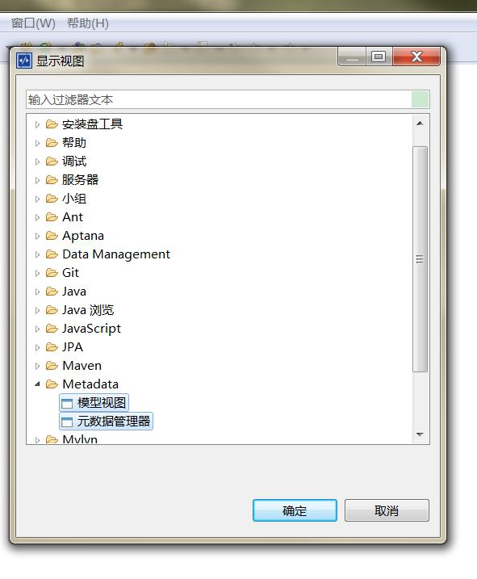
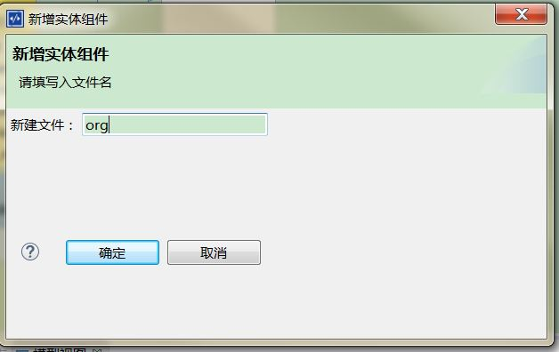
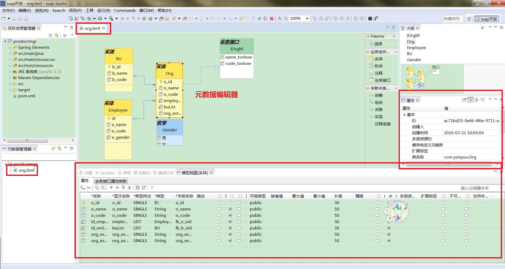
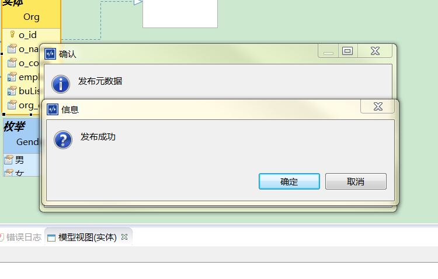
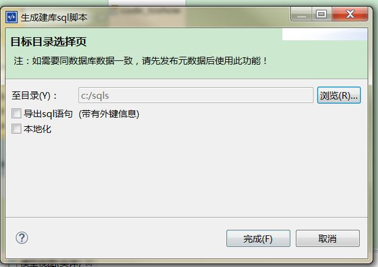
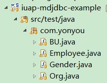
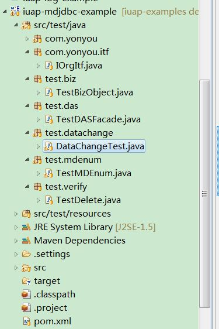

# 元数据开发 #

----------
## 新建元数据并发布 ##
1.选中要编辑发布元数据的工程，在“元数据管理器”视图中即可看到项目工程和工程下现有的元数据文件。

###### “元数据管理器视图”默认在“iuap开发”透视图中打开，如果找不到，点击工具栏“窗口”-->“显示视图”-->“其它（O...)”-->“Metadata”中选择  ######

2.新增实体组件：在元数据管理器中，右键工程--->"新增实体组件"，在弹出窗口中输入新建的实体组件名并点击确定：

3.编辑组件：
上一步完成之后会在“元数据管理器”视图中的项目名下生成一个对应组件名的文件，而开发工具的主界面则会打开一个对应组件名的BMF文件编辑器，通过这个编辑器我们可以拖拽出不同的业务组件如：实体、枚举、业务接口以及业务组件直接的关联关系如：依赖、组合关联等等。通过属性和“模型视图”界面可以查看和编辑对应的属性信息。

4.发布元数据&生成脚本
在元数据编辑界面，选中编辑完成的元数据-->右键“发布元数据”即可将编辑好的元数据发布到数据库中。

同理，右键“生成java源代码”“生成sql建库脚本”，选择输出目录后可以方便的生成模型对应的POJO风格的java源代码和当前数据库连接类型的DDL建库脚本。

导出成功后即可在对应的路径下看到java源码和建库脚本

###### 用户可直接拷贝&执行，效果如下    ######

5.使用元数据编写增改删查需要的几个方法，完整代码如下
   
    
    import org.junit.Test;
    import org.springframework.beans.factory.annotation.Autowired;
    import org.springframework.test.context.ContextConfiguration;
    import org.springframework.test.context.junit4.AbstractJUnit4SpringContextTests;
    
    import com.yonyou.Employee;
    import com.yonyou.iuap.persistence.bs.dao.DAOException;
    import com.yonyou.iuap.persistence.bs.dao.MetadataDAO;
    import org.springframework.test.context.junit4.AbstractTransactionalJUnit4SpringContextTests;
    import org.springframework.test.context.transaction.TransactionConfiguration;
    
    /**
     * Created by zengxs on 2016/5/24.
     */
    @TransactionConfiguration(defaultRollback = true)
    @ContextConfiguration("/applicationContext.xml")
    public class DataChangeTest extends AbstractTransactionalJUnit4SpringContextTests {
    
    @Autowired
    private MetadataDAO metadataDAO;
    
    @Test
    public void testAdd() throws DAOException, InterruptedException {
    Employee employee = metadataDAO.queryByPK(Employee.class, "a0f3704f-1466-45ac-a238-d8c08cadcefe");
    metadataDAO.insert(employee);
    Thread.sleep(5000);
    }
    
    @Test
    public void testDelete() throws DAOException, InterruptedException {
    Employee employee = metadataDAO.queryByPK(Employee.class, "a0f3704f-1466-45ac-a238-d8c08cadcefe");
    metadataDAO.remove(employee);
    Thread.sleep(5000);
    }
    
    @Test
    public void testUpdate() throws DAOException, InterruptedException {
    Employee employee = metadataDAO.queryByPK(Employee.class, "a0f3704f-1466-45ac-a238-d8c08cadcefe");
    employee.setE_code("testaaa");
    metadataDAO.update(employee);
    Thread.sleep(5000);
    }
    
    }
6.更多，请参照工程：“iuap-example/example_metadata_jdbc”。

