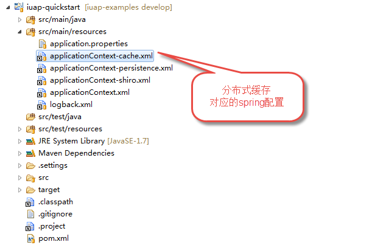

# 组件集成

> 
本部分属于平台高级开发，初级学习可以不考虑本文档
> 

开发过程中，业务上可能会需要和其他的技术组件进行集成，IUAP平台提供的技术组件，大多数以spring的方式扩展，如缓存组件、消息队列组件、分布式锁组件等。下文分布式缓存组件为例，简单介绍下组件的集成过程，其他组件的具体使用方式，请参考官网的具体的使用手册。  

第一步：在`pom.xml`中引入对iuap-cache组件的依赖。此过程可以配置IUAP_STUDIO的可视化操作来执行，在此不作赘述。  

`${iuap.modules.version}`是以变量的方式引用版本，请开发者根据需要引用指定的版本。执行Maven的update后，可以在工程的`Maven Dependencies`下看到依赖的组件jar包。  

  

第二步：引入分布式缓存所需要的Spring配置文件，加入到`src/main/resources`下。  

第三步：在属性文件`application.properties`中，配置缓存需要的连接信息。  

  

第四步：确保`web.xml`引入了spring的配置。  

第五步：在代码中注入缓存管理类，进行缓存的操作。  
其它组件的集成方式类似，请针对不同的组件，参考不同的技术组件使用手册。