# 开发工具使用

# 1.iUAP_Studio 开发工具

## 1.1 产品概述


iUAP_Studio是一个简单易用的基于Eclipse开发平台的web项目开发工具。工具集成了eclipse j2ee版本的大部分插件，大大降低了学习成本，并基于iUAP开发平台量身定做了很多实用功能，为WEB应用开发者提供便捷的可视化建模开发，包括快速生成代码块、提供界面友好的可扩展可定制的代码提示窗口、html标签扩展、JS第三方语法支持、页面模式和向导、组件仓库的管理、快速代码生成引擎以及元数据模型设计发布等功能。


## 1.2 iuap_quickstart实例工程


iuap_quickstart工程是iUAP开发平台的实例工程，该工程基于iUAP开发框架进行基本业务逻辑的编写,实现了完整的增删改查逻辑，并在具体的示例页面上加以展示。可以帮助业务开发人员快速的完成对平台基本功能的了解和使用。工程中包含了完整的iUAP基础组件和前后端框架，开发人员在iUAP Studio中可以通过新建iUAP项目来创建，并在此基础上进行开发。


# 2.开发流程

## 2.1 环境配置

### 2.1.1 JDK配置


开发工具默认JDK位于安装目录下的Runtime目录。 在IDE中，选择窗口->首选项->JAVA->已安装的JRE，可以看到目前IDE中使用的JAVA环境。如果不使用默认的JDK，可手动添加本地JDK，勾选即可。


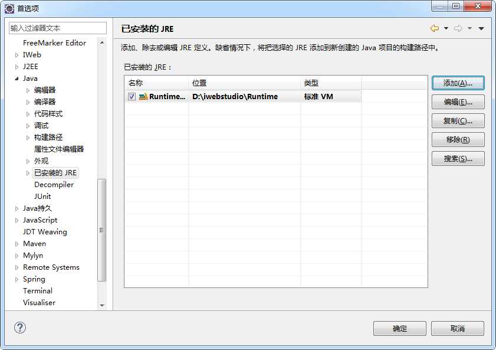


### 2.1.2 Maven配置

开发环境的maven位于iUAP开发工具包的DevTool\repository\Maven\Maven3.2.2目录下，也可以自定义使用本地maven。以默认maven为例，首先要设置maven的环境变量，在系统变量中添加环境变量MAVENHOME,该变量指向目录DevTool\repository\Maven\Maven3.2.2，然后在Path变量中加入路径%MAVENHOME%\bin。 maven环境变量配置好以后，我们要在IDE中配置maven的配置文件的路径，在IDE的菜单栏中选择窗口->首选项->Maven->User Settings，将标签页的Global Settings和User Settings改为开发工具包内maven的配置文件的地址  


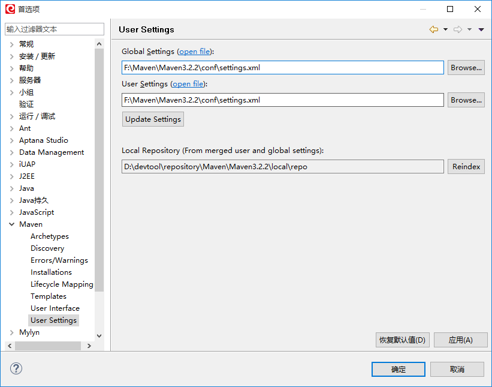

  


## 2.2 工程初始化

### 2.2.1 新建iUAP项目

在IDE菜单栏中选择新建->iUAP项目，点击下一步，进入新项目的配置页面。 输入项目名称建立新项目 如图所示：  


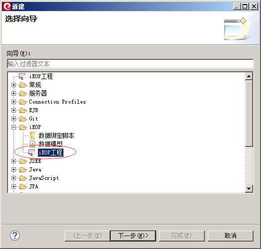


点击完成，稍等片刻，IDE在完成maven库的更新下载以及工程编译的进度读条后，这时工作空间中会建立一个新的iUAP工程。

### 2.2.2 数据源配置

右键工程，选择iUAP Tools->数据库连接配置。 在弹出的对话框中配置数据库类型和基本信息，点击测试连接，测试通过后，点击完成，即完成了对工程数据源的配置。


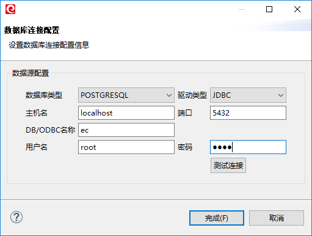

## 2.3 建模过程


### 2.3.1 实体类层编写


iUAP开发工具可使用**三种方式**快速生成javabean实体类。

**方式一：** 工具使用JPA插件，通过数据表的方式自动建立实体类，首先建立好数据库、实体表、以及数据库连接，在工程上右键选择配置->转为JPA工程，完成转化后，右键工程选择JPA tools->Generate Entities from Tables, 从数据表反向生成Entity。  

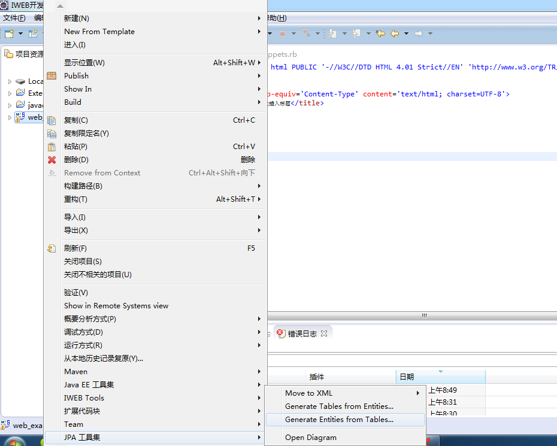   
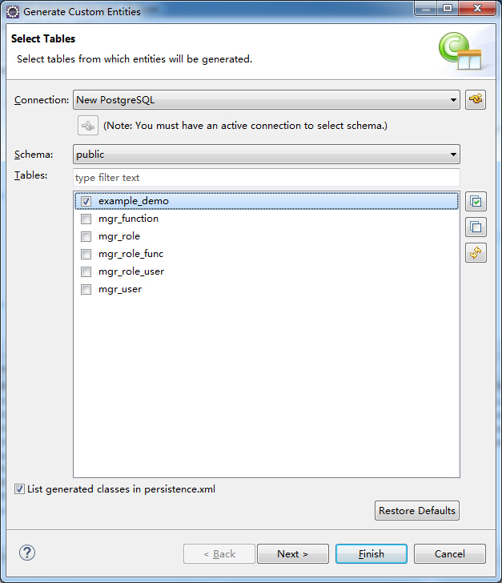

**方式二：** 通过元数据设计器设计元数据模型，并生成java源代码。

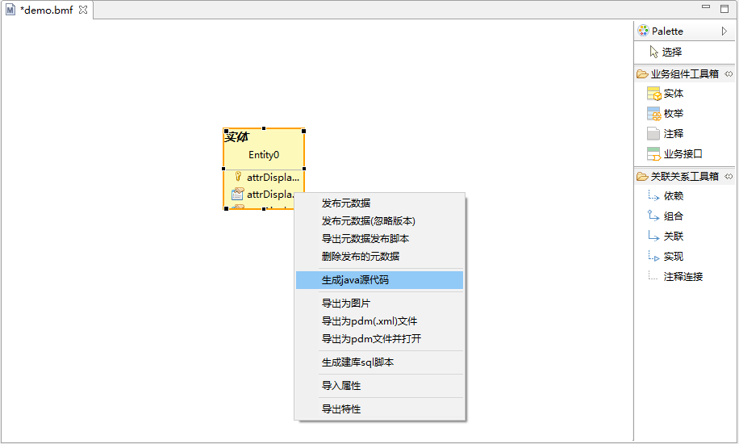  

**方式三：** 通过代码快速生成向导，选择适用的模版类型生成相应格式的javaBean。

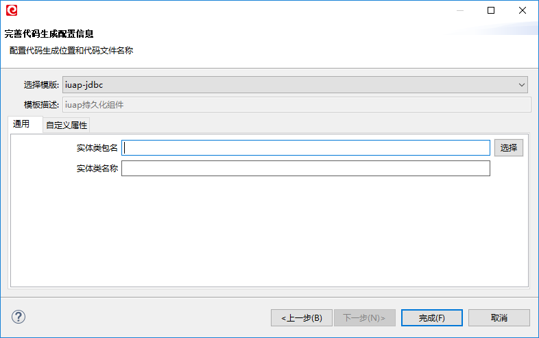  


选择生成字段以及包名等，工具自动生成注解，生成实体类如下：   


```
		@Entity

		@Table(name="example_demo")

		@NamedQuery(name="Demo.findAll", query="SELECT d FROM Demo d")

		public class Demo implements Serializable {

		    private static final long serialVersionUID = 1L
		    
		    @Id
		    private long id;

		    @NotBlank(message="测试编码不能为空!")
		    private String code;
		    
		    private String memo;

		    private String name;

		    private String isdefault;

		    public Demo() {

		    }

		    public long getId() {

		        return this.id;

		    }

		    public void setId(long id) {

		        this.id = id;

		    }

		    public String getCode() {

		        return this.code;

		    }

		    public void setCode(String code) {

		        this.code = code;

		    }

		    public String getMemo() {

		        return this.memo;

		    }

		    public void setMemo(String memo) {

		        this.memo = memo;

		    }	

		    public String getName() {

		        return this.name;

		    }

		    public String getIsdefault() {

		        return isdefault;

		    }
		
		    public void setIsdefault(String isdefault) {

		        this.isdefault = isdefault;

		    }	

		    public void setName(String name) {

		        this.name = name;

		    }

		}

``` 


### 2.3.2 数据模型引入


开发工具中的数据模型有很多用途，比如绑定控件替换参数，一键生成数据绑定配置文件，页面模式化向导等。 这里的数据模型的概念实际上是基于JavaBean实体类的xml文件，以.model为后缀名。iUAP开发工具提供两种方式生成数据模型。   

一是通过数据模型向导直接新建模型。右键工程，选择新建->数据模型。下一步输入模型的名称以及位置，点击完成后，通过model编辑器完成模型的录入。 如图所示：   


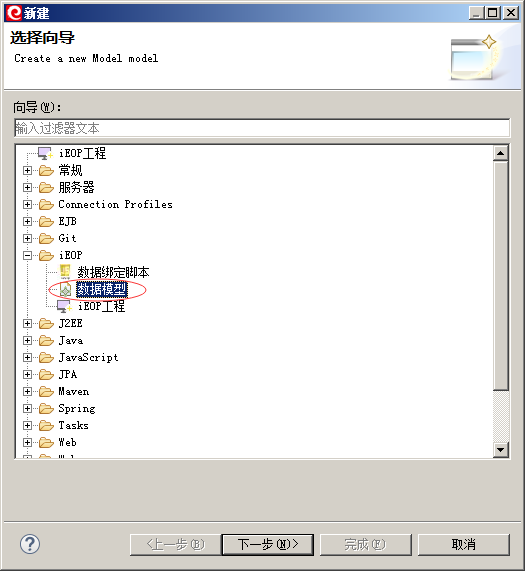   

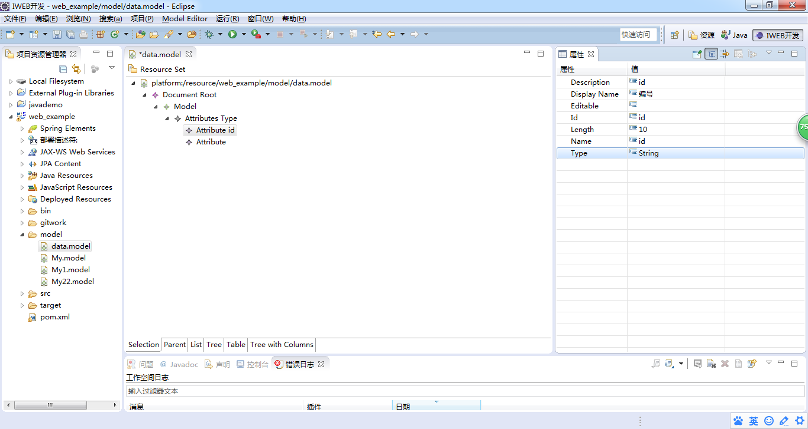  

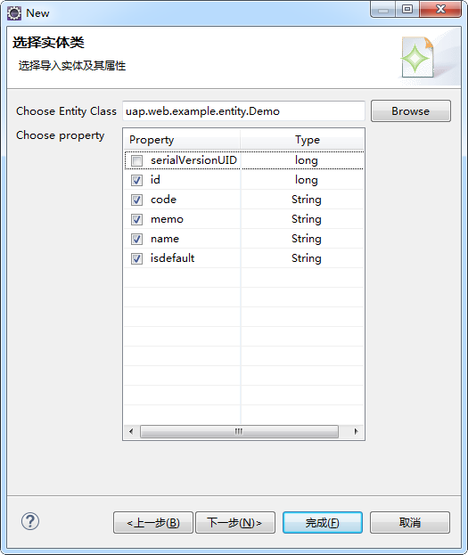   

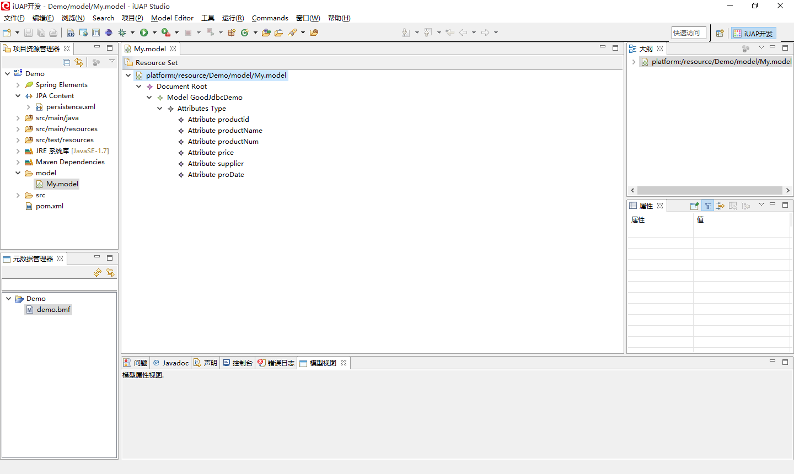   


二是通过绑定实体类，自动生成数据模型。 初始步骤同上，在输入模型名称后点击下一步，进入属性配置页面。 选择需要的实体类以及属性后，点击完成即可生成与实体类对应的模型文件。  

生成的模型文件如下所示：   

```

		<?xml version="1.0" encoding="UTF-8"?>

		<model xmlns="http://www.yonyou.com/uap/DataModel" className="uap.web.example.entity.Demo" id="Demo" name="Demo">

		  <attributes>

		    <attribute id="id" name="id" type="long"/>

		    <attribute id="code" name="code" type="String"/>

		    <attribute id="memo" name="memo" type="String"/>

		    <attribute id="name" name="name" type="String"/>

		    <attribute id="isdefault" name="isdefault" type="String"/>

		  </attributes>

		</model>

```

## 2.4 新建页面

右键点击工程根目录或者在工具栏中选择新建->iUAP页面，进入iUAP页面新建向导。 

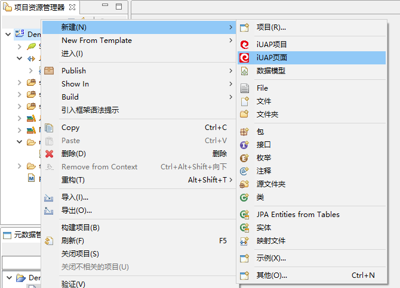   
页面统一建在工程下的src/main/webapp/pages目录下。 填写页面名称后，可以选择是否使用数据模型，如果不勾选数据模型，则可以点击完成，会创建仅包含基础js框架的页面。 若勾选，则点击下一步，进入数据模型绑定页。

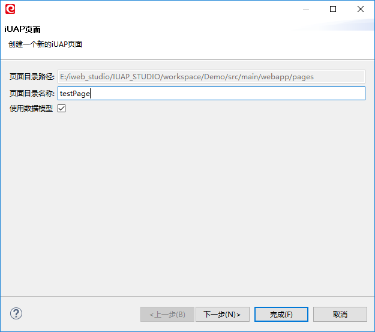   
下拉框中选择上一步创建的数据模型，并勾选用到的属性。用户可以通过勾选“选择”按钮使用多个数据模型，点击完成即可创建使用数据模型的html和js页面。

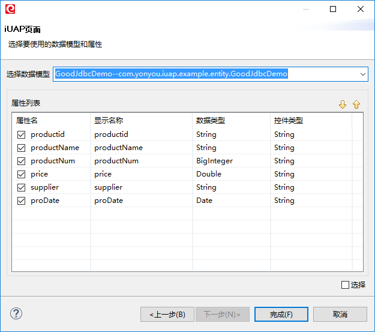   


## 2.5 数据绑定


在有些情况下，可能不是要创建整个功能页面，而是在页面中添加一些功能控件，完成数据操作。 比如上图中的列表控件和表单控件。如果要单独添加这些控件如何做呢，这就需要用到控件的数据绑定。我们这里提供了目前最常用的两种控件模板，表格和表单。


以表格为例，默认使用web页面编辑器打开html页面文件。在左侧工具箱中选择控件下的简单表格项，双击打开数据配置页，关联上面创建的数据模型，点击完成即可在html中插件相关代码，如图所示：   


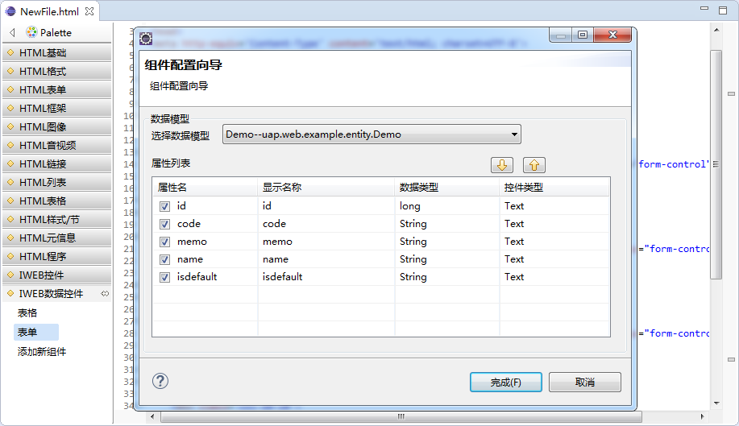   


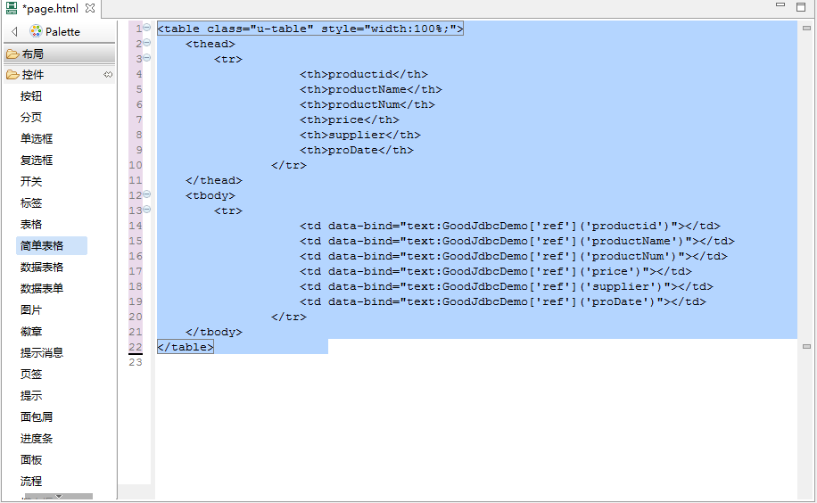  

完成html代码创建后，并不意味着可以和后台数据做关联，数据还需要采用knockout的方式进行双向绑定，所以我们需要支持创建这种数据绑定js文件，

选中工程， 右键新建，在向导页中选择iUAP->数据绑定向导。 下一步选择js文件的位置，这里js文件一般需要与相应的html文件放在同一级目录下并且命名一样。下一步选择数据模型及其属性，点击完成即可创建JS文件。这里的js文件作为中间层，提供前台控件和后台数据的绑定机制。 如图所示：  

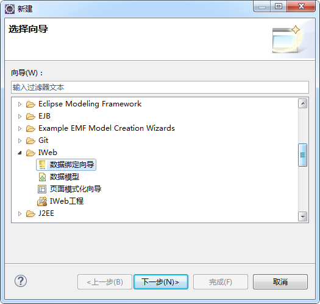   

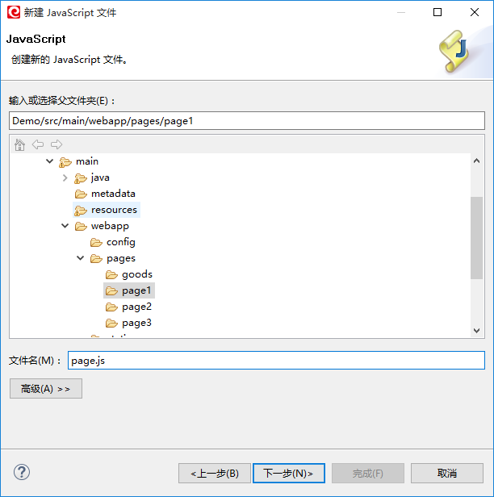  

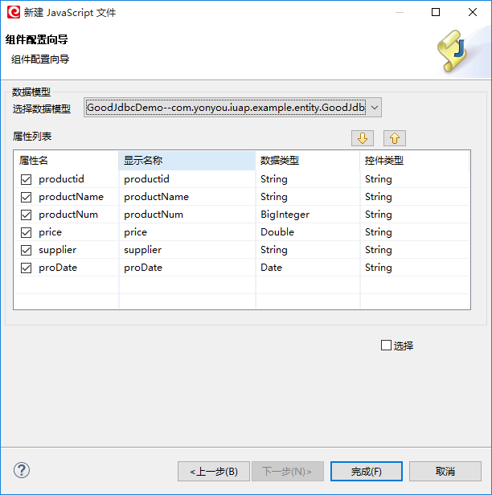  


创建出来的js文件如下所示：  


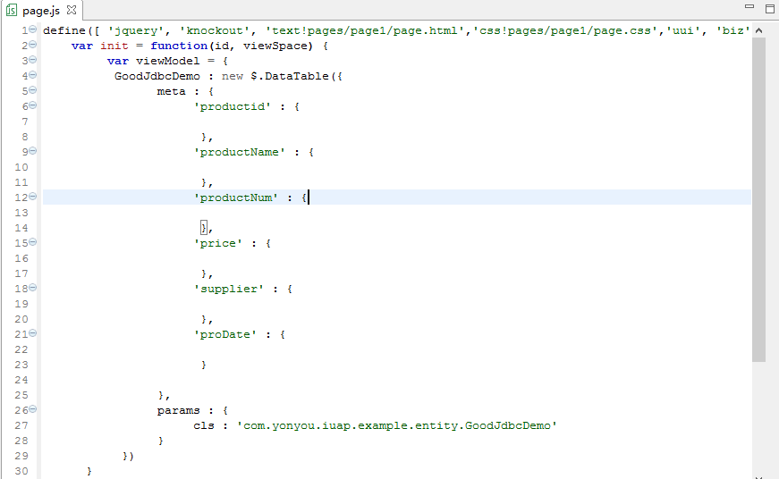   


### 2.6 示例工程运行调试

webexample是平台基本开发功能的演示示例。 在调试运行工程之前，先运行DevTool\bin目录下的startpgsql.bat、startredis.bat、startzookeeper.bat启动PostgreSQL、Redis和Zookeeper

示例工程通过jetty的方式进行运行调试，在webexample工程项目的\src\test\java\uap\web\XXX文件夹下有对应的QuickStartXXX类，运行该类就能启动项目进行调试。webexample项目调试效果如下图：  


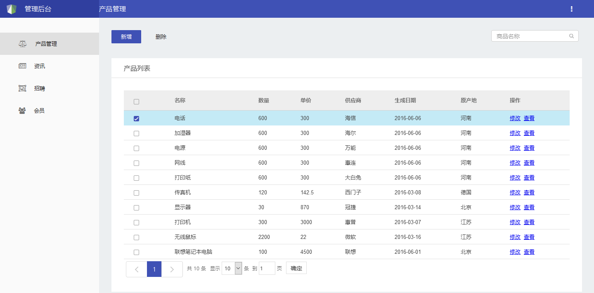   

 


# 3 代码提示


## 3.1 标签助手


在“web页面编辑器”中，键入“<”即可开启智能提示助手，准确的提示出过滤后所有的标签，如图：  


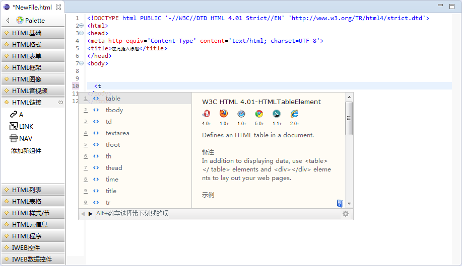   


提示框左侧是经过过滤后的标签列表，右侧是当前标签对应的种类，适用浏览器版本，描述，备注以及示例，一目了然，方便快捷。 输入数字快捷键可以更加方便的把对应标签插入html当前位置。

## 3.2 代码块

在html中直接输入触发字符可提示代码块。 代码块是常用的代码组合，比如在js中输入$，回车，则可以自动输入document.getElementById(id)。 再举例，在HTML中输入i，回车，可以得到input button标签。  

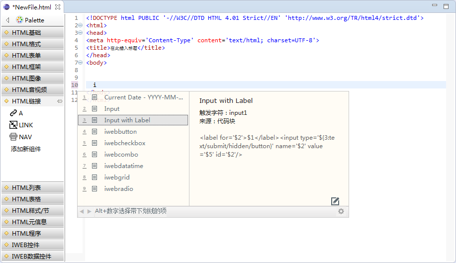   

如图，提示框左侧是过滤后的代码块列表，右侧是当前代码块的触发字符，来源，以及模板代码。

## 3.3 Emmet支持

web页面编辑器内嵌了emmet（即zencoding）插件。输入div#id1，按下tab，可以自动生成。Emmet的详细语法请查阅其官方网站emmet.io。  

## 3.4 JQuery支持

web页面编辑器内嵌了jquery插件，可以提示jquery语法。提示效果如下：  


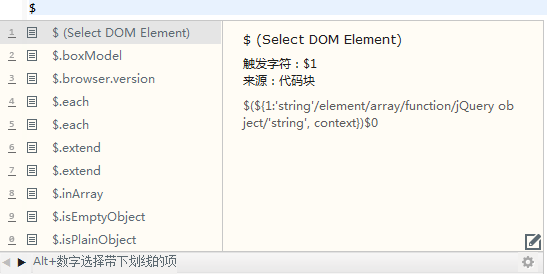   


## 3.5 标签和代码块智能提示配置

标签可通过在窗口->首选项->iUAP->Html标签扩展里面进行编辑，可创建自定义标签提示。  


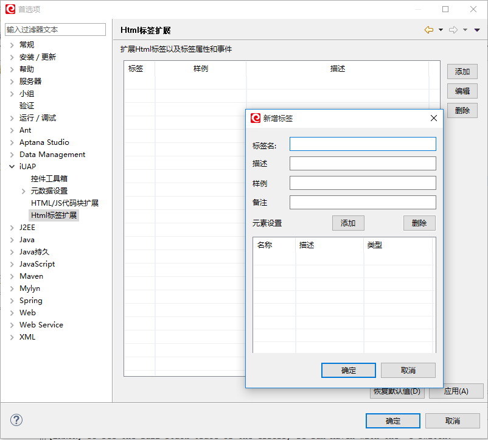   


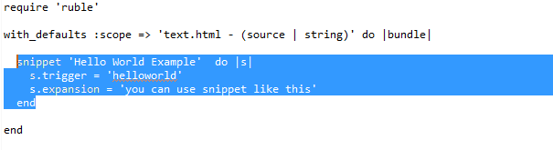   


高亮处为代码定义主体。 第一行单引号内为代码块显示标题，第二行trigger为代码块触发字符，第三行expansion为代码块主体。若想添加新的代码块，复制此处，粘贴在下行，并修改相应代码即可。


# 4 元数据设计器
## 4.1 元数据设计器概述

模型设计器作为实体模型、数据库模型的定义以及代码生成和脚本生成的工具，为业务系统中的领域模型的建立和基础代码的产生提供了一个完整的平台。业务分析和设计人员在建立领域模型时，其模型元素和模型设计器的实体操作等模型保持一致的描述方式，以保证领域模型顺利的建立和代码的顺利生成。

## 4.2 功能说明

系统提供实体模型、数据库模型等定义功能

提供版本控制和权限特性

提供模型的代码生成和数据库表的脚本生成功能

## 4.3 环境配置

从组件仓库下载元数据依赖的组件（maven依赖）。

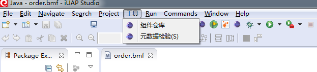

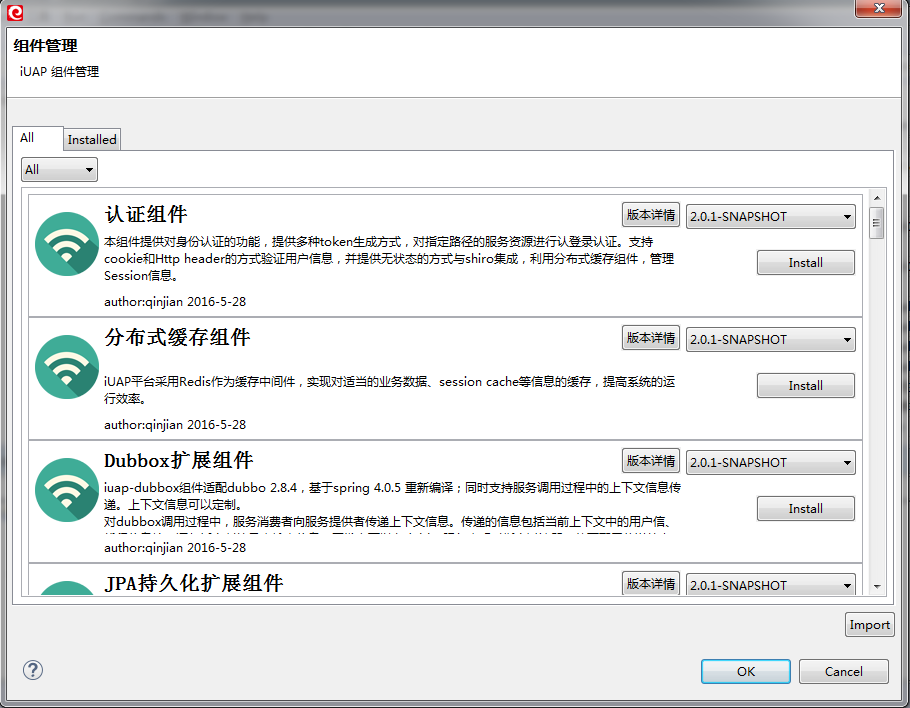

安装完成后，确保maven项目pom.xml文件有元数据组件。

如下代码段：

	<dependency>
      <groupId>com.yonyou.iuap</groupId>
	  <artifactId>metadata-jdbc</artifactId>
	  <version>2.0.1-SNAPSHOT</version>
	</dependency> 

数据库连接配置

设置数据库连接配置信息

规则：一个项目配置一个数据库连接配置，具体位置：src/main/resources/application.properties


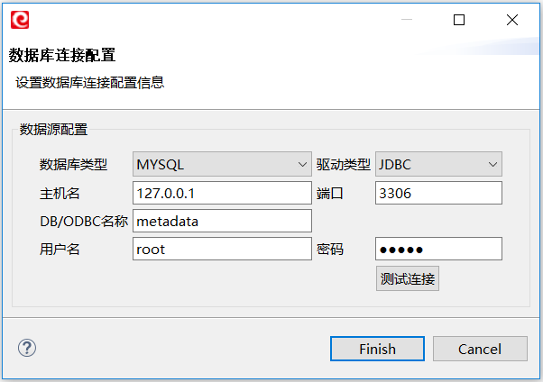
 
## 4.4 界面功能分布

根据界面功能分布，MDP模型设计器有5个重要的组成部分，分别是元数据管理器、画布、工具面板、属性面板和模型视图。

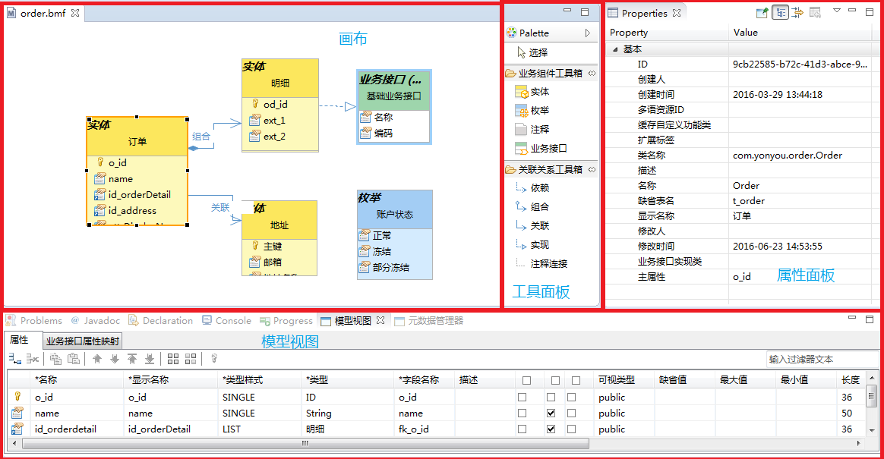

### 4.4.1 元数据管理器

元数据管理器是提供元数据的相关管理工具，它支持元数据的创建、数据库导入实体组件、导入元数据bmf文件及删除元数据文件同时方便查看所有模型资源以及公共资源。
管理器的文件系统结构是按树形方式展开，反映组件的树型组织关系：

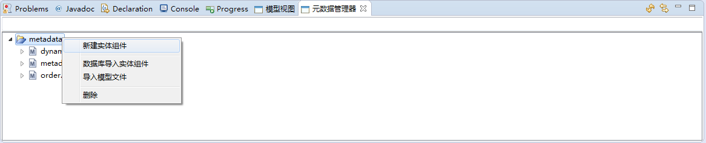


#### 4.4.1.1 新建实体组件

创建元数据bmf文件。

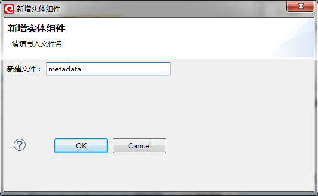


#### 4.4.1.2 数据库导入实体组件

支持从数据导入实体组件。


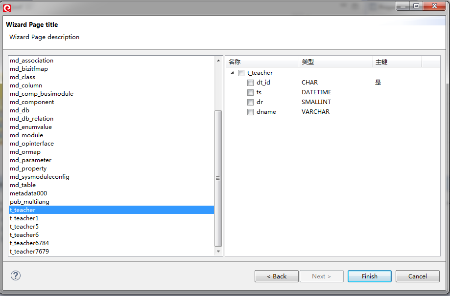


#### 4.4.1.3 导入模型文件

支持导入元数据bmf文件。

#### 4.4.1.4 删除

删除元数据bmf文件

### 4.4.2 画布

模型设计器是一个图形化的工具，画布工具便于使用者进行类图建模的绘制。使用者从工具面板中拖动相应元素到画布类图中创建实体、枚举、值对象等。并可对类图中的对象进行直接增、删、改操作。

并且在画布类图中，选定类图中对象后点击鼠标右键，可以进行导入属性、发布元数据、发布元数据（忽略版本）、删除发布元数据、生成java源代码、导出pdm(.xml)文件等功能。上述操作的详细说明将在元数据典型应用章节中进行阐述。

### 4.4.3 工具面板

实体组件工具面板上用户通过拖拽的方式，在画布上创建实体组件、创建枚举、创建业务接口、创建注释以及创建关联关系。

### 4.4.4 属性面板

属性面板主要是在设计修改模型时，为使用者提供实时查性和设置当前所选定对象的基本属性的工具。

在面板的右上角有快捷应用功能按钮 ， 如下是对各按钮功能的描述：

[属性视图图钉功能]，选中后，固定当前选择对象，在使用者点击其它对象时，属性视图不随之改变；

[显示类别]，选中后，属性视图将按属性类型的方式排列展示；

[显示高级属性]，选中后，属性视图将显示高级属性；

[恢复缺省值]，选中后，恢复当前选择对象的属性的缺省值。

### 4.4.5 模型视图

在模型视图界面中可以对实体若干属性进行新增、修改和删除操作，还可以实现业务和属性映射。介绍实体属性时会具体说明。

## 4.5 创建组件

### 4.5.1 创建实体

#### 4.5.1.1 实体属性

实体可以有若干属性和操作，还可以实现接口。


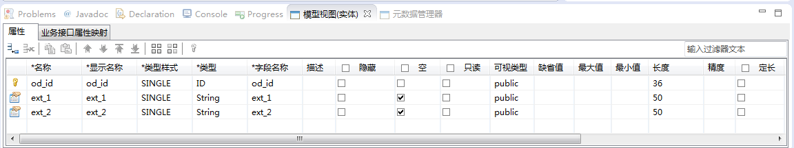


具体实体各属性

实体中属性的设置要点如下：

类型样式：目前支持Single、REF、LIST三种。

SINGLE 单一样式，最终的类型就是原始数据类型。

REF 引用样式，只用于实体，值对象，设置为引用样式，便可以得到引用类型。

LIST 列表样式类最终的类型为List<数据类型> 集合类型。

类型：可以自行选择，当建立实体间关系时，也会自动设置；主键一定要设置为ID类型。

目前元数据支持如下基本类型：String, Integer, BigInteger, MEMO, Double, Boolean, Date, Timestamp, Time, BigDecimal, ID, Money, BLOB, CLOB,CUSTOM,MULTILANGTEXT,IMAGE,FREEDOM,CONVERSIONRATE等。

字段名称：生成数据库表列的名称。

隐藏： 是否隐藏。

空：是否可以为空。

扩展标签：
1）cacheable标识此实体进行缓存处理。
2）自由配置供二次开发使用。

#### 4.5.1.2 实体的特性

实体的特性是从各种各样不同的实体中提取出来的一些共同的有特点的属性，比如说单据主实体上一定会有单据号，单据日期等。利用实体的特性，可以方便地构造出具有某些属性的实体，降低开发人员的工作量。

开发人员有两种方式来得到实体的特性：

1.可以通过修改iUAP Studio\iuap\metadata\Features文件夹下的xml文件来增加新的特性，其中特性文件名为Features_模块名；

2.开发人员亦可通过导出特性的方法来导出特性。


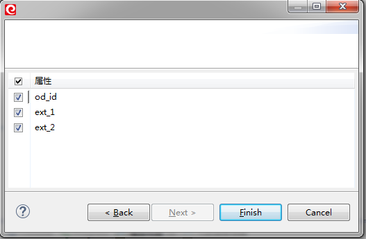

导出特性 点击后可以进入如下界面：

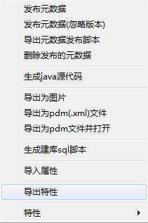

特性界面

其中特性名称为该特性的显示名称。点击next后会进入选择要导出的特性的界面，选择要导出的特性，点击完成。

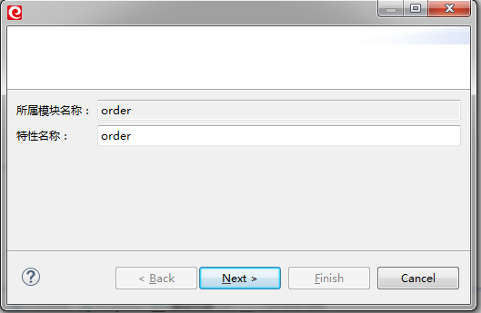

选择特性

   
#### 4.5.1.3 实体间关系

目前元数据的关系支持关联、组合。

关联，属性的类型样式是REF，在代码中生成的是一个String。

组合，属性的类型样式是LIST，在代码中生成的是一个list集合。


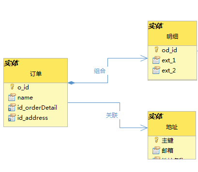
实体间关系


设置关系的注意事项：

关系中必须设置源属性。

设置了关系后，属性的类型便会发生变化，但删除关系后，属性的类型不会恢复，务必要检查。另外，修改过带有关系的属性后，需要重新设置关系（即重新拉线）。

注意：对于组合关系，子实体中不需要指向主实体的外键属性，这是业务模型而不是数据库模型，在元数据发布时会自动在数据库中为子表加上外键。外键列的名称就是源属性（在上图中即为“订单”实体中的“订单明细”属性）对应的字段名称，所以建议将源属性对应的字段名称设为所期望的子表对应主表的外键名称。

如果实体是从PDM导入的，则务必按照注意事项修改模型。


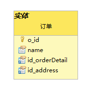
简单实体


简单VO简部全部为简单字段，与其它实体无任何关系，该实体除了客户类型为枚举类型，其它字段均为基本类型，和其它实体没有任何关系。

这是最简单的一种类型，依照实体默认产生数据库表,表名可以在设计器上指定，字段和实体属性保持一致即可，字段名也可以在设计器上设置。


一对一关联


一个实体一对一关联了另一个实体，且在产生的JAVA类里关联源字段为字符串类型，而不是被关联实体的类型，我们把这种关联称之为关联，称关联源字段的数据类型为引用类型。

比如客户关联了地区，客户里有一个字段叫[客户所在地区]，称为关联源字段，如果是引用关联，则产生的客户JAVA类里，关联源字段为String类型，记录的是地区的主键ID。


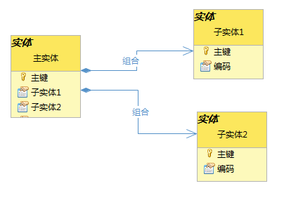

一对多组合


对于一对多组合，保存时除了保存主实体，还要保存被组合的子实体，删除时也一起删除，查询时提供全部查询和只查主实体对象。

### 4.5.2 创建业务接口

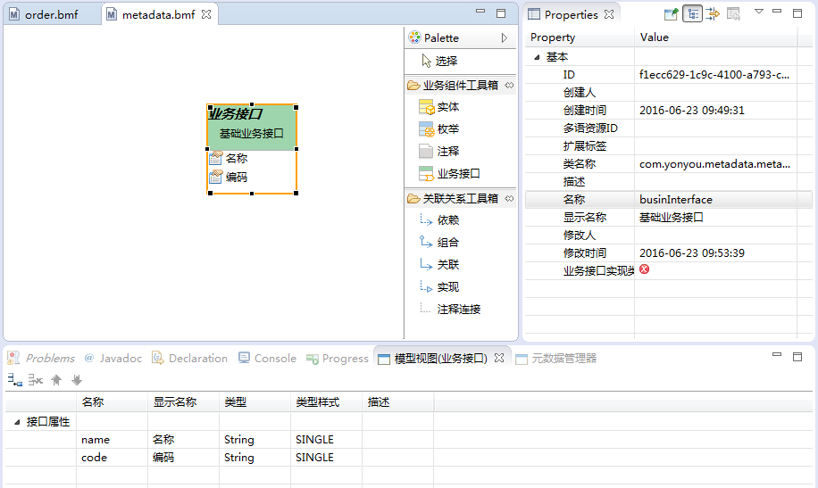

业务接口

在设计器上，业务接口只能增加属性，相应会生成get方法，比如增加一个name属性，会生成一个getName()方法，方法的返回值可以自由选择。实际上，如果希望灵活运用业务接口，你可以摆脱设计器的限制，你在设计器上设计出一个业务接口，生成代码后，可以给业务接口增加任何方法，当然实现类也由你自己实现，此时只一通过元数据来管理你的业务接口而已。

业务接口的实现类可以分为三种情况，优先级从高到低排列如下：

1.实体和特定业务接口连线上的实现类

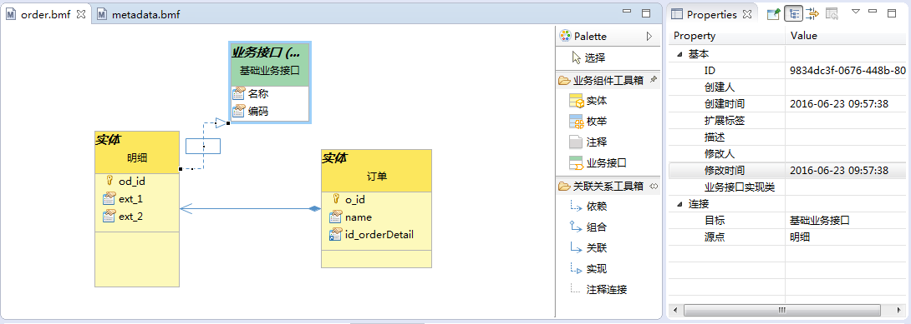
实体实现接口连线


2.实体上注册的实现类

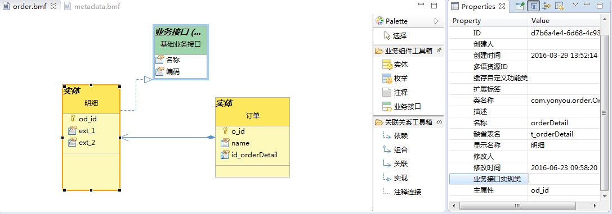
实体注册实现类


3.业务接口上注册的实现类


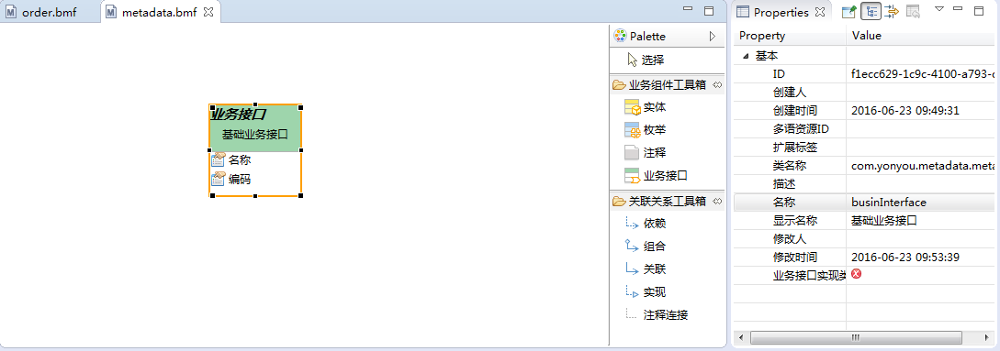
业务接口注册实现类

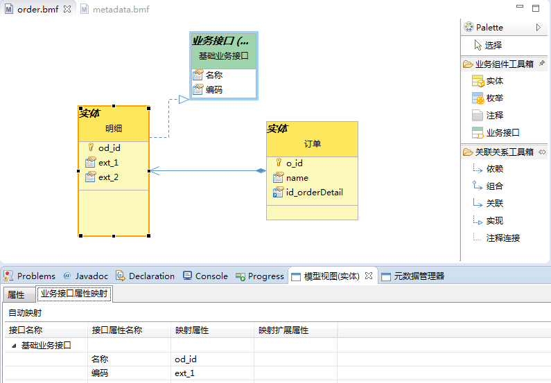

根据映射关系自动生成


### 4.5.3 创建枚举

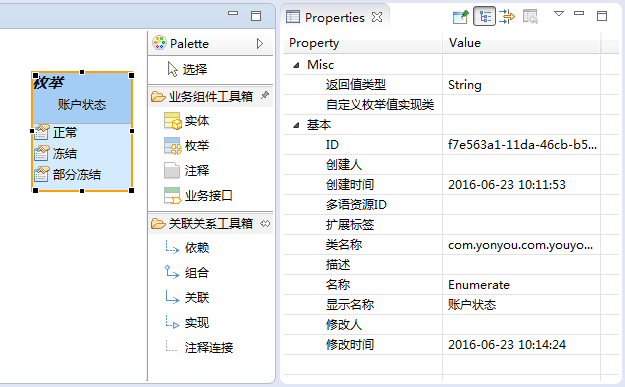
创建枚举类型


创建一个枚举类型时，要注意以下几点：

枚举类型必须设置返回值类型，当前支持String和Integer两种

## 4.5 元数据典型应用

### 4.5.1 元数据发布

元数据发布的最小单元是组件。选中某个组件，或者在画布中点击右键，即可发布元数据。

元数据发布分为两种发布方式：1.发布元数据。2.发布元数据（忽略版本）。


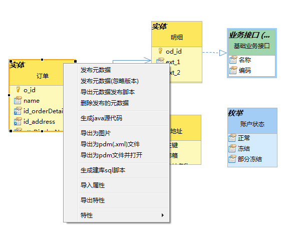

发布元数据


注意事项：

必须保存后才能发布

发布时会一起发布被依赖的组件，支持双向依赖，循环依赖。

如果发布元数据时忽略版本，则完全以本地的模型文件为准，可能造成库中新版本的模型被覆盖，非特殊情况不推荐使用。

### 4.5.2 删除发布的元数据

删除已发布在数据库中的元数据。

### 4.5.3 导出java代码

发布元数据后，在设计器上右键->导出java源代码可以导出java代码

### 4.5.4 导出sql脚本

发布元数据后，在设计器上右键->导出sql脚本

脚本带有实体建表语句及扩展表建表语句（ext_+原实体表名）。

### 4.5.5 导出PDM文件

如果当前文件夹下有同名的pdm，会分析PDM文件中的外键信息.并添加到新生成的PDM文件中。

# 5. 模版引擎

iUAP-Studio 提供模版引擎同时支持预置模版和用户自定义模版。模版引擎让用户不仅仅是使用者，还是创造者，赋予用户自主优化开发过程的能力。 

## 5.1 代码块/控件模版

studio初始安装后，打开html页面，左侧工具栏中预置了iUAP布局与控件代码块。可直接拖拽进html编辑器中。 点击菜单栏中窗口->首选项->iUAP->控件工具箱，可自定义控件的分类和内容。 自定义的控件代码存放在studio安装根目录下的templates/code中。

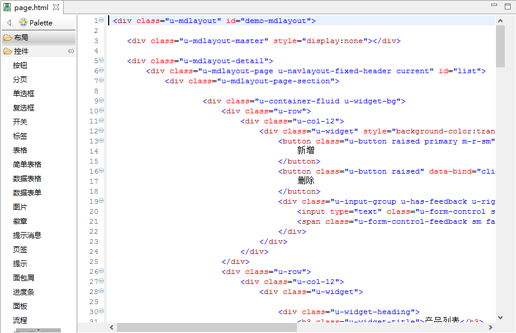

## 5.2 页面模版

点击工具栏新建->iUAP页面模版,可以使用页面模版创建页面。 studio初始安装后， 预置了通用和电商两个领域类别的模版，包含了近30套页面。用户可以根据场景选择模版，点击下一步，输入页面名称即可完成，生成的页面默认放在工程下的src/main/webapp/pages目录中。

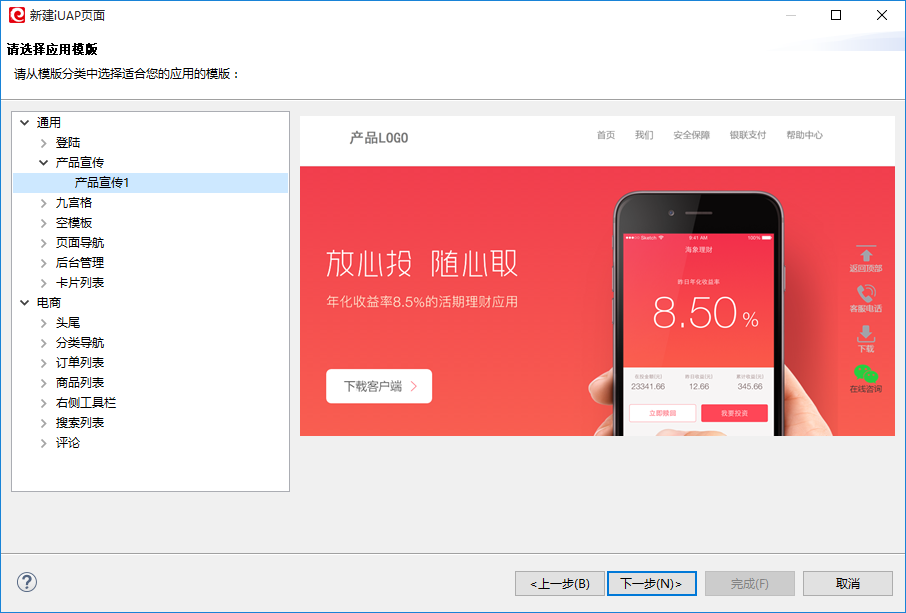

用户也可以根据已有页面生成可用模版。在pages下已完成的页面目录点击右键，选择iUAP Tools->生成页面模版，进入页面模版生成向导。 填写完成名称，分类等信息后，点击完成模版会生成在指定位置。这时，可以在新建->iUAP页面模版中可以看到刚导出的页面模版了。

## 5.3 快速代码生成

代码片段通过代码块模版生成，前端页面通过页面模版生成，后端代码则可以通过快速代码生成实现。 右键点击工程，选择iUAP Tools->快速代码生成， 进入代码生成向导。 首先选择数据源，这里有两种方式， 从元数据导入和从数据库导入。

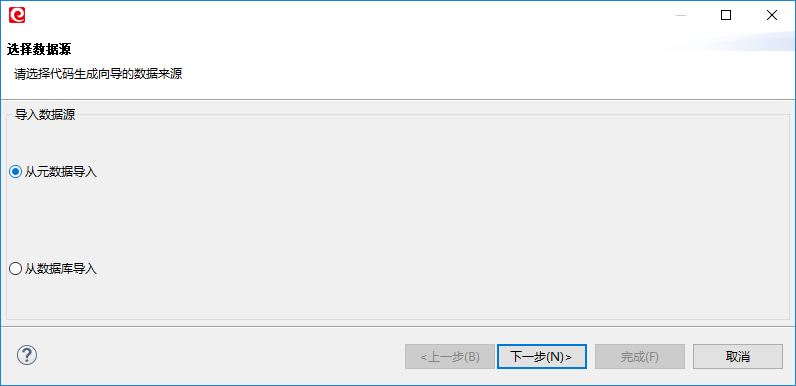

选择元数据导入： 左侧树列出了工程所有元数据文件， 选择其中一个实体，右侧会出现实体的所有属性，选择要使用的属性，点击下一步，进入信息配置页面。 选择要使用的模版，然后在通用标签页中填写生成的类的包名和名称等，在自定义属性标签页输入代码中可能用到的键值对。点击完成即可。 

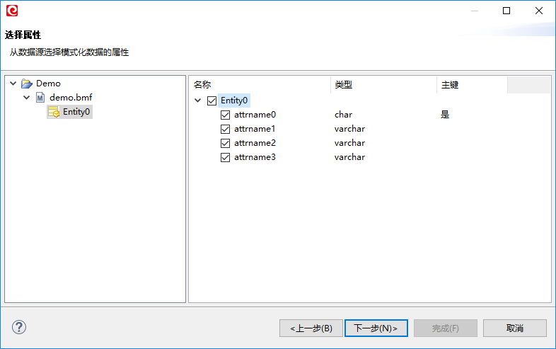
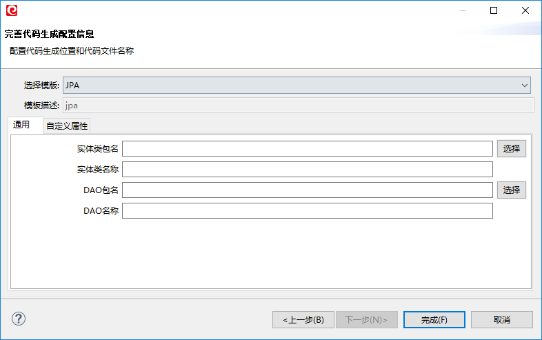
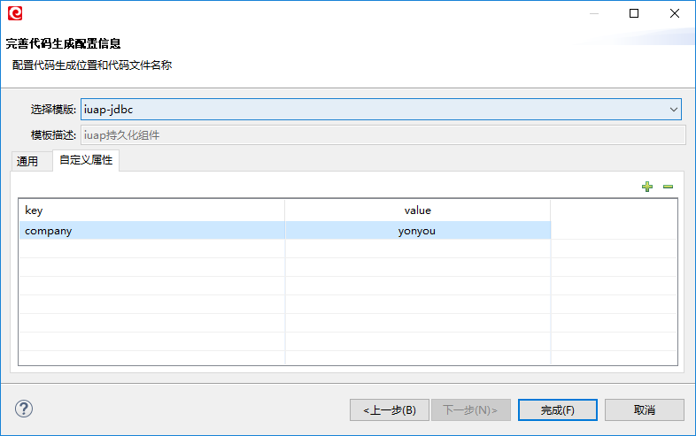

选择数据库导入： 选择数据库导入之前应该确认是否为工程配置了正确的数据库连接。 右键工程选择iUAP Tools->数据库连接配置， 进入数据源配置页面，填写数据库信息后，点击测试连接，如果通过，则可以选择数据库导入。 进入下一步，左侧是数据库中的table列表。选择其中一个table，右侧则列出table的所有列名。 勾选需要使用到的列名，点击下一步，进入信息配置页面，同元数据导入。 点击完成即可。 

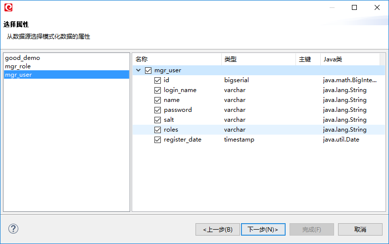

这里需要注意， Studio预置了两套代码模版，一个是iUAP持久化模版，一个是JPA方式持久化模版。 用户也可以自定义模版。模版由两部分组成，描述文件和代码模版文件。

描述文件：description.xml，内容举例如下：

```
	<?xml version="1.0" encoding="UTF-8"?>
	<codeGenerator displayname="JPA" id="jpa" ext="false" xmlns="http://www.yonyou.com/studio/codeGenerator/description" xmlns:xsi="http://www.w3.org/2001/XMLSchema-instance" xsi:schemaLocation="http://www.yonyou.com/studio/codeGenerator/description description.xsd ">
	  <description>jpa</description>
	  <template>
	    <name>javaBean</name>
	    <displayname>实体类</displayname>
	    <resourcePath>jpa/main.java.vm</resourcePath>
	    <resourceType>class</resourceType>
	  </template>
	  <template>
	    <name>dao</name>
	    <displayname>DAO</displayname>
	    <resourcePath>jpa/dao.java.vm</resourcePath>
	    <resourceType>class</resourceType>
	  </template>
	</codeGenerator>
 ```
其中codeGenerator是根节点，属性有displayname(显示名)，id(唯一标识),ext(false代表预置模版，true为自定义模版)
description为模版的功能描述，介绍模版的功能和使用方式。
template节点为模版包含的模版内容文件，可以有多个，属性有name(英文名),displayname（中文显示名）,resourcePath(模版文件相对位置),resourceType(class为后台java类文件，resource为非java资源文件)。

代码模版文件：XXXX.vm，以生成实体类的模版文件main.java.vm举例：
```
	#set($tableClass=${customizer.getConfig("javaBean").className})
	#set($package=${customizer.getConfig("javaBean").codePackage})
	package ${package};
	
	import java.io.Serializable;
	import javax.persistence.*;
	${table.importStatements}
	
	/**
	 * The persistent class for the ${table.name} database table.
	 * 
	 */
	@Entity
	@Table(name="${table.name}")
	@NamedQuery(name="${tableClass}.findAll", query="SELECT ${table.aliasForQuery} FROM ${tableClass} ${table.aliasForQuery}")
	public class ${tableClass} implements Serializable {
		private static final long serialVersionUID = 1L;
	#####
	##### fields
	#####
	#foreach ($column in $table.fieldList)
	#if ($column.propertyName == $table.keyAttribute)
		@Id
	#end
		${column.fieldScope} ${column.simplePropertyType} ${column.propertyName};
	#end
	
		public ${tableClass}() {
		}
	
	#####
	##### simple properties getters and setters
	#####
	#foreach ($column in $table.fieldList)
	
		${column.propertyGetScope} ${column.simplePropertyType} ${column.propertyGetter}() {
			return this.${column.propertyName};
		}
	
		${column.propertySetScope} void ${column.propertySetter}(${column.simplePropertyType} ${column.propertyName}) {
			this.${column.propertyName} = ${column.propertyName};
		}
	
	#end
	}
```

其中`customizer.getConfig("javaBean")`表示名为javabean的模版文件。 javabean模版可见description.xml，代表实体类。模版文件有4个属性：className(类名称),codePackage(类所在包名),resourcePath(资源路径),resourceName(资源名称)。

由此，则`${customizer.getConfig("javaBean").className}`代表javabean模版文件生成的文件的类名称，这个是在信息配置页面用户配置的。

`table`代表选择的模型数据表。table有几个属性：name(表名),aliasForQuery(查询语句别名),keyAttribute(主键属性),fieldList(属性列表),importStatements(需要引用的类名),nameSpace(命名空间),metaDefinedName(元数据识别名).

由此，则`${table.name}`代表数据表名。`$table.fieldList`代表属性列表。 通过`#foreach ($column in $table.fieldList)`循环执行，循环体内column为具体字段属性。 column也有几个属性：fieldScope(属性作用域),simplePropertyType(属性对应java类型)，propertyName(属性名称)，propertyGetScope(属性get方法作用域)，propertyGetter(get方法名),propertySetScope(set方法作用域)，propertySetter(set方法名)。

关于自定义属性页中的键值对，举例说明：
添加一个key为company，value为yonyou的键值对，在模版文件中使用${properties.get("company")}即可获取value值yonyou，完成数据的替换。

模版文件的语法遵循velocity语法规则。

将包含描述文件和模版文件的文件夹放在Studio安装根目录下的templates/generator目录下，即可作为自定义代码生成模版识别。
	

# 6. 组件管理

iUAP平台为组件化管理。 把基本功能按照组件拆分。通过maven仓库管理组件。Studio通过可视化界面， 提供maven组件的下载安装管理。

## 6.1 组件仓库

点击主菜单栏的工具->组件仓库，打开“组件商店”。 类似Eclipse MarketPlace的功能。 连接官网提供的组件仓库，按分类显示所有组件的详情描述，并提供下载安装按钮。Installed页签中列出本地maven库中已安装的所有iUAP组件。

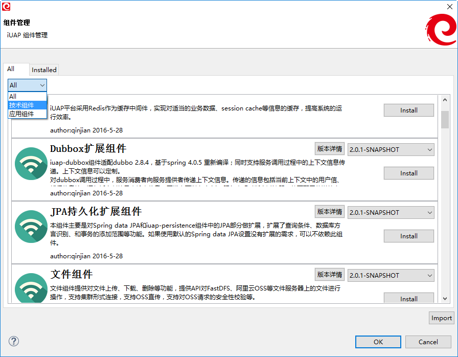

组件仓库页面提供Import(导入)按钮，可导入从官网下载的maven组件jar包安装到本地maven库中。

## 6.2 工程组件配置

右键点击工程，选择iUAP Tools->工程组件。 显示本地所有已安装的iUAP组件。 多选框中已勾选的表示工程使用的本地iUAP组件，组件版本为下拉框文本，可选择使用版本并通过勾选iUAP组件完成具体工程对iUAP组件具体版本的使用。

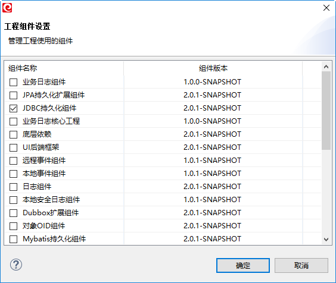