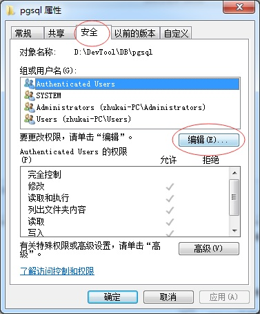
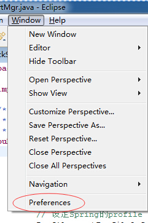
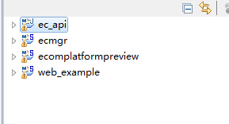
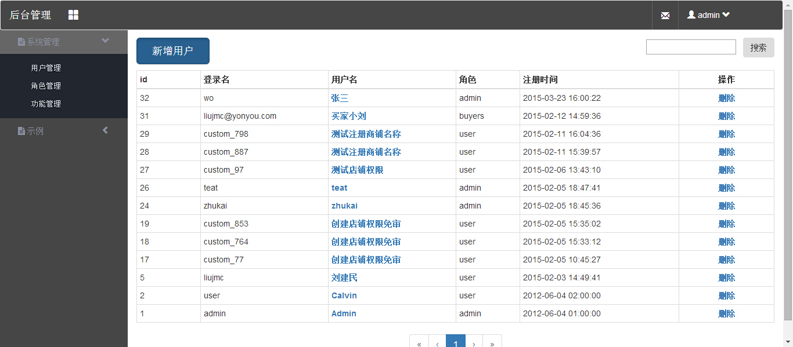
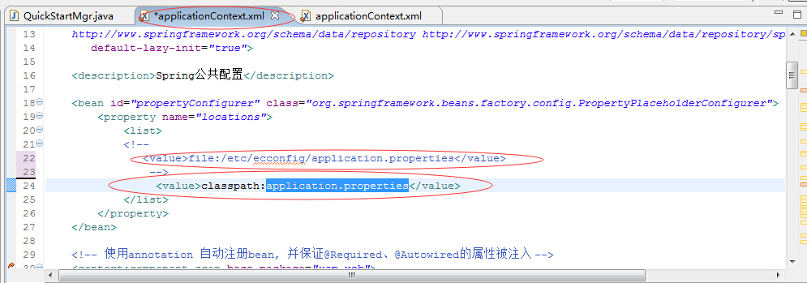

# 开发环境搭建


## 开发环境简介 ##

iuap开发工具包为开发人员提供了开发工具、互联网中间件和数据库，使用者通过简单的配置就能够快速的搭建开发环境。iuap开发工具是一个名为devtool的压缩包，通过使用它可以简化开发的准备工作、提高工作效率、快速实现互联网应用。

### 1.DevTool目录结构介绍 ###

DevTool：目录为开发环境目录，该目录下包含**bin、DB、demo、docs、lib、logs、repository、ui、workspace**九个目录。

bin：目录包含开发环境的批处理脚本，通过这些脚本可以进行环境变量的设置、启动数据库、mongodb、redis、solr、zookeeper。开发人员可以根据不同的情况开启需要的服务。

DB：目录包含了数据库的数据文件和生成脚本，开发人员可以选择使用开发环境自带的数据库或者通过脚本建立新的数据库。

demo：目录可以快速部署开发环境的示例，该目录下的conf文件夹内的文件为开发环境的配置文件，通过更改该文件可以对开发中的提供各种服务的地址进行变更。war文件夹存放了三个示例工程的war包。

docs：目录存放了，开发工具的相关文档。

lib：目录包含了开发环境依赖的第三方jar包以及iuap平台的jar包。

log：目录存放开发平台以及快速示例产生的日志文件。

repository：目录提供了一些中间件给开发者，这些中间件包括**AppServers**目录下的tomcat、Cache目录下的Redis、DB目录的**PostgreSql、dubbox、IDE**目录的IwebStudio、MQ目录下的**RabbitMQ、Search**目录的solr和ZooKeeper,此外该文件夹还包含了JDK、maven以及maven的本地库。

ui：目录存放了iuap平台前端UI的相关文件。

workspace：是存放开发平台示例工程源码的工作空间文件夹。

### 2.示例快速预览 ###

建议开发工具包文件夹放入D盘根目录下。

在启动示例快速预览之前要进行一些准备：

1、需要将devtool\repository\Maven\Maven3.2.2\conf\settings.xml 文件中的localRepository一项的路径改为\devtool\repository\Maven\Maven3.2.2\local\repo的绝对路径,并在eclipse中设置maven配置为settings.xml文件。 `<localRepository>此处改为maven本地库的地址</localRepository>`  

2、如果打开pgsql数据库发生闪退，需要对devtool\DB\pgsql文件夹赋予完全控制权限。对文件夹点击右键选择属性--选择安全标签--点击编辑--为USER用户添加完全控制权限。如下图  

 


3、需要安装vc2010运行库，DEVTOOL文件夹下vcredist_x86.exe为安装包
准备工作完毕后，通过demo文件夹的脚本能够快速的启动开发环境的示例网站，启动DevTool\demo目录下的qucikstart.bat，启动成功后在浏览器输入http://localhost、http://localhost/ecmgr可以分别浏览电商网站、电商管理后台。启动bin目录下的startmongodb.bat和startredis.bat可以启动mongodb和redis。启动bin目录下的startsolr.bat可以开启solr为商城的首页提供全文检索商品服务示例。

示例网站效果如下  

  


### 3.IDE开发环境配置 ###

建议开发工具包文件夹放入D盘根目录下。

#### 3.1 maven环境配置 ####

开发环境的maven位于DevTool\repository\Maven\Maven3.2.2目录下，首先要设置maven的环境变量，在系统变量中添加环境变量MAVEN_HOME,该变量指向目录DevTool\repository\Maven\Maven3.2.2，然后在Path变量中加入路径%MAVEN_HOME%\bin。
maven环境变量配置好以后，我们要在IDE中配置maven的配置文件的路径，首先按照2.示例快速预览的方法修改maven配置文件中本地库的地址，然后在IDE的windows菜单栏中选择preference，再弹出的窗口中选择Maven——User Settings，将标签页的Global Settings和User Settings改为开发工具包内maven的配置文件的地址，如下图：

  


#### 3.2 maven示例工程及说明 ####

workspace目录下的ecapi、ecmgr、ecomplatformpreview、web2platform、webexample，工程都是由maven构建的，maven构建项目的标准目录结构如下：

```
		src
		   main
		     bin 脚本库
		     java java源代码文件
		     resources 资源库，会自动复制到classes目录里
		     filters 资源过滤文件
		     assembly 组件的描述配置（如何打包）
		     config 配置文件
		     webapp web应用的目录。WEB-INF、css、js等
		   test
		     java 单元测试java源代码文件
		     resources 测试需要用的资源库
		     filters 测试资源过滤库
		   site Site（一些文档）
		target
		bin
```

src目录存放工程的源码
target是有存放项目构建后的文件和目录，jar包、war包、编译的class文件等。
bin目录包含对示例工程进行测试、打包等操作的脚本。

### 4.示例工程介绍及调试示例 ###

开发环境初始包含以下几个工程

  

其中ecmgr为示例网站的后台管理，ecomplatformpreview是示例的前台商城网站。ecapi工程则是ec项目的功能接口，webexample是平台基本开发功能的演示示例。
在调试运行工程之前，先运行DevTool\bin目录下的startpgsql.bat、startredis.bat、startzookeeper.bat启动PostgreSQL、Redis和Zookeeper。示例工程通过jetty的方式进行运行调试，再ecomplatformpreview、ecmgr、webexample三个工程项目的\src\test\java\uap\web\XXX文件夹下都有对应的QuickStartXXX类，运行该类就能启动项目进行调试。webexample项目调试效果如下图：

  
 
此外通过修改工程/src/main/resources/applicationContext.xml中的propertyConfigurer配置能够设置工程是使用calsspath下的application.properties配置文件或者是外部的application.properties配置文件。如图所示：

  