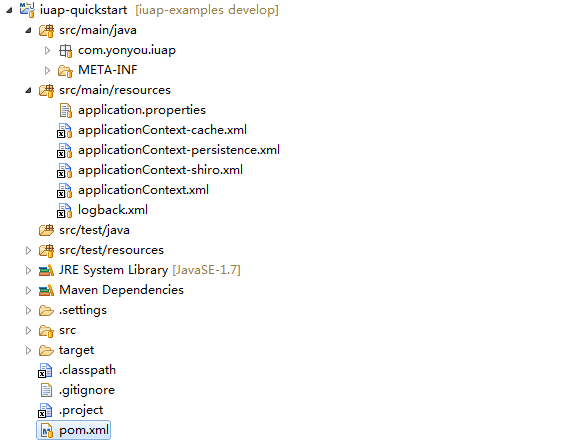
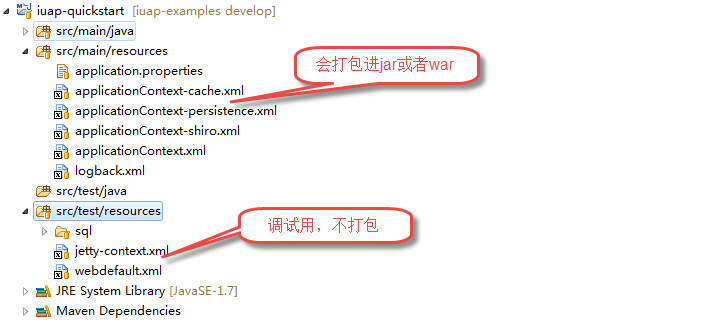
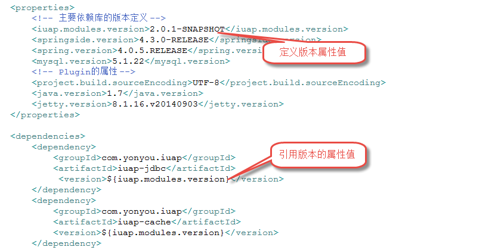
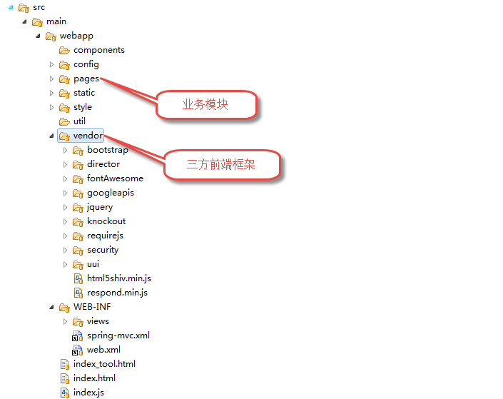
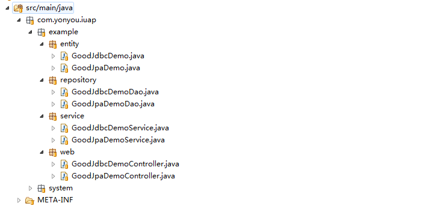

# 代码规范

开发涉及到很多不同的编码规范，主要是Java、html、js、css、SQL等，这些代码需要遵循本身的规范

# 后端目录规范

iuap平台组件和示例工程均采用Maven来构建、管理，推荐使用Maven工程的标准工程结构来组织。

## 1.1 后端工程基本结构

<table>
   <tr>
      <td>目录结构</td>
      <td>描述</td>
   </tr>
   <tr>
      <td>src/main/java</td>
      <td>工程的java源码文件</td>
   </tr>
   <tr>
      <td>src/main/resources</td>
      <td>源码资源文件，比如：配置文件、多语资源文件等</td>
   </tr>
   <tr>
      <td>src/main/filters</td>
      <td>过滤器资源目录，解决多套环境开发配置问题</td>
   </tr>
   <tr>
      <td>src/main/webapp</td>
      <td>web资源目录，与最终生成的war包结构一致</td>
   </tr>
   <tr>
      <td>src/main/metadata</td>
      <td>iuap元数据资源文件</td>
   </tr>
   <tr>
      <td>src/test/java</td>
      <td>测试用例的源码文件</td>
   </tr>
   <tr>
      <td>src/test/resources</td>
      <td>测试用例的资源文件</td>
   </tr>
   <tr>
      <td>src/test/filters</td>
      <td>测试用例的过滤器</td>
   </tr>
   <tr>
      <td>src/it</td>
      <td>集成测试代码所在的目录，主要是供别的插件使用</td>
   </tr>
   <tr>
      <td>src/assembly</td>
      <td>组件（Assembly）描述符所在的目录</td>
   </tr>
   <tr>
      <td>src/site</td>
      <td>站点文件</td>
   </tr>
   <tr>
      <td>LICENSE.txt</td>
      <td>项目的许可文件</td>
   </tr>
   <tr>
      <td>NOTICE.txt</td>
      <td>该项目依赖的库的注意事项</td>
   </tr>
   <tr>
      <td>README.txt</td>
      <td>项目的readme文件</td>
   </tr>
   <tr>
      <td></td>
   </tr>
</table>

工程统一采用UTF-8编码，配置文件、属性配置文件统一采用UTF-8编码。示例如下：

注意事项：
1：src/main/resources包下的配置文件和属性文件会在maven打包的时候，打入到对应的jar包或者war包中，jar类型的组件中，尽量不要将配置文件打入jar包，请开发人员注意。如果是调试类型的配置文件，如jetty-context.xml、webdefault.xml等，建议放置在src/test/resources下，如下图：

2：pom文件中引用依赖时候注意，尽量同group下的组件，以属性的形式定义版本，避免切换版本时候多处修改

3：项目上如果遇到三方依赖组件的版本冲突问题，需要手动调整排除的组件，保证最终打包产品的三方组件无重复版本。可以借助工具中的pom文件的依赖关系查看来解决。

## 1.2 Web目录结构

<table>
   <tr>
      <td>一级目录</td>
      <td>二级目录</td>
      <td>三级目录</td>
      <td>含义</td>
   </tr>
   <tr>
      <td>style</td>
      <td></td>
      <td></td>
      <td>样式文件目录</td>
   </tr>
   <tr>
      <td></td>
      <td></td>
      <td>global.css</td>
      <td>全局公共样式文件</td>
   </tr>
   <tr>
      <td></td>
      <td>default</td>
      <td></td>
      <td>默认皮肤样式</td>
   </tr>
   <tr>
      <td></td>
      <td></td>
      <td>css</td>
      <td></td>
   </tr>
   <tr>
      <td></td>
      <td></td>
      <td>images</td>
      <td></td>
   </tr>
   <tr>
      <td></td>
      <td>theme1 </td>
      <td></td>
      <td>皮肤1</td>
   </tr>
   <tr>
      <td></td>
      <td>theme2</td>
      <td></td>
      <td>皮肤2</td>
   </tr>
   <tr>
      <td>vender</td>
      <td>jquery、bootstrap等</td>
      <td></td>
      <td>各种前端框架的存放位置，包括jquery,bootstrap等</td>
   </tr>
   <tr>
      <td></td>
      <td>uui</td>
      <td></td>
      <td>iuap前端框架</td>
   </tr>
   <tr>
      <td>config</td>
      <td></td>
      <td></td>
      <td>配置文件目录，如放置requirejs的配置文件</td>
   </tr>
   <tr>
      <td>components</td>
      <td>comp1</td>
   </tr>
   <tr>
      <td>（公共应用组件）</td>
      <td>css</td>
      <td>组件样式文件</td>
   </tr>
   <tr>
      <td></td>
      <td></td>
      <td>js</td>
      <td>私有第三方框架</td>
   </tr>
   <tr>
      <td></td>
      <td></td>
      <td>images</td>
      <td>图像文件</td>
   </tr>
   <tr>
      <td></td>
      <td></td>
      <td>themes</td>
      <td>组件皮肤，自己内部处理</td>
   </tr>
   <tr>
      <td></td>
      <td></td>
      <td>res</td>
      <td>国际化资源目录</td>
   </tr>
   <tr>
      <td>pages</td>
      <td>page1</td>
   </tr>
   <tr>
      <td>（应用页面）</td>
      <td>style</td>
      <td>样式目录</td>
   </tr>
   <tr>
      <td></td>
      <td></td>
      <td>res</td>
      <td>国际化资源目录</td>
   </tr>
   <tr>
      <td></td>
      <td></td>
      <td>image</td>
      <td>图片目录</td>
   </tr>
   <tr>
      <td></td>
      <td></td>
      <td>js</td>
      <td>私有第三方框架</td>
   </tr>
   <tr>
      <td>WEB-INF</td>
      <td>lib</td>
      <td></td>
      <td>jar包存放目录</td>
   </tr>
   <tr>
      <td></td>
      <td>classes</td>
      <td></td>
      <td>类编译输出路径</td>
   </tr>
   <tr>
      <td></td>
      <td>conf</td>
      <td></td>
      <td>配置文件预留目录，采用Spring的配置文件方案，建议放在WEB-INF的classes目录|</td>
   </tr>
   <tr>
      <td></td>
      <td>temps</td>
      <td></td>
      <td>临时生成文件的放置位置</td>
   </tr>
   <tr>
      <td></td>
      <td>templates</td>
      <td></td>
      <td>模板</td>
   </tr>
   <tr>
      <td>index.html</td>
      <td></td>
      <td></td>
      <td>系统首页</td>
   </tr>
   <tr>
      <td>static</td>
      <td></td>
      <td></td>
      <td>公共静态资源目录</td>
   </tr>
   <tr>
      <td>util</td>
      <td></td>
      <td></td>
      <td>公共工具类目录</td>
   </tr>
   <tr>
      <td></td>
   </tr>
   <tr>
      <td></td>
   </tr>
</table>

说明：
（1）本目录结构是指站点的标准目录结构，与java工程下的src/main/webapp对应
（2）本目录是针对已经编译完成的前端资源，前端工程目录不尊从该目录规范

示例结构如下：

 

# 前端目录规范

<table>
   <tr>
      <td>目录</td>
      <td>说明</td>
   </tr>
   <tr>
      <td>config</td>
      <td>配置文件目录</td>
   </tr>
   <tr>
      <td>pages</td>
      <td>功能页面</td>
   </tr>
   <tr>
      <td>static</td>
      <td>静态资源(图片、视频等)</td>
   </tr>
   <tr>
      <td>style</td>
      <td>样式文件目录</td>
   </tr>
   <tr>
      <td>vendor</td>
      <td>第三方库</td>
   </tr>
   <tr>
      <td>WEB-INF</td>
      <td>WEB应用的安全目录</td>
   </tr>
   <tr>
      <td>index.html</td>
      <td>首页文件</td>
   </tr>
   <tr>
      <td>index.js</td>
      <td>首页面js</td>
   </tr>
</table>

# 命名规范

1.  文件、目录命名不能用中文，推荐使用数字和英文字母构成，只能使用数字和英文字母，不能以数字开头
2.  文件、目录命名需要有一定的意义，尽量简短，名称符合各种主流操作系统的要求,如不要使用空格，不以”.”开头，不使用过长的文件名
3.  文件名称的分隔，使用下划线或者采用首单词小写，其余单词首字母大写的方式分隔
4.  包名命名格式：商业标记(com/org)/公司(yonyou)/产品线(iuap)/产品(可选)/组件 比如:iuap日志组件的包名：com.yonyou.iuap.log
5.  开源产品，建议使用org开头，公司依然是yonyou；如以个人名义开发，不得使用yonyou
6.  基于iuap开发的产品建议组件下包划分如下

    * entity:业务实体
    * repository:持久化层
    * service:服务层
    * web:web访问层

示例分层如下：

 
 
如果项目或者开发组上需要对整个工程按照模块拆分，请按照maven多模块的方式来组织工程结构，此示例为小型单个工程的示例。
多模块拆分有利于分布式服务的搭建，特别是工程较大的时候，多模块拆分和微服务的搭建便于针对不同的服务进行扩容和调整。

# 编程规范

## JAVA编程规范

建议遵循 Google Java 编程风格，详细规则请参考以下链接：
[http://www.hawstein.com/posts/google-java-style.html](http://www.hawstein.com/posts/google-java-style.html)

## 前端编程规范

建议遵从Google JavaScript 编码规范，详细贵族请参考以下地址：
[http://alloyteam.github.io/JX/doc/specification/google-javascript.xml](http://alloyteam.github.io/JX/doc/specification/google-javascript.xml)

