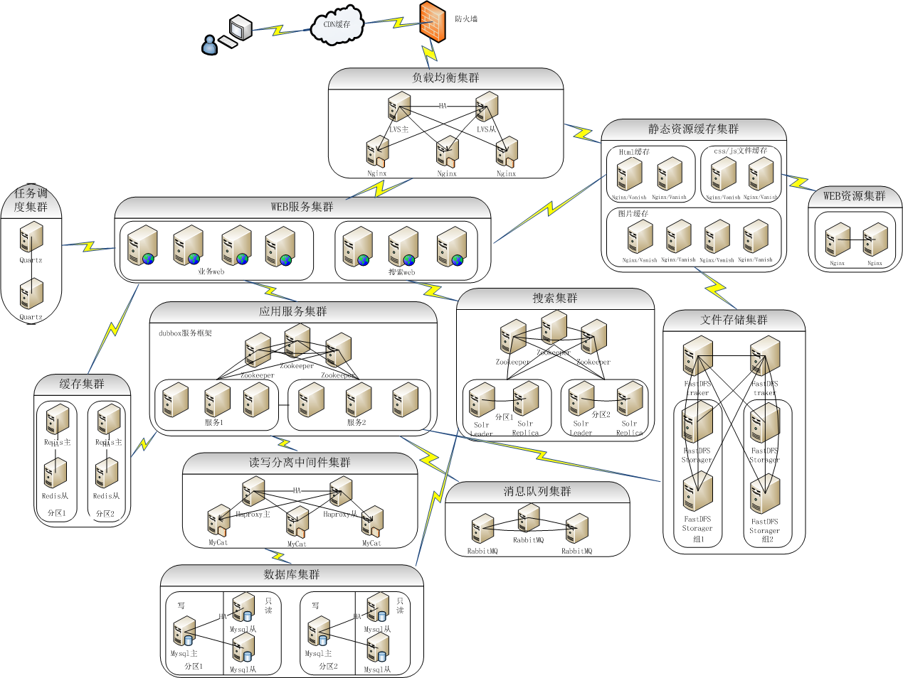

# 服务端架构

服务端架构包括功能架构与部署架构两个方面。

## 功能架构

iuap 平台为应用提供以下关键组件，应用可以按需选择，灵活组装。

1. 基于开源技术的运行时：包括基于Spring的轻量级容器、MVC框架，基于Shiro的安全框架，基于Freemarker的模板框架等。
2. 应用支撑组件：包括组织框架、权限框架、UI模板、审批流、任务、打印、业务日志、附件管理、编码规则、安全日志等。
3. 互联网连接器：包括IM适配器、社交连接器、支付连接器、电商连接器、短信适配器、消息推送等。
4. 基础技术组件：包括持久化、日志、分布式服务、认证、分布式会话、事务、安全、缓存、上下文、元数据、分布式锁等。
5. 互联网中间件：包括负载均衡、Web服务器、应用服务器、分布式缓存、文件、搜索、消息队列、任务调度、数据库读写分离中间件等。

## 部署架构

iuap 系统部署架构遵循互联网架构设计原则：

1. 尽可能的服务化：从传统的巨石型架构，转变为去中心化的微服务架构。
2. 尽可能的拆分：考虑业务系统的垂直拆分，数据的水平拆分等。
3. 尽可能的容错：考虑应用服务的高可用，中间件的高可用，数据库的高可用等。
4. 尽可能的自动化：考虑持续集成的自动化，部署自动化，监控自动化等。
5. 尽可能的异步与缓存：考虑服务间的松耦合设计，利用缓存提高性能，事务的最终一致性等。

以下是典型的 iuap 系统部署架构方案，供参考。

