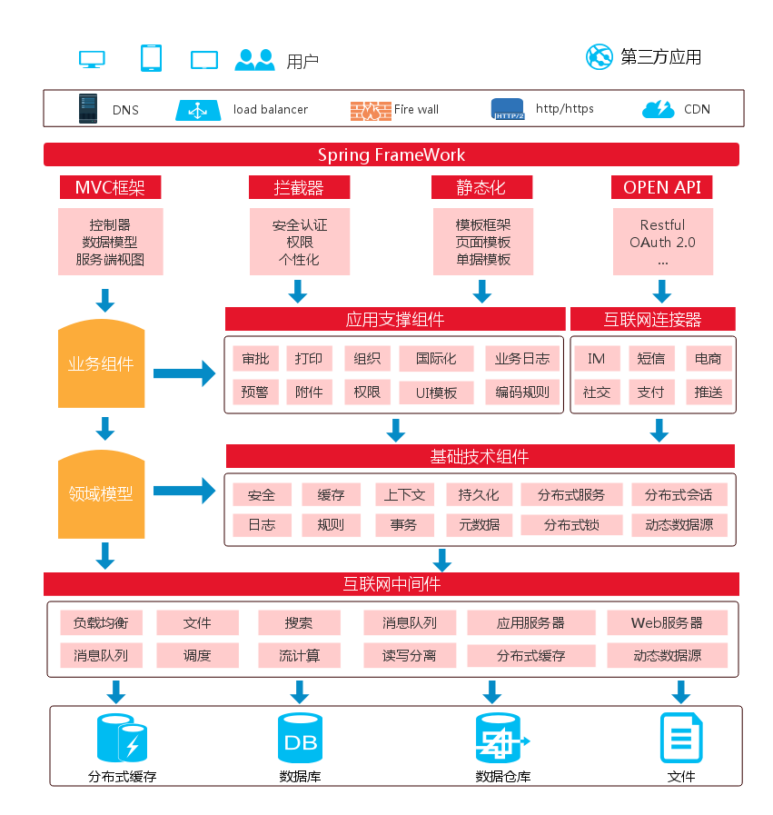

# iUAP功能架构

 
 

iUAP平台提供以下关键组件：

1. 基于开源技术的运行时

   包括基于Spring技术的轻量级容器、MVC框架；基于Shiro的安全框架；基于Freemarker的模板框架；Restful开发框架。
2. 应用支撑组件

   包括组织框架、权限框架、UI模板、审批流、预警、打印、业务日志、附件管理、编码规则、国际化等功能。
3.	互联网连接器

   包括IM适配器、社交连接器、制服连接器、电商连接器、短信适配器、消息推送等功能。
4.	基础技术组件 

   提供持久化,日志,分布式服务,分布式会话,事务,安全,缓存,上下文,规则,动态数据源等功能。
5.	互联网中间件 

   提供负载均衡,Web服务器 应用服务,分布式缓存,文件,搜索,消息队列,调度,数据库读写分离等功能。

总体上，iUAP平台提的组件包括了支撑企业互联网类应用、SaaS类应用、电商类应用所必须的运行时、工具、组件、服务。