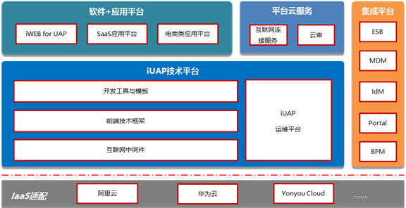

# iUAP功能架构

 
 

iUAP平台提供以下功能：
1. 提供技术平台，为互联网应用和服务的开发者，提供开发平台、运行时框架/中间件/数据库、运维平台。
    a)	开发平台包括开发工具、模板、前端框架、服务端框架、中间件等。
    b)	运维平台以可视化页面，提供持续发布、部署、集群管理、监控、日志分析等功能。
2.  提供应用平台，支撑SaaS类应用、电商类应用。应用平台包括权限框架、编码规则框架、打印组件、流程处理等。
3.	提供平台云服务，包括互联网连接服务、云审批服务、用户中心服务等。
4.	提供运营支撑服务，包括租户管理、计量方案等。
5.	提供集成平台，包括ESB、主数据、身份认证管理、门户等产品。
6.	iUAP可以部署运行在主流的IaaS上，包括阿里云、华为云、用友云等。

总体上，iUAP平台为企业互联网类应用和服务提供平台化工具、框架、服务。
