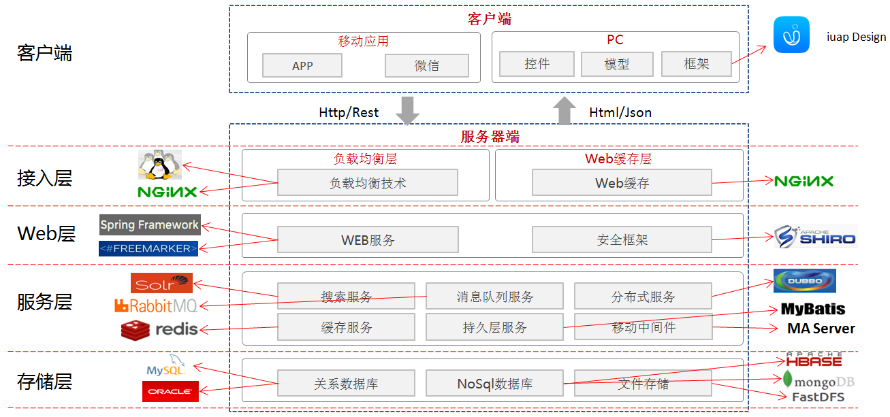

# 基于iUAP的系统架构

企业互联网架构应遵循以下设计原则：

1.	尽可能的服务化。从传统的巨石型架构，转变为去中心化的微服务架构。
2.	尽可能的拆分。考虑业务系统的垂直拆分，数据的水平拆分等。
3.	尽可能的容错。考虑应用服务的高可用、中间件的高可用、数据库的高可用、异地容灾等。
4.	尽可能的自动化。考虑持续集成的自动化、部署自动化、监控自动化等。
5.	尽可能的异步与缓存。考虑系统的松耦合设计、利用缓存提高性能等。
6.	实现事务一致性。考虑分布式事务的一致性方案。

根据以上设计原则，架构部提供：

1.	架构设计方案；详细方案见“架构原则及方案”章节；
2.	把平台级服务、组件、框架，以iUAP平台的产品形态，提供给互联网应用和服务；
3.	开发规范、运维规范、集成规范、安全规范；

以下是典型的互联网架构方案，供参考。

在技术选型上，使用以下技术：

 
