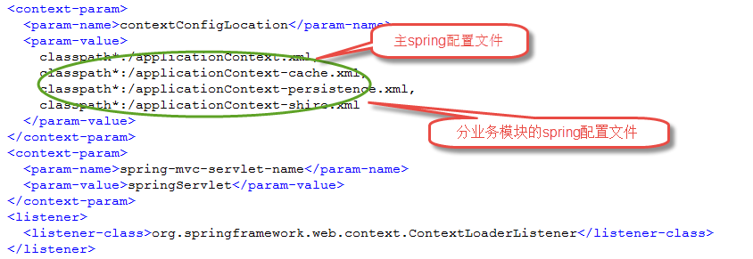
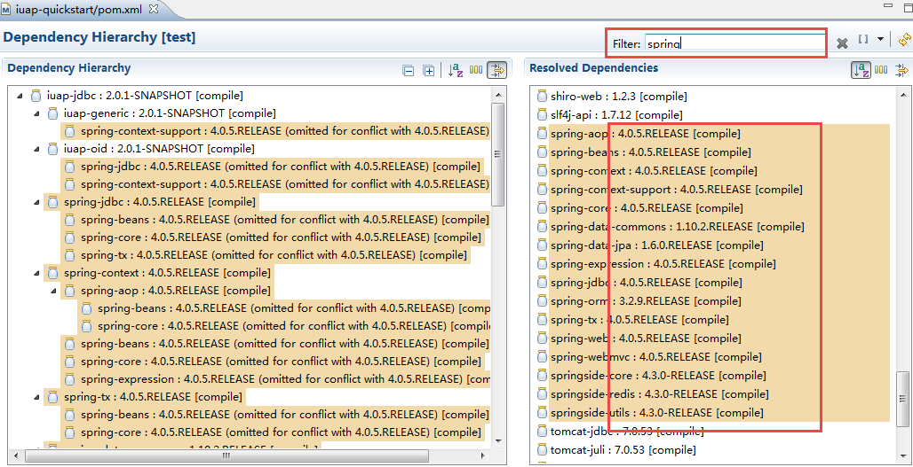

# Spring 框架的整合

iuap 平台的基础技术组件中，都使用了Spring的方式配置和集成，在平台的开发工具的默认示例中，默认引入了Spring框架的4.0.5.RELEASE 版本，平台的其它组件和项目中应该与此版本保持一致。

默认引入方式如 web.xml：
 

从pom.xml中可以查看到Spring的版本，集成时此版本务必保持一致，参考如下：
 

注意事项：
1. 尽量在主Spring配置文件中定义对属性文件的引用；
2. 如果多模块中都有对数据源、持久化等Bean的声明，应该统一合并到一个Spring配置文件中，如applicationContext-persistence.xml，数据源、连接池、JbcTemplate、JPA、Mybatis、事务管理等应该统一在此文件中定义，不能在多个Spring配置文件中多次出现。

