# Spring MVC集成

Spring MVC 是一种基于Java实现了MVC设计模式的请求驱动类型的轻量级Web框架，使用了MVC架构模式的思想，将Web层进行职责解耦。iuap 平台采用Spring MVC作为后端的MVC框架，帮助开发者简化开发。

Spring MVC有以下优势：
1. 简单快速的设计Web层； 
2. 提供强大的约定大于配置的契约式编程支持；
3. 支持灵活的URL到页面控制器的映射；
4. 容易与其他视图技术集成，如Velocity、FreeMarker等；
5. 灵活的数据验证、格式化和数据绑定机制；
6. 支持Restful风格。

## Spring MVC配置
1. Maven配置如下，其中spring-webmvc模块的版本和Spring的版本统一。
 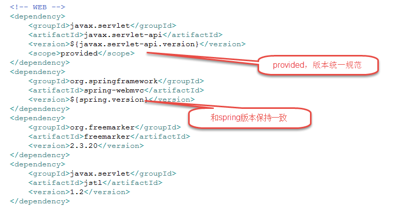
2. web.xml配置核心控制器：
 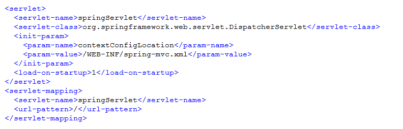
3. spring-mvc.xml配置
 控制器注解扫描：
 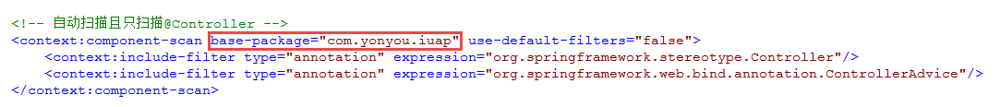
 规范信息输出格式和编码：
 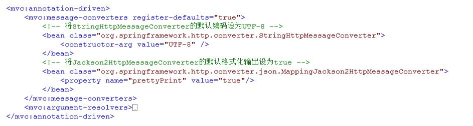
 使用Spring MVC框架，前端的视图层可以是多种形式，如Freemarker，JSP，Velocity等，各种视图需要在Spring MVC的配置文件中配置解析器。多种视图可以同时使用，配置的时候可以指定匹配视图的顺序。
 配置freemaker的视图解析：
  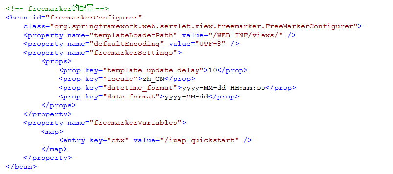
  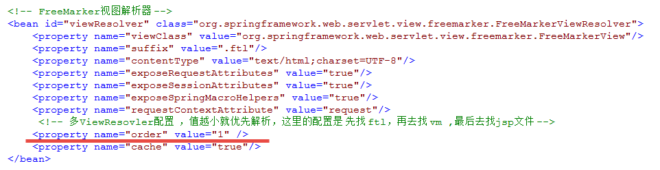
 配置JSP视图解析：
 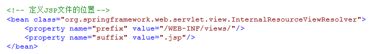
 配置Velocity视图解析：
 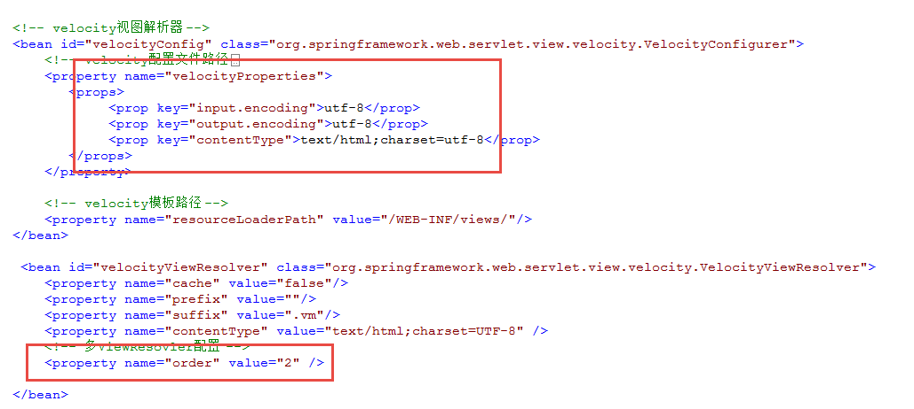

## Spring MVC使用
建议使用注解的方式配置控制器和映射路径，Spring MVC的Controller配置类上的注解示例如下：
 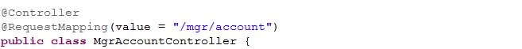
方法上的注解如下，使用@ResponseBody注解限制返回的格式为JSON，使用@RequestMapping注解的method属性可以限制此方法接收的Http请求的类型，使用@RequestParam注解可以配置参数和默认值，具体的注解请参考相应的文档。
 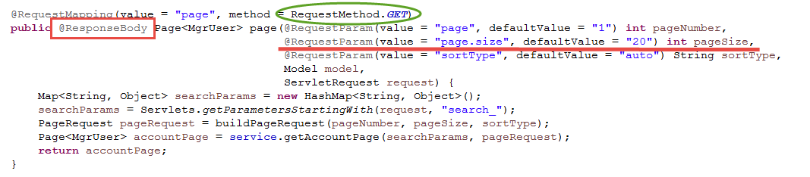
传入的参数中，可以和前台控件对应，配置构造分页对象的各个参数，如pagenum、pagesize等，根据参数构造PageRequest对象并调用服务查询数据。可以使用Restful的格式声明路径映射，用{}的方式传入参数。
 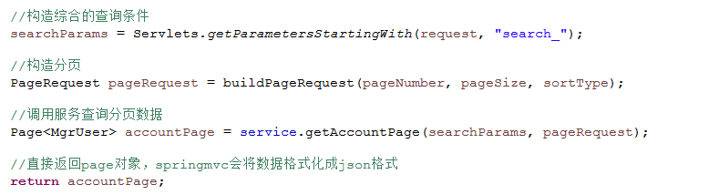
其他新增、更新等操作示例如下：
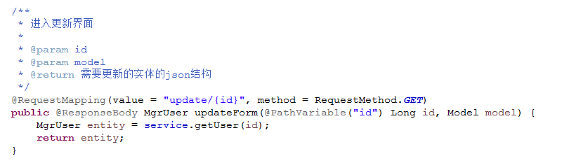 
视图层的使用：
使用视图的时候，可以借助EL表达式、JSTL表达式或者视图中的语法来获取后端返回的值。多种视图可以同时使用，配置的时候可以指定order属性值匹配视图的顺序。
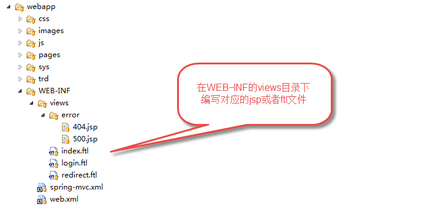

注意：JSP中默认会在web应用服务器中启用session，需要设置session禁用，设置方法如<%@ page session="false" %>，如果需要在session中存储信息，请参考无状态会话和分布式缓存章节，使用对应的方法存储session信息。
