# iuap JDBC方式持久化

iuap JDBC是基于JDBC的持久层框架，遵循基本的JPA规范，提供对数据的增删改查，分页等功能。提供了基础sql功能，能够提供对多数据库的语法适配支持，目前支持的数据库包括：MySQL、Oracle和Postgresql。

## iuap JDBC配置
1. 数据源配置如下：
 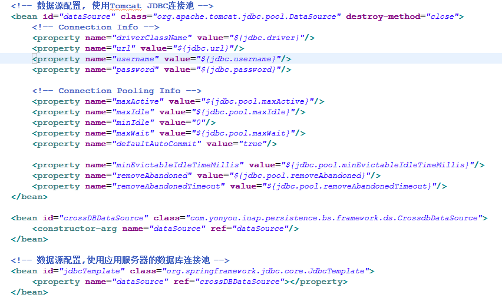
2. 配置Spring事务：
 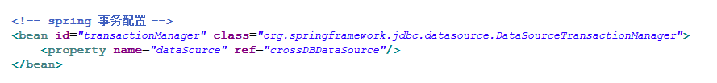
3. 配置BaseDAO：
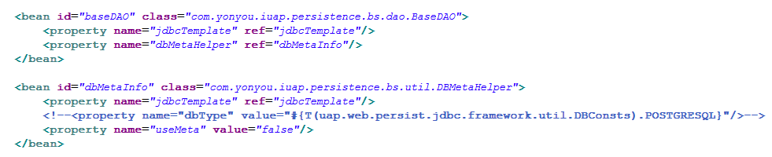
4. 如果配置使用元数据，需要在resources目录下增加配置文件jdbc.properties：
 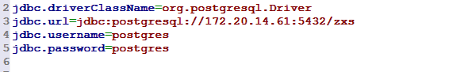

## iuap JDBC使用
1. 配置maven依赖，其中版本号iuap.modules.version为指定的日志组件的版本，可以从maven仓库获取适当的版本，例如3.0.0-RELEASE等。
 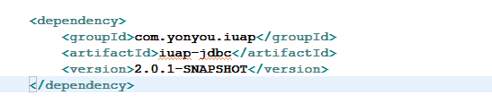
2. BaseDAO的API如下：
 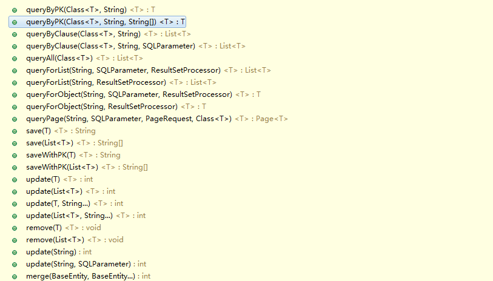
3. 实体类的声明方式：继承BaseEntity，需要注意注解是使用的iuap-jdbc组件中的注解。
 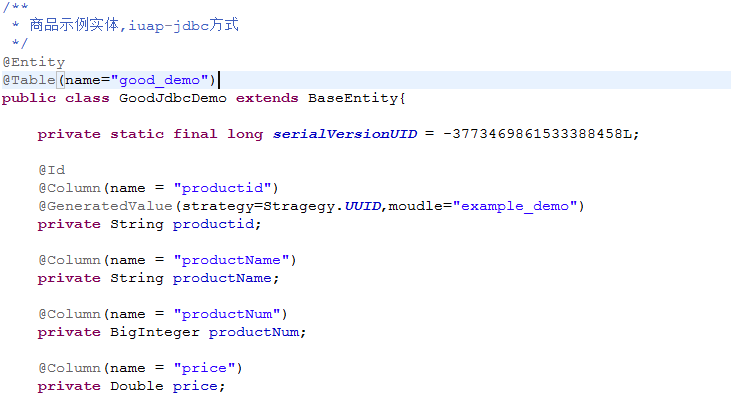
	iuap-jdbc为了预留对元数据的扩展，要求必须实现getMetaDefinedName和getNamespace方法，利用iuap Studio可以自动生成，如果手动编写，请注意返回值。
 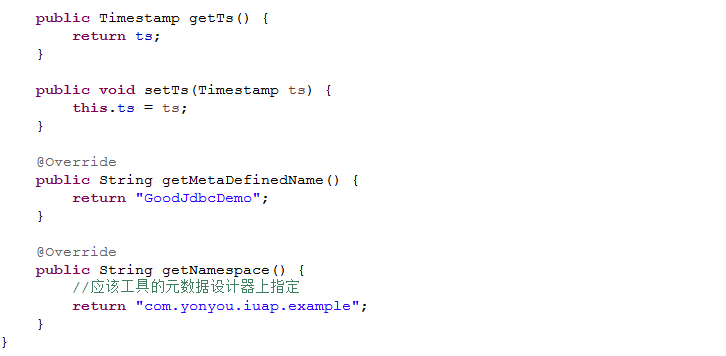
利用iuap 平台的持久化组件对实体数据进行持久化时，需要生成唯一标识，使用者可以利用数据库本身提供的自增机制生成，也可以根据iuap 平台提供的OID组件API进行生成。平台提供的组件中默认提供了几种常用的策略来生成OID，例如UUID、Redis的自增、Snowflake算法，UAPOID算法等，具体配置参考iuap-oid技术组件的介绍。通过简单的配置和依赖引用，开发人员就可以对工程中需要生成主键的代码进行规范。
4. 持久化接口的使用：
 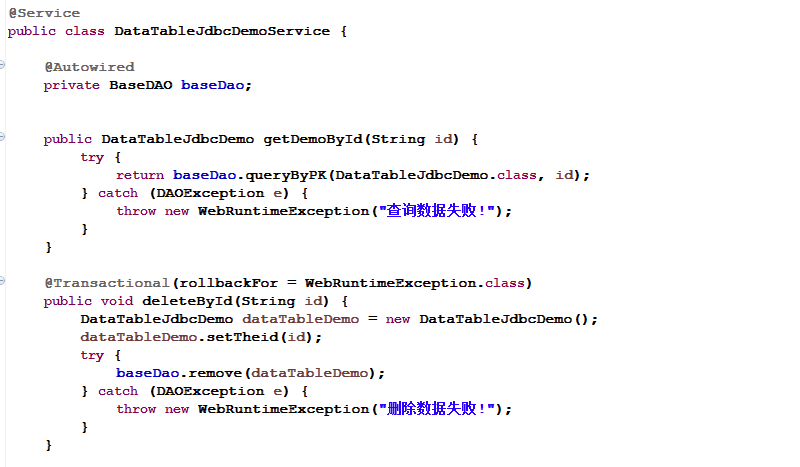
 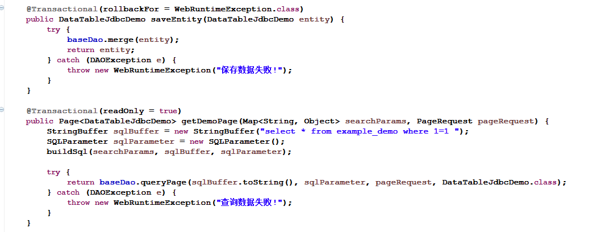
5. 主子表持久化：
 - 实体必须为BaseEntity的子类，并且设置了status。status相关常量如下：
 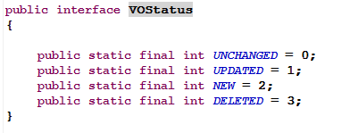
 - 子表需要声明外键@FK；
 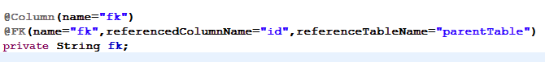
 - 调用BaseDAO的merge方法，传入参数，完成主子表的持久化。

