# JPA方式持久化

Spring Data是一个用于简化数据库访问，并支持云服务的开源框架。Spring Data JPA是由Spring Data提供的一个用于简化JPA开发的框架。
使用Spring Data JPA可以极大的简化JPA的写法，可以在几乎不用写实现类的情况下，实现对数据的访问和操作。除了CRUD外，还包括分页、排序等一些常用的功能。

Spring Data JPA提供的主要接口：
1. Repository：顶层的接口，统一所有Repository的类型，让组件扫描的时候自动识别;
2. CrudRepository ：Repository的子接口，提供CRUD的功能;
3. PagingAndSortingRepository：CrudRepository的子接口，添加分页和排序的功能;
4. JpaRepository：是PagingAndSortingRepository的子接口，增加了一些实用的功能，比如：批量操作等;
5. JpaSpecificationExecutor：负责查询的接口;
6. Specification：Spring Data JPA提供的一个查询规范，要做复杂的查询，需围绕这个规范来设置查询条件。
    
iuap 平台引入Spring Data JPA框架，底层采用Hibernate实现，与Spring集成，配合事务管理器等完成简单业务的查询与持久化操作。

## JPA配置
1. maven配置
maven的依赖配置如下图，其中版本号iuap.modules.version为指定的日志组件的版本，可以从maven仓库获取适当的版本，例如2.0.1-RELEASE、3.0.0-RELEASE等。
 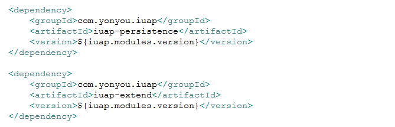
iuap 平台提供的持久层组件已经将Spring Data JPA和Hibernate需要的依赖包进行管理，引用的依赖如下：
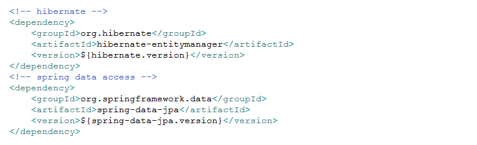 
注意：数据库驱动的maven依赖需要开发者根据数据库选型自行引入。
2. web.xml配置:
如果是web应用，需要在web.xml中引入相关的配置文件
 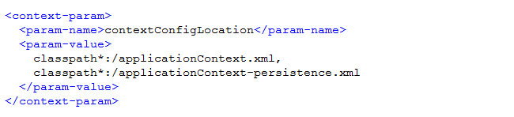
3. 属性文件配置
 数据库的连接信息、用户名密码、连接池信息等，通常是采用属性配置文件的方式利用key-value方式定义，方便部署时候的修改，用户可以根据项目需求，选择自己的数据库类型和驱动。
 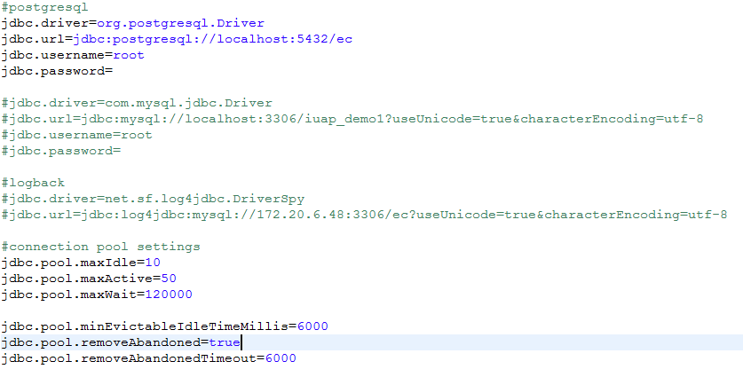
4. spring文件配置
配置属性文件的位置和包自动扫描：
 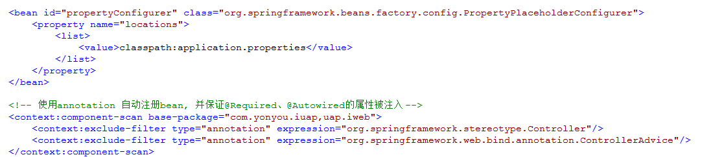
以Tomcat JDBC数据库连接池为例，配置数据源如下：
 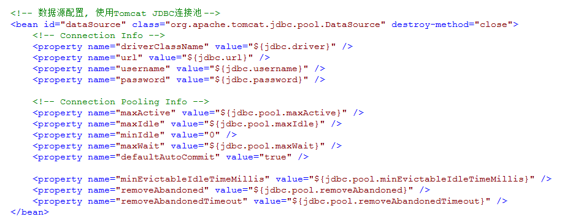
配置实体管理工厂：
 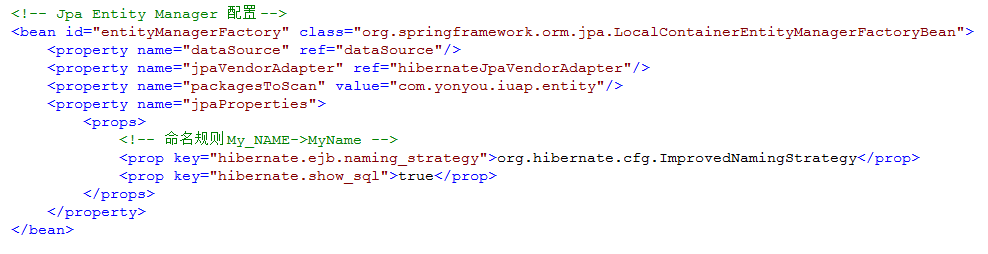
配置Hibernate适配和方言处理：
 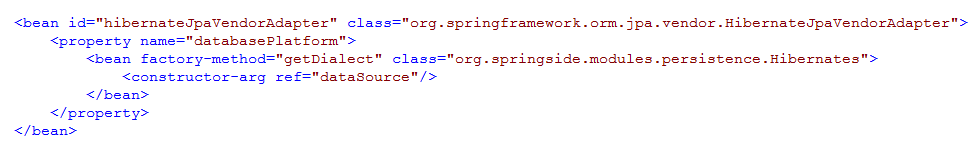
配置Spring Data JPA：
 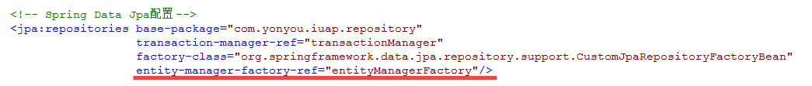
配置事务管理器和注解支持：
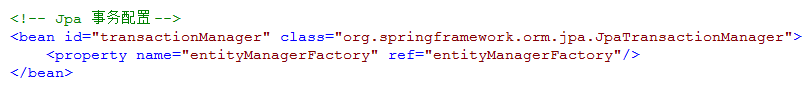 
 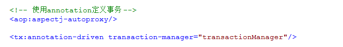

## JPA使用
1. 编写实体类：
   实体类使用简单Java对象即可，POJO类可以手动编写，也可以使用JPATools依据数据表自动生成，生成后的实体类再根据业务需要进行简单调整。
 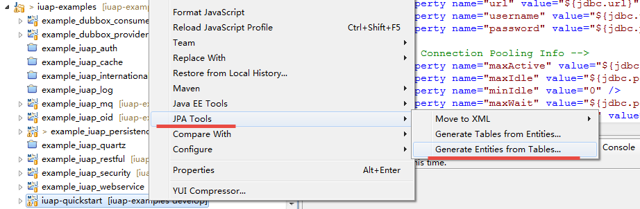
 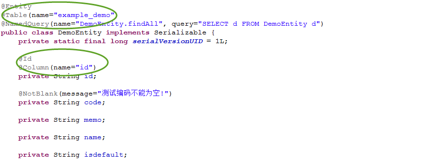 
2. 编写DAO层：
数据库操作类所在的包，在Spring配置工厂的时候已经设置自动扫描，此包内的类会自动加入到Spring容器管理。可以使用jpql语言查询，也可以配置native sql的查询和更新方式。开发者只用编写接口即可。
 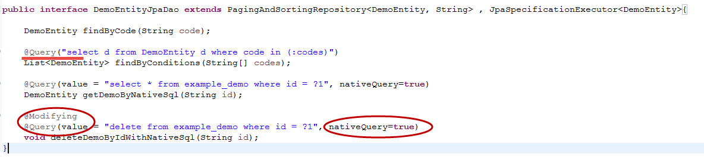
3. 使用示例：
在需要使用持久化的服务类中，直接使用注解注入Dao即可，Spring Data JPA会在运行态使用动态代理的方式生成实现类。
 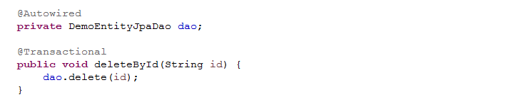
