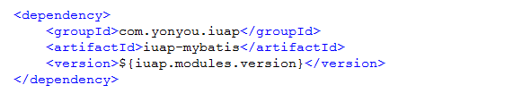
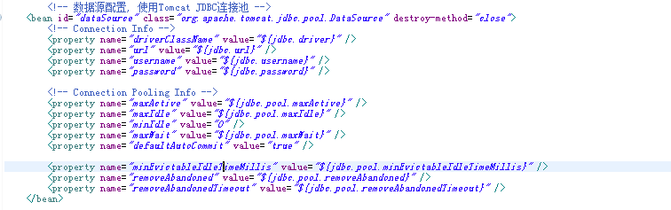
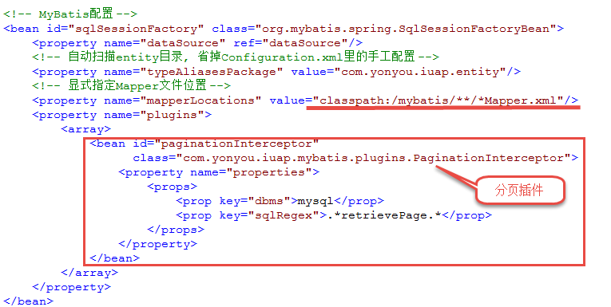
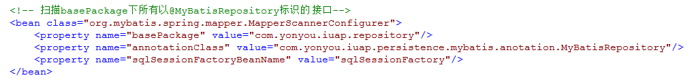
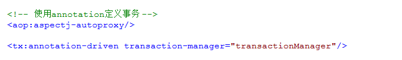
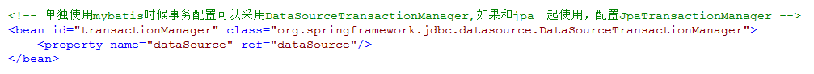
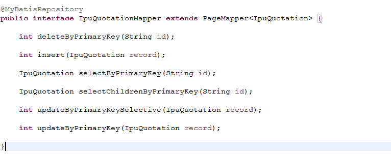
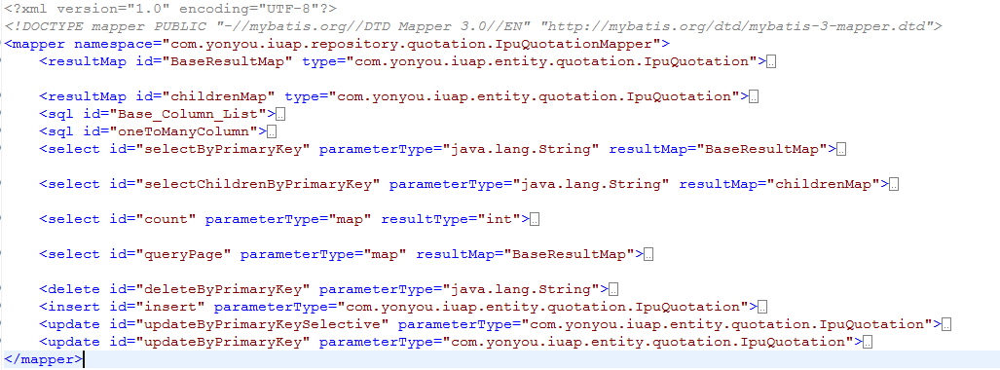
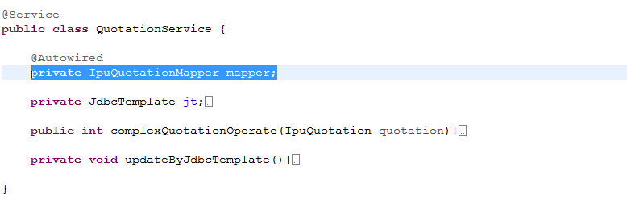

# MyBatis方式持久化

MyBatis源自开源项目iBatis, 是一个支持普通SQL查询，存储过程和高级映射的优秀持久层框架。它消除了几乎所有的JDBC代码和参数的手工设置以及对结果集的检索封装。MyBatis可以使用简单的XML或注解用于配置和原始映射，将接口和Java的POJO对象映射成数据库中的记录。

## MyBatis配置
1. maven配置:
maven的依赖配置如下图，其中版本号iuap.modules.version为指定的日志组件的版本，可以从maven仓库获取适当的版本，例如2.0.1-RELEASE、3.0.0-RELEASE等。
 
iUAP平台提供的持久层组件已经将Mybatis需要的依赖包进行管理，引用的依赖如下：
 
	数据库驱动的maven依赖需要开发者根据数据库选型自行引入。
2. 属性文件配置:
 
3. web.xml配置
如果是web应用，需要在web.xml中引入相关的配置文件，例如在applicationContext-persistence.xml中定义数据库连接池、数据源、mybatis的SqlSessionFactory和mapper映射等。
 
4. spring文件配置配置数据源，如下：
 
配置SqlSessionFactory：
 
 
配置时指定数据源、实体类所在的包名、mapper映射文件、分页插件等，可以通过通配符等配置匹配的目录和文件。
配置事务如下：
 

注意：如果单独使用Mybatis，可以配置事务管理器为DataSourceTransactionManager，如果持久化时混合使用JPA方式和Mybatis方式，不能使用此事务管理器，可以使用jPA的事务管理，但建议不要混合使用。

## MyBatis使用
1. 编写实体类：实体类使用POJO即可，生成方式可以参考JPA的生成方式，简单调整即可;
2. 编写Mapper映射接口，使用@MyBatisRepository注解声明;
 
 编写时按照相应的规范：
 - 接口类名和mapper映射文件的命名空间相同；
 - 方法名和mapper映射文件的sqlid对应；
 - 映射文件名和接口的简单类名相同。
3. 编写mapper映射文件: 
 
映射文件中，可以指定传入和返回类型，更详细的配置请参考Mybatis使用相关文档。
 
Mapper接口调用
 
