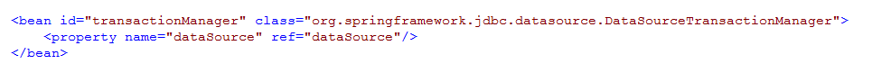
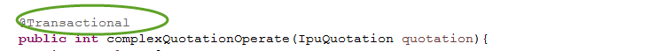
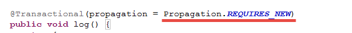
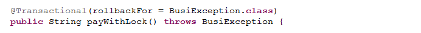

# 事务操作

在持久化操作时，如果是更新操作或者涉及到多表操作，一般需要进行事务控制来保证数据的完整性和一致性。控制事务的方式有多种，可以采取编程式事务，或者配置型事务。在iuap 持久层框架的基础上，推荐使用Spring的事务控制，采用注解配置的方式进行事务控制。

iuap 平台提供的持久化方式有多种，如果单独使用Spring JDBC或者Mybatis，可以采用DataSourceTransactionManager进行事务管理；如果和Spring Data JPA混合使用，需要配置为JpaTransactionManager，建议业务开发前期进行选型，避免持久层的混合使用。

## 事务传播机制
Spring事务的几种传播特性如下：
-   PROPAGATION_REQUIRED: 
    如果存在一个事务，则支持当前事务。如果没有事务则开启。
- 	PROPAGATION_SUPPORTS: 
    如果存在一个事务，支持当前事务。如果没有事务，则非事务的执行。
- 	PROPAGATION_MANDATORY: 
    如果已经存在一个事务，支持当前事务。如果没有一个活动的事务，则抛出异常。
- 	PROPAGATION\_REQUIRES_NEW: 
    总是开启一个新的事务。如果一个事务已经存在，则将这个存在的事务挂起。
- 	PROPAGATION\_NOT_SUPPORTED: 
    总是非事务地执行，并挂起任何存在的事务。
- 	PROPAGATION_NEVER: 
    总是非事务地执行，如果存在一个活动事务，则抛出异常。
- 	PROPAGATION\_NESTED：
    如果一个活动的事务存在，则运行在一个嵌套的事务中. 如果没有活动事务, 则按TransactionDefinition.PROPAGATION\_REQUIRED 属性执行。业务开发Service类时候，可以在方法上指定事务的传播机制，按照业务需求配置具体的属性，默认配置为PROPAGATION_REQUIRED，也是最常用。

## 事务隔离级别
在多个事务并发执行数据库操作时，需要考虑事务的隔离级别。 数据库事务的隔离级别有4个，由低到高依次为Read uncommitted、Read committed、Repeatable read、Serializable，这四个级别可以逐个解决脏读、不可重复读、幻读这几类问题。

数据库的不同的事务隔离级别可能出现的脏读、不可重复读和幻读的现象也不同，出现的情况如下：√: 可能出现    ×: 不会出现
<table>
   <tr>
      <td>事务隔离级别</td>
      <td>脏读</td>
      <td>不可重复读</td>
      <td>幻读</td>
   </tr>
   <tr>
      <td>Read uncommitted</td>
      <td>√</td>
      <td>√</td>
      <td>√</td>
   </tr>
   <tr>
      <td>Read committed</td>
      <td>×</td>
      <td>√</td>
      <td>√</td>
   </tr>
   <tr>
      <td>Repeatable read</td>
      <td>×</td>
      <td>×</td>
      <td>√</td>
   </tr>
   <tr>
      <td>Serializable</td>
      <td>×</td>
      <td>×</td>
      <td>×</td>
   </tr>
</table>

不同的数据库对事务隔离级别的支持略有不同，Oracle数据库支持READ COMMITTED 和 SERIALIZABLE和READ-ONLY。
各种数据库的默认的事务的隔离级别不同：
- SqlServer：默认是READ COMMITTED
- Oracle：默认使用的是READ COMMITTED
- Mysql：默认使用REPEATABLE READ
- PostgreDql：默认隔离级别是READ COMMTIED
 
iuap 平台持久化使用Spring管理事务，Spring事务的隔离级别如下：
- ISOLATION_DEFAULT： 
这是一个PlatfromTransactionManager默认的隔离级别，使用数据库默认的事务隔离级别。另外四个与JDBC的隔离级别相对应。
- ISOLATION_READ_UNCOMMITTED： 
这是事务最低的隔离级别，它充许令外一个事务可以看到这个事务未提交的数据。这种隔离级别会产生脏读，不可重复读和幻像读。
- ISOLATION_READ_COMMITTED： 
保证一个事务修改的数据提交后才能被另外一个事务读取。另外一个事务不能读取该事务未提交的数据。
- ISOLATION_REPEATABLE_READ： 
这种事务隔离级别可以防止脏读，不可重复读。但是可能出现幻像读。它除了保证一个事务不能读取另一个事务未提交的数据外，还保证了避免下面的情况产生(不可重复读)。
- ISOLATION_SERIALIZABLE 
最高代价但是最可靠的事务隔离级别。事务被处理为顺序执行。除了防止脏读，不可重复读外，还避免了幻像读。

## 事务配置
iuap 平台建议使用声明式的方式使用Spring管理事务，声明式事务的配置方式如下：
1. Spring配置文件中配置事务管理器
如果是Spring JDBC和Mybatis，配置DataSourceTransactionManager：
 
如果使用Spring Data Jpa，配置JpaTransactionManager：
 
2. 配置事务注解特性
 
<tx:annotation-driven>常用属性如下：
- mode：指定Spring事务管理框架创建通知bean的方式。可用的值有proxy和aspectj。前者是默认值，表示通知对象是个JDK代理；后者表示Spring AOP会使用AspectJ创建代理。
- proxy-target-class：如果为true，Spring将创建子类来代理业务类；如果为false，则使用基于接口的代理。（如果使用子类代理，需要在类路径中添加CGLib.jar类库）
- order：如果业务类除事务切面外，还需要织入其他的切面，通过该属性可以控制事务切面在目标连接点的织入顺序。
- transaction-manager：指定到现有的PlatformTransaction Manager bean的引用，通知会使用该引用。

## 事务使用
在Service上使用@Transactional注解来声明事务，@Transactional注解可以标注在实现类和方法上，也可以标注在定义的接口和接口方法上。  
如果接口上标注@Transactional注解，会留隐患：因为注解不能被继承，所以业务接口中标注的@Transactional注解不会被业务实现类继承。所以可能会出现不启动事务的情况。所以，Spring建议将@Transaction注解在实现类上。
在方法上的@Transactional注解会覆盖掉类上的@Transactional。
简单示例如下：
 

 

 

@Transactional的具体配置项的含义如下：
<table>
   <tr>
      <td>属性名</td>
      <td>类型</td>
      <td>说明</td>
   </tr>
   <tr>
      <td>isolation</td>
      <td>org.springframework.transaction.annotation.Isolation的枚举值</td>
      <td>事务隔离级别，可以根据情况配置上述章节中介绍的事务隔离级别，注意针对的数据库类型。</td>
   </tr>
   <tr>
      <td>noRollbackFor</td>
      <td>Class<? extends Throwable>[]</td>
      <td>一组异常类，遇到时不回滚。默认为{}</td>
   </tr>
   <tr>
      <td>noRollbackForClassName</td>
      <td>Stirng[]</td>
      <td>一组异常类名，遇到时不回滚，默认为{}</td>
   </tr>
   <tr>
      <td>propagation</td>
      <td>枚举org.springframework.transaction.annotation.Propagation的值</td>
 	  <td>事务传播行为，可以配置以上章节中介绍的事务传播类型，如开启子事务@Transactional(propagation = Propagation.REQUIRES_NEW)</td>
   </tr>
   <tr>
      <td>readOnly</td>
      <td>boolean</td>
      <td>事务读写性</td>
   </tr>
   <tr>
      <td>rollbackFor</td>
      <td>Class<? extends Throwable>[]</td>
      <td>一组异常类，遇到时回滚</td>
   </tr>
   <tr>
      <td>rollbackForClassName</td>
      <td>Stirng[]</td>
      <td>一组异常类名，遇到时回滚</td>
   </tr>
   <tr>
      <td>timeout</td>
      <td>int</td>
      <td>超时时间，以秒为单位</td>
   </tr>
   <tr>
      <td>value</td>
      <td>String</td>
      <td>可选的限定描述符，指定使用的事务管理器</td>
   </tr>
</table>
