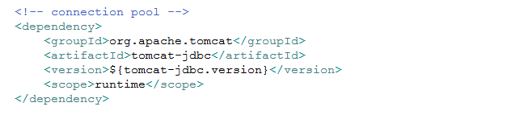
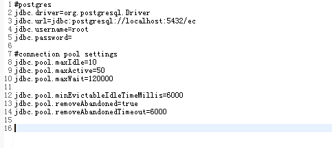
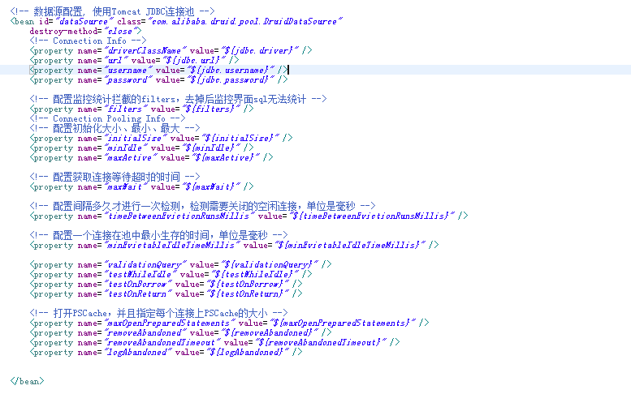
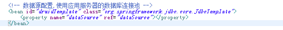
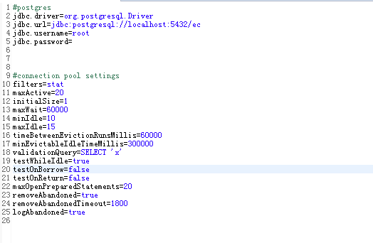
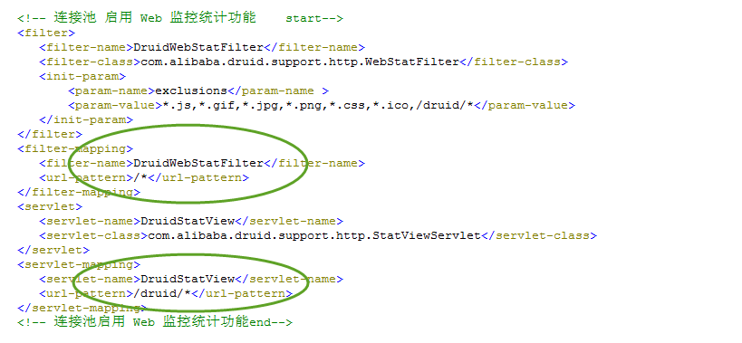

# 数据库连接池

iuap平台默认使用Tomcat Jdbc作为数据库连接池。

Tomcat jdbc连接池兼容dbcp，性能更高。以异步方式获取连接tomcat jdbc pool 是 tomcat 的一个模块，基于 tomcat JULI，使用 Tomcat 的日志框架。支持高并发应用环境，应用简单方便支持 JMX、支持 XA Connection。

## 4.2.2 数据库连接池配置

Tomcat数据库连接池需要引入maven依赖如下，如果引入iuap-persistence会间接引入：

 

数据源的配置如下：

 

Tomcat数据库连接池属性配置：

 

属性文件配置示例：

	jdbc.driver=com.mysql.jdbc.Driver
	jdbc.url=jdbc:mysql://localhost:3306/iuap_demo?useUnicode=true&characterEncoding=utf-8
	jdbc.username=root
	jdbc.password=
	jdbc.defaultAutoCommit=true
	
	#connection pool settings
	jdbc.pool.minIdle=0
	jdbc.pool.maxIdle=20
	jdbc.pool.maxActive=50
	jdbc.pool.maxWait=30000
	jdbc.pool.initialSize=0
	
	jdbc.pool.testOnBorrow=false
	jdbc.pool.validationInterval=30000
	jdbc.pool.testOnReturn=true
	jdbc.pool.validationQuery=select 1
	
	jdbc.pool.testWhileIdle=true
	jdbc.pool.timeBetweenEvictionRunsMillis=30000
	jdbc.pool.numTestsPerEvictionRun=-1
	
	jdbc.pool.minEvictableIdleTimeMillis=60000
	jdbc.pool.removeAbandoned=true
	jdbc.pool.removeAbandonedTimeout=60

spring文件中bean的配置示例：

	<!-- 数据源配置, 使用Tomcat JDBC连接池 -->
	<bean id="dataSource" class="org.apache.tomcat.jdbc.pool.DataSource" destroy-method="close">
		<!-- Connection Info -->
		<property name="driverClassName" value="${jdbc.driver}" />
		<property name="url" value="${jdbc.url}" />
		<property name="username" value="${jdbc.username}" />
		<property name="password" value="${jdbc.password}" />
		<property name="defaultAutoCommit" value="${jdbc.defaultAutoCommit}"/>
	
		<!-- Connection Pooling Info -->
		<property name="maxActive" value="${jdbc.pool.maxActive}" />
		<property name="maxIdle" value="${jdbc.pool.maxIdle}" />
		<property name="minIdle" value="${jdbc.pool.minIdle}" />
		<property name="maxWait" value="${jdbc.pool.maxWait}" />
		<property name="initialSize" value="${jdbc.pool.initialSize}" />
		
		<property name="testOnBorrow" value="${jdbc.pool.testOnBorrow}"/>
		<property name="validationInterval" value="${jdbc.pool.validationInterval}"/>
		<property name="testOnReturn" value="${jdbc.pool.testOnReturn}"/>
		<!--mysql,sqlserver,postgresql使用select 1，oracle使用select 1 from dual-->
		<property name="validationQuery" value="${jdbc.pool.validationQuery}"/>
	
		<property name="testWhileIdle" value="${jdbc.pool.testWhileIdle}"/>
		<property name="timeBetweenEvictionRunsMillis" value="${jdbc.pool.timeBetweenEvictionRunsMillis}"/>
		<property name="numTestsPerEvictionRun" value="${jdbc.pool.numTestsPerEvictionRun}"/>
	
		<property name="minEvictableIdleTimeMillis" value="${jdbc.pool.minEvictableIdleTimeMillis}" />
		<property name="removeAbandoned" value="${jdbc.pool.removeAbandoned}" />
		<property name="removeAbandonedTimeout" value="${jdbc.pool.removeAbandonedTimeout}" />
	</bean>

 Druid也是较好的数据库连接池，在功能、性能、扩展性方面，都超过其他数据库连接池，如DBCP、C3P0、BoneCP、Proxool、JBossDataSource。Druid已经在阿里巴巴部署了超过600个应用，经过一年多生产环境大规模部署的严苛考验。Druid提供了数据库访问性能的监控、DBCP和C3P0替换、数据库密码加密、SQL执行日志、扩展JDBC等功能。
 
Druid连接池需要引入jar包，druid-1.0.16.jar，Druid数据库连接池配置：

 

Jdbctemplate与Druid数据源绑定配置：

 

Druid数据库连接池属性配置：

 

## 4.2.3 数据库连接池使用

DataSource配置好之后，JPA方式、Mybatis、JDBC方式的连接自动从连接池中获取，业务开发时候不需要关心，直接调用即可。

 

如果使用的是Druid连接池，本身可提供监控界面，需要在web.xml中进行配置，如下：

 

监控界面中提供大量的信息，可以方便的查看慢sql等信息，帮助开发人员进行性能分析，界面如下：
 
 

## 4.2.4多种数据源的适配

### 4.2.4.1 JPA的适配

	使用Spring Data JPA方式，除了在注解上使用的本地sql方式外，会适配多种数据库，不需要做太多修改，需要业务开发时候，使用标准的JPQL语法即可。在配置文件中，指定方言的配置为：

 

    iuap平台提供的方言控制类已经提供了绝大多数常用数据库的配置，如果需要对特殊数据库进行配置，需要对应的扩展。

### 4.2.4.2 MyBatis的适配

	Mybatis对应的映射文件编写时候使用的是针对某种数据库的语法，如果需要兼容多种数据库，需要在对应的配置文件的目录编写针对性的配置文件，mapper映射文件的名称保持相同即可，可以在制定mapper映射文件的时候，以数据库类型的文件夹名称区分，例如将mysql对应的mapper映射文件放置在mybatis/mysql，目录下，修改指定的位置即可。
 
 

### 4.2.4.3 UAP JDBC的适配

（1）数据源配置如下：

 

（2）配置Spring事务

 

（3）配置BaseDAO

 

（4）如果配置使用元数据，需要在resources目录下增加配置文件jdbc.properties

 
