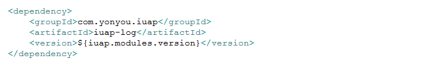
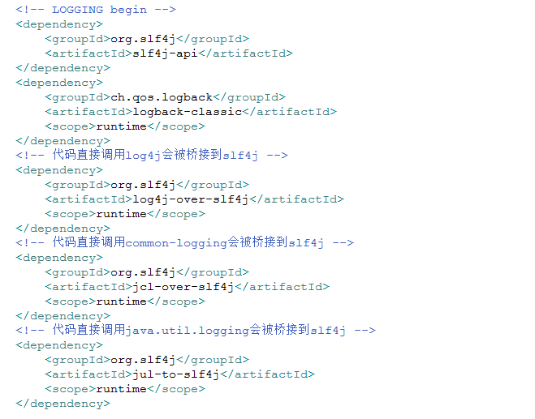
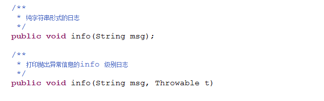
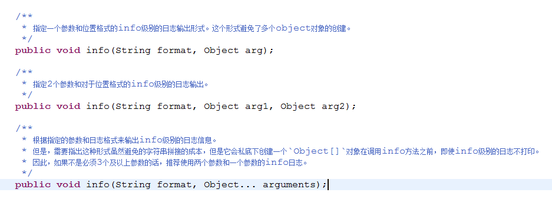

# 日志规范

业务工程依赖的不同组件可能会使用不同的日志组件，为了统一日志输出，iuap 平台采用了SLF4j和LogBack的组合，配合使用SLF4j对各个日志组件的桥接器，实现日志的管理。同时Slf4j配合MDC机制，可以将当前用户、线程调用ID等信息记录到日志中并格式化输出，以便发生异常时追踪关联日志。

SLF4j 只提供日志接口，具体的实现是在打包应用程序时所放入的绑定器（名字为 slf4j-XXX-version.jar）来决定，XXX 可以是 log4j12、jdk14、jcl、nop 等，实现了跟具体日志工具（比如 log4j）的绑定及代理工作。例如，如果一个程序希望用 log4j 日志工具，那么程序只需针对 slf4j-api 接口编程，然后在打包时再放入 slf4j-log4j12-version.jar 和 log4j.jar 就可以了。

## 日志配置
iuap 平台提供统一的日志组件，采用maven方式构建，maven的依赖配置如下图，其中版本号iuap.modules.version为指定的日志组件的版本，可以从maven仓库中获取适当的版本，例如2.0.1-RELEASE，3.0.0-RELEASE。
 
日志组件已经将SLF4j和logback以及各个日志组件之间的桥接做了默认配置，不需要工程再次引入，配置信息如下图：

 
注意：如果项目中使用log4j并引入了相关jar包，或者其他的三方组件简介引入了log4j的实现jar包，需要在maven的pom文件中进行排除。

使用日志组件的工程中需要设置logback的配置文件，来指定输入到控制台和日志文件的格式、日志级别等，参考配置如下：
 
    项目上线时候，需要修改日志的输出级别。

## 日志使用
1. 日志示例的创建

		import org.slf4j.Logger;
		import org.slf4j.LoggerFactory;
		private static final Logger logger = LoggerFactory.getLogger(类名.class);

2. 基本API使用，以INFO级别为例，其它级别类似
 

3. 参数化输出
 
    详细的日志使用示例请参考对应的示例工程。
