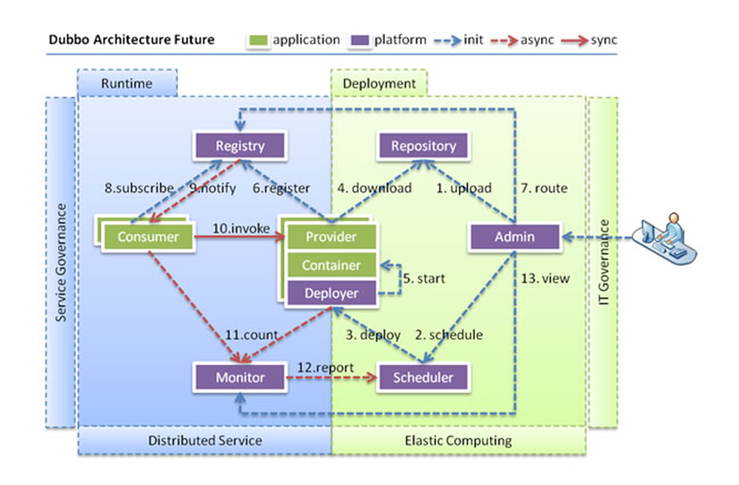
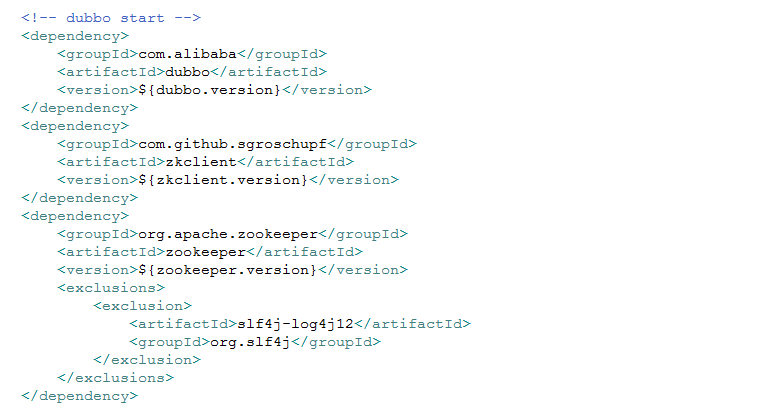
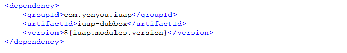
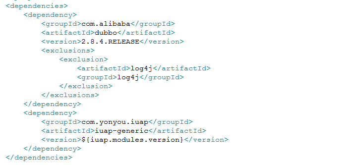
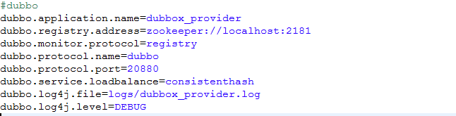
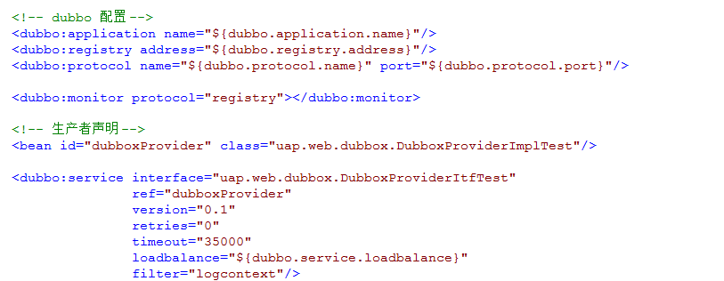
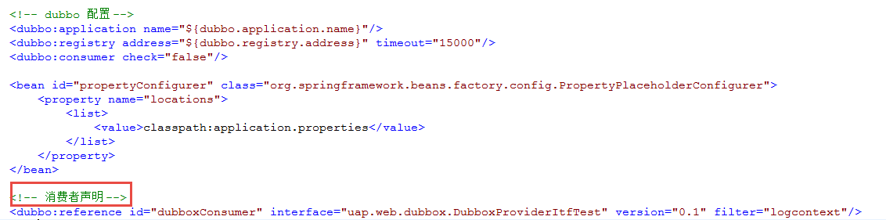
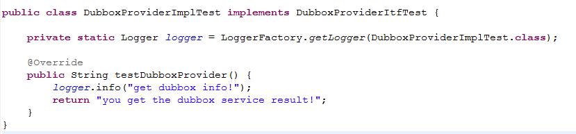
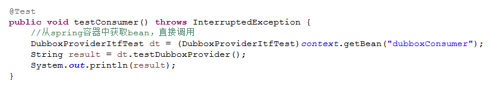

# Dubbox分布式服务

Dubbox是在广泛使用的开源分布式服务框架Dubbo基础上的扩展，它解决了分布式服务的URL调用配置复杂，相互之间依赖关系难以整理，服务容量难以估算的问题，结合Zookeeper的集群机制以及版本控制机制，提供了服务动态扩容、缩容和动态升级、降级的功能。

iuap 平台对Dubbox服务的使用提供完整方案和示例，使得服务的提供和调用变得简单，开发者进行简单的配置即可快速搭建分布式服务。
 

## Dubbox服务配置
1. maven配置：maven的依赖配置参考如下，其中版本号dubbo.version、zkclient.version、zookeeper.version版本统一定义，目前dubbox使用的版本为2.8.4.RELEASE。
 
	如果使用iuap-dubbox组件，可以省略上述配置，直接在maven工程的pom文件中引入对iuap-dubbox组件的依赖即可（如下图），组件在原生的dubbox服务基础上，增加了对日志信息和业务信息上下文的传递，并引入了通用spring4.x版本编译过的dubbo2.8.4版本。
 
	组件中对dubbox的默认引入如下：
 
2. 属性文件配置：属性文件中制定了Zookeeper的连接地址和端口、Dubbox服务使用的端口号、负载均衡的策略等信息。
 
3. Spring配置，分为服务提供者和服务消费者。
 
 

## Dubbox服务使用
1. 实现服务提供者，接口名和实现类名在配置文件中需要统一。
 
2. 消费端服务声明，参考配置中的信息，其中接口名和服务提供者接口相同。从Spring容器中直接获取Bean即可调用。
 

