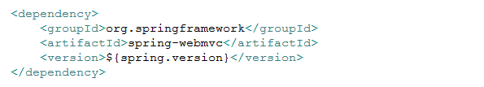
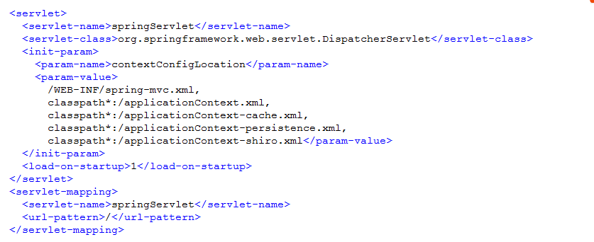
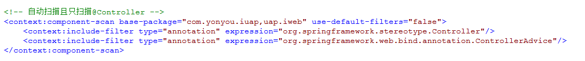
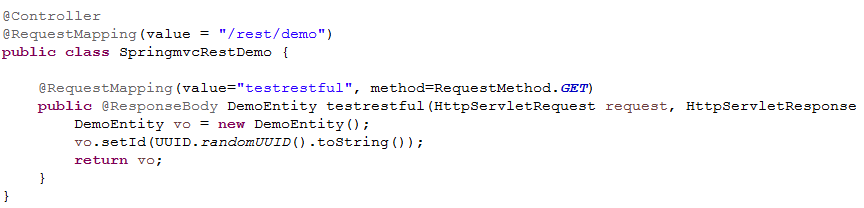
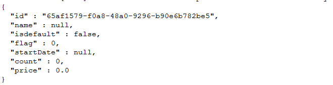

# RestFul服务

RESTful架构，是基于REST服务的互联网软件架构,其目的是提高系统的可伸缩性，降低应用之间的耦合度，具有结构清晰、符合标准、易于理解、扩展方便，正得到越来越多企业的采用。REST服务采用HTTP协议所规定的GET、POST、PUT、DELETE等动作处理对应资源的增删改查操作。

iuap平台使用基于Spring MVC并配合注解的方式，提供REST服务，供前端页面调用以及为其他端或者系统提供服务。

## RestFul服务配置
1. maven依赖配置：spring.version为当前使用的sping的版本，如4.0.5.RELEASE。
 
2. web.xml配置
 
3. spring-mvc.xml配置：配置spring-mvc.xml并且指定需要扫描的包名，将用注解标识的控制器注册到容器中。
 

    配置完成后，即可用注解声明控制器，来接收Http请求，如果是Open API，需要在指定的url规则上配置过滤器，如拦截/rest和/api的请求，并进行签名的验证，只有通过验证的请求才允许继续访问。

## RestFul服务使用
编写Spring MVC的控制器：使用@RestController、@RequestMapping、@ResponseBody等接口，声明控制器类路径和返回的内容格式等，前端使用java提交Http请求或者JS的Ajax请求即可调用此方法。
 

其中方法的返回值可以是java对象，使用@ResponseBody 注解，Spring MVC会自动将返回内容适配成JSON格式，返回格式如下：
 
