# Web Service服务

Apache CXF 是一个开源的服务框架，它支持多种服务协议，比如：SOAP、XML/HTTP、RESTful HTTP 或者 CORBA ，并且可以在多种传输协议上运行，比如：HTTP、JMS 或者 JBI。
	
iuap 平台采用 CXF 支持对 Web Service 的开发，可以方便的定义和发布 SOAP 协议的 Web Service，也可以发布类似 RestFul 服务方式的Web Service。

## Web Service配置
1. maven配置
 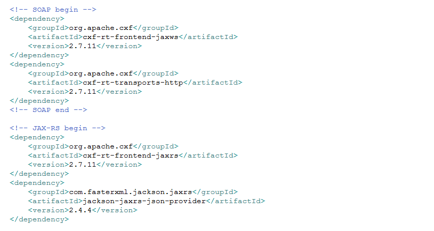
2. 配置CXF，修改web.xml，加入CXF相关配置。
 
3. 引入Spring和CXF集成的配置文件
 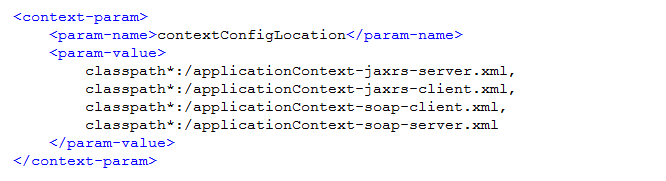

## Web Service使用
1. 发布SOAP协议的Web Service

	编写Web Service的接口类和实现，使用@WebService、@WebMethod注解声明接口和方法，示例如下：
 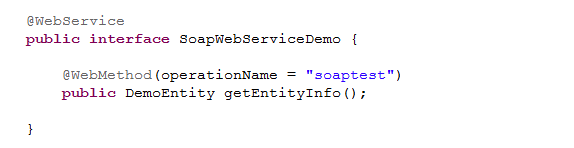
	
	编写实现类，实现方法：
 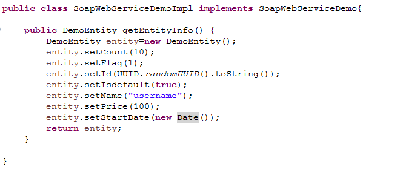
	
	配置applicationContext-soap-server.xml：
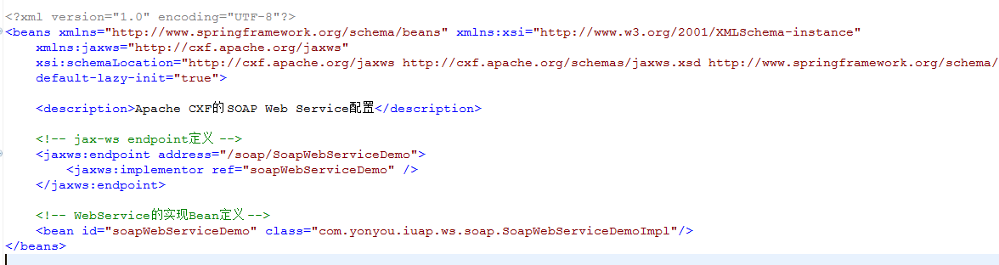 
	
	启动工程后，可以在浏览器中查看Web Service的描述：
	http://localhost:8080/example_iuap_webservice/cxf/soap/SoapWebServiceDemo?wsdl
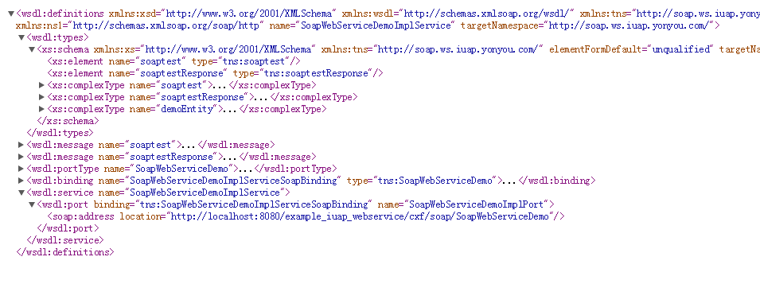
 
	编写测试用例，测试方法和返回结果如下格式：
 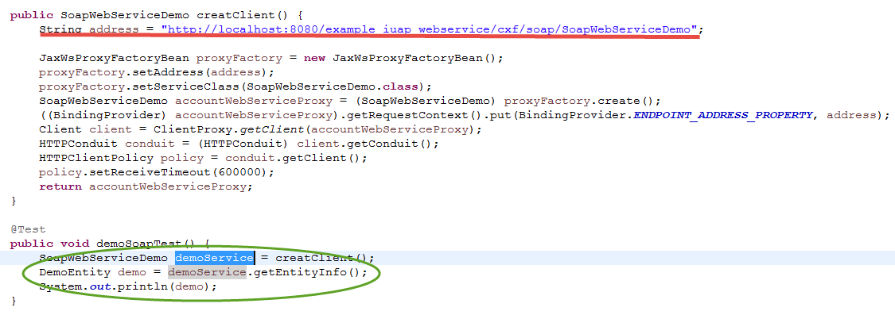
 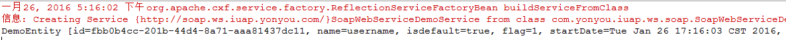

2. 发布RestFul格式的Web Service
	
	编写服务类，使用@Path注解声明服务和指定地址映射，使用@Produces注解设置返回的内容格式。
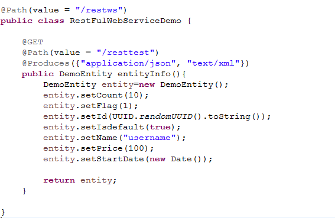 
   
	配置applicationContext-jaxrs-server.xml，指定相关配置：
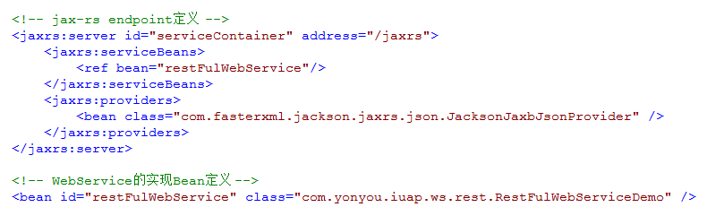 

	启动工程后，在浏览器中可以查看服务的描述文件，描述文件对应的浏览器地址为：http://localhost:8080/example_iuap_webservice/cxf/jaxrs?_wadl
 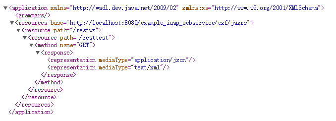
	编写测试用例，如下：
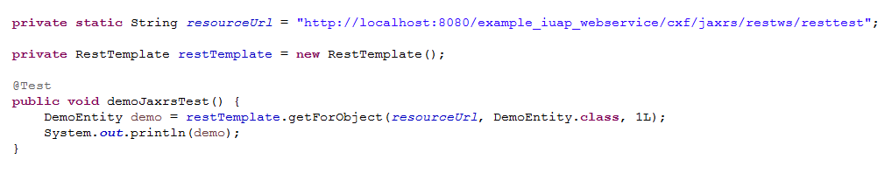 
