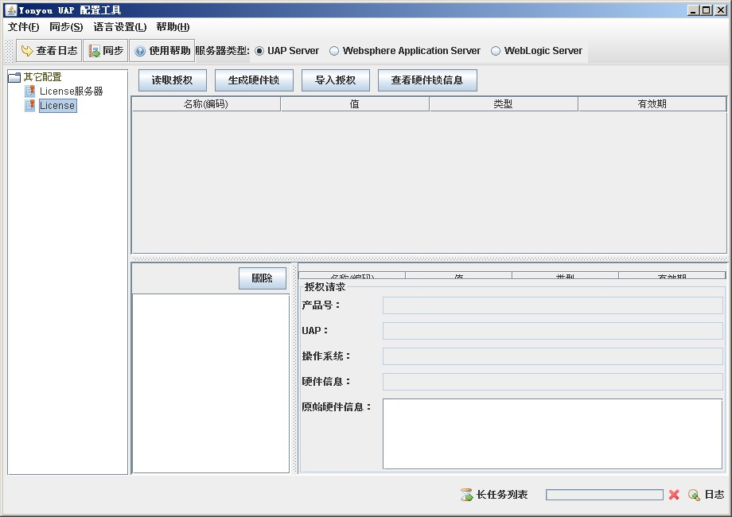
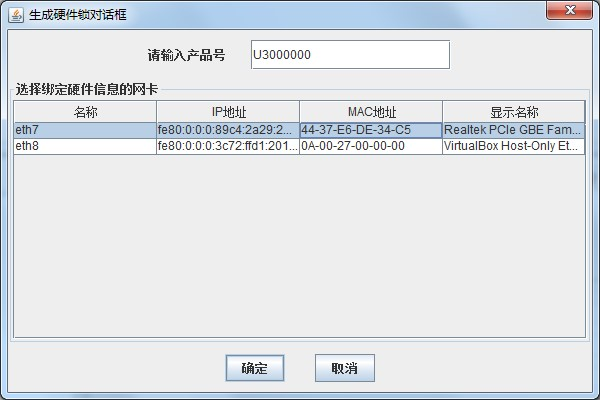
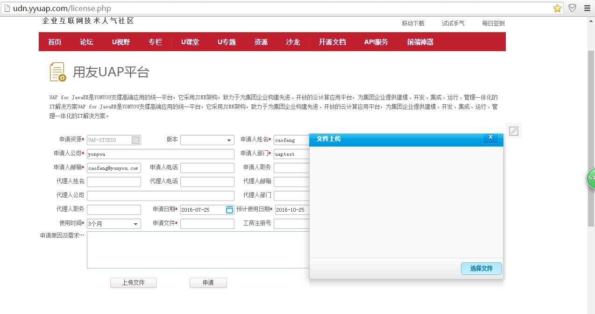
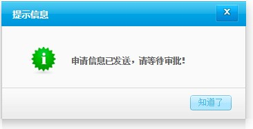
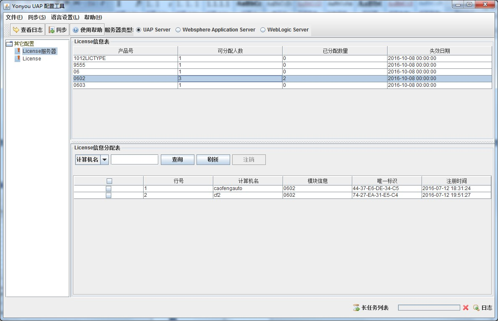

# 授权服务器简介 #

设计License Server是为了解决当用户购买了多套UAP产品需要重复注册的问题,有了License Server用户只需要注册一次,从软件厂商处一次获得所有的许可权限,用户可自由部署UAP产品,将产品登陆到License Server即可使用.

# 使用说明 #

## 一、配置License Server ##

License Server 位于安装盘的“DevTool\LicenseServer”目录下。

###1配置###

双击“DevTool\LicenseServer\bin”路径下的SysConfig.bat文件，进入LicenseServer配置和授权显示界面：

----------

点击左树的License节点，打开右侧License界面。

###2生成硬件锁###

点生成硬件锁按钮，在弹处框中输入产品号，并点选网卡，点确定按钮即可。

######注意：选择网卡时，请选择物理网卡。######

###3打开“网上注册”页面###

在“用友UAP平台权限申请”页面，填写客户信息，并上传硬件锁文件。申请License授权请访问如下地址：
Http://udn.yyuap.com

上传硬件锁成功后提示等待邮件。

###4导入License 文件###

License Server导入授权文件后应该显示授权产品名称，授权产品点数，有效期和硬件锁信息。导入成功后须重新启动License Server才能生效。

## 二、启动License Server ##

双击“DevTool\LicenseServer”路径下的startup.bat文件即可启动授权服务器。完成正常的客户端授权流程。

## 三、显示注册客户端 ##

当客户端注册成功后，License Server将显示License信息表和License信息分配表。License信息表主要显示当前产品的可分配已分配和失效时间；License信息分配表显示正在使用当前产品的客户端明细。

#### 另外，授权服务器和客户端时区和时间请务必保持一致，对于不一致情况导致的授权失败问题，后果自负 ####