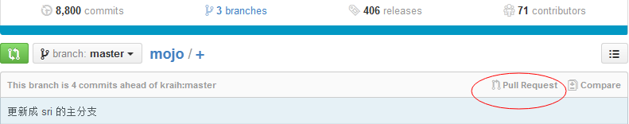

# gitHub使用说明 #

## github 上 Fork 别人的项目后的常用的操作指南 ##

因为我 Fork 了 Mojo 的项目，这样才学会了如何使用 github. 因为其它一些项目是自己创建的，也就学不会怎么和其它团队合作。 现在给这部分不一样的经验分享给大家。希望有利于大家参与到开源的项目来。

1. 提交自己本地项目的修改到 github 的库中.
如果你自己的项目，或者是其它人的项目， 你 Fork 了以后， 一定是到本地来进行开发和测试。所以当你自己给自己的项目 clone 到本地后, 进行了一系列的修改后， 当你想提交时， 最方便的方式是直接使用 HTTP 的方式进行提交。 但当你提交的时候， 就会发现一直权限出错的提示：


```error: The requested URL returned error: 403 Forbidden while accessing http://xxx```

这时， 你需要修改你的项目目录下的 .git/config 这个 git 的配置文件。给其中的 url 选项中修改如下：


```url = https://iakuf@github.com/iakuf/mojo```

这其实就是给你的 github 的帐号名， 通过 @ 加到 URL 的前半部分， 这样才能成为 HTTP 认证的用户信息来进行接下来的认证. 这样就不用关心 SSH 的 Key 的问题了。

2. 当自己 Fork 后的项目更新后， 提交 ( Pull Requests) 给原作者合并
我原来一直使用 github 但只会提交修改， 后来在陈子的指导下学会了 Pull Requests 到原来的作者。
其实很简单。 在界面上边有个 Pull Requests。

点进去， 然后就可以见到你和原作者项目的差异的代码，上面有个 "Create pull request". 点击后会让你写上本次提交合并“主题”，还有相关提交修改的内容的一些介绍， 这方便原作者理解和了解你的修改，并会考虑是否给你的提交合并到他自己本身的代码。 写完这些信息后， 然后提交过去。 作者的项目就会收到你这个请求了。如果他认为你写的代码没问题，介绍也合理， 就会合并到你的代码到他的主代码中。
 
3. 更新自己 Fork 的代码项目和原作者的项目进度一致的方法
经过一段时间， 有可能作者原来的代码变化很大， 你想接着在他最新的代码上修改， 这时你需要合并原作者的最新代码过来， 让你的项目变成最新的。这个需要接着在你的本地操作。
假设前提是， 你现在你的代码是克隆下来在本地的。 例如我 Fork 了 sri (Mojo 的作者) 的 Mojo 项目， 我的项目地址是 https://github.com/iakuf/mojo. 我现在克隆这个在我的本地了。

```
git clone https://github.com/iakuf/mojo
cd mojo
```

接着， 我只需要添加 sri 项目的地址,也就是主项目的 remote 地址， 我们加入后， 给代码 fetch 过来， 然后进行 merge 的合并操作。

```
git remote add sri https://github.com/kraih/mojo
git fetch sri
git merge sri/master
```
这样就能给你的当前本地的项目变成和原作者的主项目一样。 然后你按正常的流程进行修改并提交到你的项目就好了。

```
git commit -am '更新到原作者的主分支的进度'
git push origin
```
要接着给修改提交给原作者，请参照第二步。

## git如何处理别人的pull request及解决冲突

出过两次了，每次都查很多资料，太蛋疼，记录在此。

当你的项目比较牛逼的时候，有人给你贡献代码，但他修改的地方恰恰你前阵子也修改了，这样在github中就不能够自动merge了。

因此你需要手动去解决冲突。首先要在本机安装好命令行工具gitbash，之后用clone拉下你的项目，之后

按照以下命令输入

```
git checkout -b 某人-master master
git pull https//github.com/某人的/某项目的.git master
```

这时候命令行会提示你有冲突，冲突文件是啥，那如何解决冲突呢，很简单

在同步代码的过程中，git会自动检查冲突，并尝试进行**自动合并**。最好的情况应该是大家同时修改一个文件，但是大家修改的地方不同了。在这样的情况下，git会进行非冲突合并，这时，在调用 git pull 的时候，git会尝试进行非冲突合并。 
而在合并过程中有冲突的时候， git 会把修改记录直接保存在文件中，让开发者判断文件如何解决合并。例如，在一个描述文件中同时修改了一句话，在合并的时候，git会这么做：

```
<<<<<<< HEAD
It's not a project cool enough for you to enjoy the code but a mix of my thoughts in the year 2012~2013. I didn't know where the project leads to. Hope it will became useful after practice.
=======
It's not a project
```

即把两个更改都写在文件上，但是用=======来区别发生冲突的位置，在=======以上是 HEAD，即本地的代码；而=======以下则是来自远程的更改了。这个时候，你可以选择保留远程或本地的修改或者都不要（简单地说，把不需要的内容删除即可）。

也就是说我们把文件修改好后，把增加的那几行head >>><<<之类删掉就ok啦。之后冲突修改完毕，我们继续输入

```
git commit -a //把修改提交到这个人的分支上，会提示你成功merge本地代码到这个人的代码库

git checkout master //切换到自己的分支上

git merge 某人-master //
```

还要记着一点，本地修改代码前一定要先pull一下看看，记得慎用github的在线编辑功能

# GitHub中"watch" "star" "fork"三个按钮干什么用的#

1.想拷贝别人项目到自己帐号下就fork一下。
2.持续关注别人项目更新就star一下
3.watch是设置接收邮件提醒的。